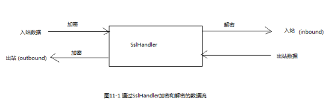
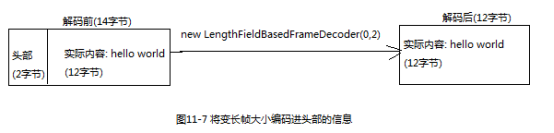

[TOC]


# 1 SSL/TSL

为了支持SSL/TSL，Netty提供了SslHandler，其实现利用了javax.net.ssl包，在内部使用SSLEngine来完成实际的工作。

Netty还提供了使用OpenSSL工具包的SSLEngine实现，这个OpenSslEngine比jdk提供的SSLEngine的性能更好。



```
****** 代码清单11-1 添加SSL/TSL支持 ******

public class SslChannelInitializer extends ChannelInitializer<Channel> {
    
    private final SSLContext sslContext;
    
    //如果设置为true,第一个写入的消息将不会被加密,客户端应该设置为true
    private final boolean startTls;

    public SslChannelInitializer(SSLContext sslContext, boolean startTls) {
        this.sslContext = sslContext;
        this.startTls = startTls;
    }

    protected void initChannel(Channel channel) throws Exception {
        SSLEngine engine = sslContext.createSSLEngine();
        //大多数情况下,SslHandler将是第一个ChannelHandler
        channel.pipeline().addFirst(new SslHandler(engine,startTls));
    }
}
```


# 2 Http/Https

## 2.1 Http编码器、解码器和编解码器

```
****** 代码清单10-2 添加Http支持 ******

public class HttpPipelineInitializer extends ChannelInitializer<Channel> {

    private final boolean isClient;

    public HttpPipelineInitializer(boolean isClient) {
        this.isClient = isClient;
    }

    protected void initChannel(Channel channel) throws Exception {
        ChannelPipeline pipeline = channel.pipeline();
        if(isClient){
            pipeline.addLast(new HttpResponseDecoder())     // http响应解码器
                    .addLast(new HttpRequestEncoder());     // http请求编码器
        }else{
            pipeline.addLast(new HttpRequestDecoder())      // http请求解码器
                    .addLast(new HttpResponseEncoder());    // http响应编码器
        }
    }
}
```


## 2.2 聚合Http消息

```
****** 代码清单10-3 自动聚合http的消息片段 ******

public class HttpAggregatorInitializer extends ChannelInitializer<Channel> {

    private final boolean isClient;

    public HttpAggregatorInitializer(boolean isClient) {
        this.isClient = isClient;
    }

    protected void initChannel(Channel channel) throws Exception {
        ChannelPipeline pipeline = channel.pipeline();
        if(isClient){
            pipeline.addLast("codec",new HttpClientCodec());
        }else {
            pipeline.addLast("codec",new HttpServerCodec());
        }
        pipeline.addLast("aggregator",new HttpObjectAggregator(512*1024));   // http消息大小限制为最大512k
    }
}
```


## 2.3 http压缩

```
****** 代码清单11-4 自动压缩http消息 ******

public class HttpCompressInitializer extends ChannelInitializer<Channel> {

    private final boolean isClient;

    public HttpCompressInitializer(boolean isClient) {
        this.isClient = isClient;
    }

    protected void initChannel(Channel channel) throws Exception {
        ChannelPipeline pipeline = channel.pipeline();
        if(isClient){
            pipeline.addLast(new HttpClientCodec())
                    .addLast(new HttpContentDecompressor());    // 客户端添加http解压缩器
            
        }else {
            pipeline.addLast(new HttpServerCodec())
                    .addLast(new HttpContentCompressor());      // 服务器添加http压缩器
        }
    }
}
```


## 2.4 Websocket

由WebSocket定义的称为帧的特殊消息类型：WebSocketFrame


|            名称            |                             描述                             |
| :------------------------: | :----------------------------------------------------------: |
|    BinaryWebSocketFrame    |                      数据帧:二进制数据                       |
|     TextWebSocketFrame     |                       数据帧:文本数据                        |
| ContinuationWebSocketFrame | 数据帧:属于上一个BinaryWebSocketFrame或者TextWebSocketFrame的文本的或者二进制数据 |
|    CloseWebSocketFrame     |       控制帧:一个close请求/关闭的状态码以及关闭的原因        |
|     PingWebSocketFrame     |              控制帧:请求一个PongWebSocketFrame               |
|     PongWebSocketFrame     |            控制帧:对PingWebSocketFrame请求的响应             |

```
******代码清单11-6 在服务端支持WebSocket ******

public class WebSocketInitializer extends ChannelInitializer<Channel> {
    protected void initChannel(Channel channel) throws Exception {
        channel.pipeline().addLast(
                new HttpServerCodec(),
                new HttpObjectAggregator(65536),    // 为握手提供聚合的HttpRequest
                new WebSocketServerProtocolHandler("/websocket"), //如果被请求的端点是"websocket",则处理
                new TextFrameHandler(),             // 自定义的处理TextWebSocketFrame类型数据帧的处理器
                new BinaryFrameHandler(),           // 自定义的处理BinaryWebSocketFrame类型数据帧的处理器
                new CountinuationFrameHandler()     // 自定义的处理ContinuationWebSocketFrame类型数据帧的处理器
        );
    }
}
```

要想为WebSocket添加安全性，只需将SslHandler作为第一个ChannelHandler添加到pipeline中即可。


# 3 空闲的连接和超时

用于空闲连接以及超时的ChannelHandler

|        名称         |                             描述                             |
| :-----------------: | :----------------------------------------------------------: |
|  IdleStateHandler   | 当连接的空闲时间太长,将会触发一个IdleStateEvent事件,你可以通过在你的ChannelInboundHandler中重写userEventTriggered()方法来处理该事件 |
| ReadTimeoutHandler  | 如果在指定的时间间隔内没有收到任何的入站数据,则抛出一个ReadTimeoutExecption并关闭对应的Channel. 可以在exceptionCaught()方法中检测该异常 |
| WriteTimeoutHandler | 如果在指定的时间间隔内没有任何出站数据写入,则抛出一个WriteTimeoutExecption并关闭对应的Channel. 可以在exceptionCaught()方法中检测该异常 |


```
******代码清单11-7 每隔60s进行连接的心跳检测 ******

public class IdleStateInitializer extends ChannelInitializer<Channel> {

    protected void initChannel(Channel channel) throws Exception {
        channel.pipeline()
                .addLast(new IdleStateHandler(0,0,60, TimeUnit.SECONDS))
                .addLast(new HeartBeatHandler());
    }

    public class HeartBeatHandler extends ChannelInboundHandlerAdapter {
        @Override
        public void userEventTriggered(ChannelHandlerContext ctx, Object evt) throws Exception {
            if(evt instanceof IdleStateEvent)
                ctx.writeAndFlush(Unpooled.copiedBuffer("心跳测试", CharsetUtil.UTF_8))
                    .addListener(ChannelFutureListener.CLOSE);
            else 
                super.userEventTriggered(ctx,evt);
        }
    }
}
```


# 4 解码基于分隔符的协议和基于长度的协议

## 4.1 基于分隔符的协议

用于处理基于分隔符协议的解码器

|            名称            |                      描述                      |
| :------------------------: | :--------------------------------------------: |
| DelimiterBasedFrameDecoder | 使用任何由用户提供的分隔符来提取帧的通用解码器 |
|   LineBasedFrameDecoder    |    提取由行尾符(\n或者\r\n)分隔的帧的编码器    |


```
****** 代码清单11-8 处理由行尾符分隔得帧 ******

pipeline.addLast(new LineBasedFrameDecoder(64*1024)) // 添加提取帧的解码器
        .addLast(new FrameHandler());                            // 添加自定义的接收帧的处理器
```


## 4.2 基于长度的协议

用于基于长度的协议的解码器

|             名称             |                             描述                             |
| :--------------------------: | :----------------------------------------------------------: |
|   FixedLengthFrameDecoder    |               提取在调用构造函数时指定的定长帧               |
| LengthFieldBasedFrameDecoder | 根据编码进帧头部的长度提取帧,该字段的偏移量以及长度在构造函数中指定 |





# 5 写大型数据 

## 5.1 直接传输文件内容

使用FileRegion接口的实现

```
****** 代码清单11-11 使用FileRegion传输文件的内容 ******

FileInputStream in = new FileInputStream(file);
FileRegion region = new DefaultFileRegion(in.getChannel(),0,file.length());
channel().writeAndFlush(region);
```


## 3.2 ChunkedWriterHandler

在需要将数据从文件系统复制到用户内存中时，可以使用ChunkedWriterHandler，它支持异步写大型数据流，而又不会导致大量的内存消耗。

ChunkedInput的实现

|       名称       |                             描述                             |
| :--------------: | :----------------------------------------------------------: |
|   ChunkedFile    | 从文件中逐块获取数据,当你的平台不支持零拷贝或者你需要转换数据时使用 |
|  ChunkedNioFile  |          和ChunkedFile类似,只是它使用了FileChannel           |
|  ChunkedStream   |                 从InputStream中逐块传输内容                  |
| ChunkedNioStream |             从ReadableByteChannel中逐块传输内容              |


```
****** 代码清单11-12 使用ChunkedStream传输文件内容 ******

public class ChunkedWriterInitializer extends ChannelInitializer<Channel> {
    
    private final File file;

    public ChunkedWriterInitializer(File file) {
        this.file = file;
    }

    protected void initChannel(Channel channel) throws Exception {
        channel.pipeline().addLast(new ChunkedWriteHandler())
                .addLast(new WriteStreamHandler());
    }
    
    public final class WriteStreamHandler extends ChannelInboundHandlerAdapter{
        @Override
        public void channelActive(ChannelHandlerContext ctx) throws Exception {
            super.channelActive(ctx);
            ctx.writeAndFlush(new ChunkedStream(new FileInputStream(file)));
        }
    }
}
```


# 6 序列化数据

## 6.1 JDK序列化

JDK序列化编码器

|          名称           |                         描述                          |
| :---------------------: | :---------------------------------------------------: |
| CompatibleObjectDecoder | 和使用JDK序列化的非Netty的远程节点进行互操作的解码器  |
| CompatibleObjectEncoder | 和使用JDK序列化的非Netty的远程节点进行互操作的编码器  |
|      ObjectDecoder      | 构建于JDK序列化之上的使用自定义的序列化来解码的解码器 |
|      ObjectEncoder      | 构建于JDK序列化之上的使用自定义的序列化来编码的编码器 |


## 6.2 JBoss Marshalling序列化

需要JBoss Marshalling的相关依赖jar包。

 JBoss Marshalling的编解码器

|                           名称                            |                                                      |
| :-------------------------------------------------------: | :--------------------------------------------------: |
| CompatibleMarshallingDecoder CompatibleMarshallingEncoder |           与只使用JDK序列化的远程节点兼容            |
|        MarshallingDecoder <br />MarshallingEncoder        | 适用于使用JBoss Marshalling的节点,这两个必须一起使用 |


## 6.3 Protocol Buffers序列化

Protobuf编解码器

|                    名称                     |                             描述                             |
| :-----------------------------------------: | :----------------------------------------------------------: |
|               ProtobufDecoder               |                     使用Protobuf进行解码                     |
|               ProtobufEncoder               |                     使用Protobuf进行编码                     |
|     ProtobufDecoderVarint32FrameDecoder     | 根据消息中的Google Protocol Buffers的”Base 128 Varints”整型长度字段值动态地分割所接收到的ByteBuf |
| ProtobufDecoderVarint32LengthFieldPrepender | 向ByteBuf前追加一个Google Protocol Buffers的”Base 128 Varints”整型长度字段值 |


```
******代码清单11-14 使用protobuf ****** 

pipeline.addLast(new ProtobufVarint32FrameDecoder())
        .addLast(new ProtobufDecoder(消息头))
        .addLast(new ProtobufEncoder());
```