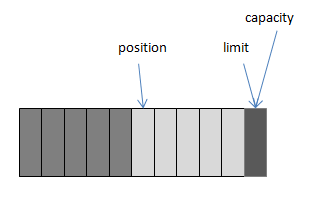

[TOC]


# 1 NIO和BIO的区别

1. BIO是面向流的，NIO是面向缓冲区的。

   BIO面向流意味着每次从流中读一个或多个字节，直至读取所有字节，它们没有被缓存在任何地方。此外，它不能前后移动流中的数据。如果需要前后移动从流中读取的数据，需要先将它缓存到一个缓冲区。

   NIO则将数据读取到一个它稍后处理的缓冲区，需要时可在缓冲区中前后移动。这就增加了处理过程中的灵活性。但是，还需要检查是否该缓冲区中包含所有您需要处理的数据。而且，需确保当更多的数据读入缓冲区时，不要覆盖缓冲区里尚未处理的数据。

2. BIO的各种流是阻塞的，而NIO支持非阻塞模式IO。

   在BIO中，当一个线程调用`read()` 或 `write()`时，该线程被阻塞，直到有一些数据被读取，或数据完全写入。该线程在此期间不能再干任何事情了。

   NIO的非阻塞模式，使一个线程从某通道发送请求读取数据，但是它仅能得到目前可用的数据，如果目前没有数据可用时，就什么都不会获取。而不是保持线程阻塞，所以直至数据变的可以读取之前，该线程可以继续做其他的事情。 非阻塞写也是如此。一个线程请求写入一些数据到某通道，但不需要等待它完全写入，这个线程同时可以去做别的事情。 线程通常将非阻塞IO的空闲时间用于在其它通道上执行IO操作，所以一个单独的线程现在可以管理多个输入和输出通道（channel）。


# 2 核心组件

## 2.1 Buffer

Buffer，缓冲区，实际上是一个数组容器。

Channel从网络或者文件等读取的数据都必须经过Buffer。


Java nio提供了多种Buffer实现，如`ByteBuffer`、`CharBuffer`、`DoubleBuffer`、`FloatBuffer`、`IntBuffer`、`LongBuffer`、`ShortBuffer`，分别对应各种基本数据类型。还有`MappedByteBuffer`、`HeapByteBuffer`、`DirectByteBuffer`等适用于特殊场景的实现。


### 2.1.1 内部模型

Buffer类中定义了四个变量：capacity、position、limit、mark。

|   变量   |                             说明                             |
| :------: | :----------------------------------------------------------: |
| capacity |            缓冲区数组的总长度，默认大小为数组长度            |
| position |              下一个要操作的元素的位置，默认为0               |
|  limit   | 缓冲区数组中不可操作的下一个元素的位置：limit<=capacity，默认大小为数组长度 |
|   mark   |                用于记录当前position，默认为-1                |


下面，以ByteBuffer为例，通过对其常用方法进行说明，来了解上述四个变量是如何工作的。


### 2.1.2 allocate

分配指定大小的HeapByteBuffer，HeapByteBuffer属于堆缓冲区，是ByteBuffer的一种实现，也是我们常用的ByteBuffer实现，因为是在java堆内存中，所以其能被快速分配，并且能被垃圾收集器收集释放。


### 2.1.2 allocateDirect

分配指定大小的DirectByteBuffer，DirectByteBuffer不在堆内存中，所以不存在由于垃圾收集引起的复制操作。但是其主要缺点是分配和释放比较昂贵，并且需要程序员手动释放。

在调用`ByteBuffer.allocate(11)`后，ByteBuffer内部数组可以用下面的图示表示：


此时position=0，mark=-1，capacity=limit=10。


### 2.1.3 向ByteBuffer写入5个字节



此时position=5，mark=4，capacity=limit=10。


### 2.1.4 flip

通俗来理解，flip方法就是标记出当前数组中可以读取的数据。在使用中，通常要先调用flip方法，标记出ByteBuffer中可读取的数据起始和结束位置，然后将数据读取到channel中。

```
public final Buffer flip() {
    limit = position;
    position = 0;
    mark = -1;
    return this;
}
```

承接上面的图示:


### 2.1.5 clear

clear方法会将position、limit、mark全部置为初始值。此时如果数组中还有未读数据，那么这些数据就会被”遗忘”，无法再获取到这些数据，并且在向数组中写入新数据时，会覆盖这些遗留数据。

```
public final Buffer clear() {
    position = 0;
    limit = capacity;
    mark = -1;
    return this;
}
```


### 2.1.6 compact

compact方法会将数组中的未读数据拷贝到数组起始处，然后将position设置为最后一位未读数据的下一步，在向数组写入新数据时，会在position处开始写入，不会覆盖掉原有的未读数据。

```
public ByteBuffer compact() {
    System.arraycopy(hb, ix(position()), hb, ix(0), remaining());
    position(remaining());
    limit(capacity());
    discardMark();
    return this;
}
```


### 2.1.7 position

将position置于newPosition位置，可用于读取newPosition到limit部分的数据。

```
public final Buffer position(int newPosition) {
    if ((newPosition > limit) || (newPosition < 0))
        throw new IllegalArgumentException();
    position = newPosition;
    if (mark > position) mark = -1;
    return this;
}
```


### 2.1.8 limit

limit方法用于更新limit位置，可以用于限制读取position到newLimit之间的数据。

```
public final Buffer limit(int newLimit) {
    if ((newLimit > capacity) || (newLimit < 0))
        throw new IllegalArgumentException();
    limit = newLimit;
    if (position > limit) position = limit;
    if (mark > limit) mark = -1;
    return this;
}
```


### 2.1.9 mark 和 reset

mark方法会标记当前position。

```
public final Buffer mark() {
    mark = position;
    return this;
}
```


reset方法用于恢复用`mark()`方法标记的position位置。

```
public final Buffer reset() {
    int m = mark;
    if (m < 0)
        throw new InvalidMarkException();
    position = m;
    return this;
}
```


### 2.1.10 rewind

rewind方法会重置position，limit保持不变，可用于重复读取数组中的数据。

```
public final Buffer rewind() {
    position = 0;
    mark = -1;
    return this;
}
```


## 2.2 Channel

通常来说，所有的 NIO 的 I/O 操作都是从 Channel 开始的。一个 channel 类似于一个 stream。


### 2.2.1 java Stream 和 NIO Channel 对比

同一个 Channel 中可以执行读和写操作，然而同一个 Stream 仅仅支持读或写。

Channel 可以异步地读写，而 Stream 是阻塞的同步读写。

Channel 总是从 Buffer 中读取数据，或将数据写入到 Buffer 中。


### 2.2.2 Channel 类型

1. `FileChannel`：文件操作

2. `DatagramChannel`：UDP 操作

3. `SocketChannel`：TCP 操作

4. `ServerSocketChannel`：TCP 操作，使用在服务器端

   这些通道涵盖了 UDP 和 TCP网络 IO以及文件 IO。


### 2.2.3 使用示例

#### 2.2.3.1 文件IO

##### 2.2.3.1.1 读取文件

```
public  static void read() throws Exception {
    RandomAccessFile file = new RandomAccessFile("C:\\Users\\Administrator\\Desktop\\jstatd.all.policy","rw");
    FileChannel channel = file.getChannel();
    ByteBuffer buffer = ByteBuffer.allocate(10);
    int i = channel.read(buffer);
    while (i != -1){
        buffer.flip();
        while (buffer.hasRemaining()){
            System.out.print((char) buffer.get());
        }
        buffer.clear();
        i = channel.read(buffer);
    }
    channel.close();
    file.close();
}
```


##### 2.2.3.1.2 写入文件

```
public static void write() throws Exception{

    RandomAccessFile file = new RandomAccessFile("C:\\Users\\Administrator\\Desktop\\aaa.txt","rw");
    FileChannel channel = file.getChannel();
    String str = "i am writing some text into file! now=" + System.nanoTime();
    ByteBuffer buffer = ByteBuffer.allocate(1024);
    buffer.clear();
    buffer.put(str.getBytes("utf-8"));
    buffer.flip();
    while (buffer.hasRemaining()){
        channel.write(buffer);
    }
    channel.close();
    file.close();

}
```


#### 2.2.3.2 TCP

##### 2.2.3.2.1 服务端

```
public static void main(String[] args) throws Exception {

    ServerSocketChannel serverSocketChannel = ServerSocketChannel.open();
    serverSocketChannel.configureBlocking(false);
    serverSocketChannel.bind(new InetSocketAddress("127.0.0.1",8181));

    while (true){
        SocketChannel socketChannel = serverSocketChannel.accept();
        if(socketChannel != null){
            System.out.println("["+System.nanoTime()+"] 服务器接收到客户端消息:");
            ByteBuffer readBuffer = ByteBuffer.allocate(10);
            readBuffer.clear();

            int i = socketChannel.read(readBuffer);
            while (i != -1){
                readBuffer.flip();
                while (readBuffer.hasRemaining()){
                    System.out.print((char) readBuffer.get());
                }
                readBuffer.clear();
                i = socketChannel.read(readBuffer);
            }
        }
    }

}
```


##### 2.2.3.2.2 客户端

```
public static void main(String[] args) throws Exception {

    SocketChannel socketChannel = SocketChannel.open();
    socketChannel.configureBlocking(false);
    socketChannel.connect(new InetSocketAddress("127.0.0.1",8181));

    while (socketChannel.finishConnect()){
        ByteBuffer writeBuffer = ByteBuffer.allocate(1024);
        writeBuffer.clear();
        writeBuffer.put(("client request : "+System.nanoTime()).getBytes());
        writeBuffer.flip();
        while (writeBuffer.hasRemaining()){
            socketChannel.write(writeBuffer);
        }
    }

}
```


#### 2.2.3.3 UDP

##### 2.2.3.3.1 发送端

```
public static void send() {
    try {
        DatagramChannel channel= DatagramChannel.open();
        int i = 1;
        while (i<=20){
            String str = "["+System.nanoTime()+"] udp message";
            ByteBuffer buffer = ByteBuffer.allocate(50);
            buffer.clear();
            buffer.put(str.getBytes());
            buffer.flip();
            while (buffer.hasRemaining()){
                channel.send(buffer,new InetSocketAddress("127.0.0.1",8181));
            }
            buffer.clear();
            System.out.println("---send udp message successfully!");
            i++;
        }
    }catch (Exception e){
        e.printStackTrace();
    }
}
```


##### 2.2.3.3.2 接收端

```
public static void receive() {
    try {
        DatagramChannel channel= DatagramChannel.open();
        channel.bind(new InetSocketAddress(8181));
        int i = 1;
        while (i<=20){
            ByteBuffer buffer = ByteBuffer.allocate(50);
            buffer.clear();
            channel.receive(buffer);
            System.out.print("receive udp message :");
            buffer.flip();
            while (buffer.hasRemaining()){
                System.out.print((char) buffer.get());
            }
            buffer.clear();
            System.out.println();
            i++;
        }
    }catch (Exception e){
        e.printStackTrace();
    }
}
```


## 2.3 Selector

Selector 允许一个单一的线程来操作多个 Channel。

如果我们的应用程序中使用了多个 Channel，那么使用 Selector 很方便的实现这样的目的，但是因为在一个线程中使用了多个 Channel，因此也会造成了每个 Channel 传输效率的降低。

使用 Selector 的图解如下:


### 2.3.1 使用Selector

#### 2.3.1.1 创建Selector

```
Selector selector = Selector.open();
```


#### 2.3.1.2 将Channel注册到Selector

```
channel.register(selector,selectorKey) 
或 
channel.register(selector,selectorKey,attObject)
```


要将channel注册到Selector前必须保证channel是非阻塞的，register方法的第二个参数指定了我们感兴趣的事件，有四种可选值：

```
SelectionKey.OP_CONNECT     //channel已连接
SelectionKey.OP_ACCEPT      //channel确认,用于tcp服务端
SelectionKey.OP_READ        //channel可读
SelectionKey.OP_WRITE       //channel可写
```


如果想要一次性指定多个感兴趣的事件，可以使用”|”运算来组合:

```
int interestSet = SelectionKey.OP_READ | SelectionKey.OP_WRITE;
```


注意：一个channel仅可以注册到一个Selector一次，后续注册会覆盖掉之前的注册信息。register方法可以通过第三个参数传入一个附加对象，并且能够在事件发生后获取到该对象。


#### 2.3.1.3 获取事件

通过`selector.selectedKeys()`可以获取所有注册到Selector的所有事件，并可以通过`isAcceptable()`、`isConnectable()`、`isReadable()`、`isWritable()`来判断事件是否已经准备就绪，并且能够通过`channel()`方法获取对应的channel，如果存在附加对象，可以通过`attachment()`方法获取。

注意：在通过`selectedKeys()`方法获取到事件集合后，如果对该事件进行了处理，那么Selector并不会删除该事件，需要手动删除。

也可以通过`select()`方法获取准备就绪的事件个数，该方法默认阻塞等待事件就绪。可以通过`select(long timeout)`方法设置等待时间，也可以通过`selectNow()`获取，该方法不会阻塞，立刻返回结果。


### 2.3.2 示例

```
    public static void main(String[] args) throws IOException {
        Selector selector = Selector.open();
        ServerSocketChannel serverSocketChannel = ServerSocketChannel.open();
        serverSocketChannel.configureBlocking(false);
        serverSocketChannel.bind(new InetSocketAddress("127.0.0.1",8181));
        //注册事件
        serverSocketChannel.register(selector,SelectionKey.OP_ACCEPT);
        while (true){
            if(selector.selectNow() == 0){
                //如果没有事件准备就绪,继续下一次循环
                continue;
            }
            Iterator<SelectionKey> selectionKeys = selector.selectedKeys().iterator();
            while (selectionKeys.hasNext()) {
                SelectionKey key = selectionKeys.next();
                if (key.isAcceptable()) {
                    System.out.println("新的客户端连接成功!");
                    SocketChannel channel = ((ServerSocketChannel)key.channel()).accept();
                    channel.configureBlocking(false);
                    channel.register(key.selector(),SelectionKey.OP_READ,ByteBuffer.allocate(1024));
                } else if (key.isReadable()) {
                    System.out.print("读取客户端消息:");
                    ByteBuffer buffer = (ByteBuffer) key.attachment();
                    buffer.clear();
                    SocketChannel socketChannel = (SocketChannel) key.channel();
                    socketChannel.read(buffer);
                    buffer.flip();
                    while (buffer.hasRemaining()) {
                        System.out.print((char) buffer.get());
                    }
                    buffer.clear();
                } 
                selectionKeys.remove();
            }
        }
    }
```