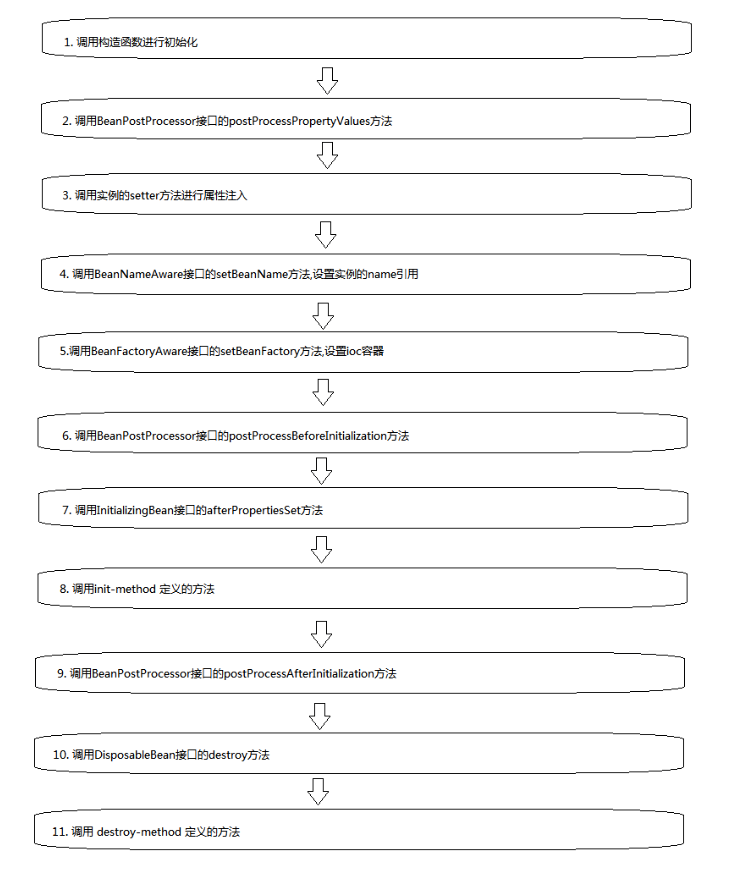

[TOC]

通过一个示例，来逐步演示spring中bean的生命周期，完整版的流程图会在文章最后给出。


首先，我们定义一个简单的User类，然后通过xml文件来简单配置。

**User类**

```
public class User {

    private String username;

    private int age;

    public User(){
        System.out.println("调用User的构造函数进行实例化");
    }

    public String getUsername() {
        return username;
    }

    public void setUsername(String username) {
        System.out.println("调用setter方法,设置username字段值");
        this.username = username;
    }

    public int getAge() {
        return age;
    }

    public void setAge(int age) {
        System.out.println("调用setter方法,设置age字段值");
        this.age = age;
    }

    @Override
    public String toString() {
        return "User@"+this.hashCode()+"[name="+this.getUsername()+",age="+this.getAge()+"]";
    }
}
```


**xml文件**

```
<bean class="cn.booklish.beanlife.User">
    <property name="username" value="liuxindong"/>
    <property name="age" value="26"/>
</bean>
```


**启动程序，加载xml文件，获取user类:**

```
ApplicationContext applicationContext =
        new ClassPathXmlApplicationContext("Application.xml");

User user1 = applicationContext.getBean(User.class);

User user2 = (User) applicationContext.getBean("cn.booklish.beanlife.User");

System.out.println(user1);
System.out.println(user2);
```


**查看控制台打印输出：**

```
调用User的构造函数进行实例化
调用setter方法,设置username字段值
调用setter方法,设置age字段值
User@2009787198[name=liuxindong,age=26]
User@2009787198[name=liuxindong,age=26]
```


可以看到，spring先调用了User的无参构造函数，然后将xml文件中定义的属性值通过setter方法设置给相应的字段。

在从spring容器中获取User实例时，可以通过User类的class类型或者全类名获取，在打印user1和user2的结果中，可以看到两者的hashcode是相同的，也就是同一个对象，这也表明spring bean默认情况下是单例的。


补充：当xml配置中，显式声明了name属性时，如下

```
<bean name="user" class="cn.booklish.beanlife.User">
    <property name="username" value="liuxindong"/>
    <property name="age" value="26"/>
</bean>
```

调用`applicationContext.getBean("cn.booklish.beanlife.User")`，抛出`NoSuchBeanDefinitionException: No bean named 'cn.booklish.beanlife.User' available`异常，要使用xml配置文件中的name值来获取`applicationContext.getBean("user")`。


# 1 Bean级

## 1.1 生命周期接口

### 1.1.1 BeanNameAware

设置bean在工厂中的名称。


**User类**

```
public class User implements BeanNameAware{

    //...省略重复内容

    public void setBeanName(String s) {
        System.out.println("接口[BeanNameAware]的setBeanName方法被调用,参数为"+s);
    }

}
```


**xml文件**

```
<bean name="user" class="cn.booklish.beanlife.User">
    <property name="username" value="liuxindong"/>
    <property name="age" value="26"/>
</bean>
```


**加载xml文件，查看控制台输出**

```
调用User的构造函数进行实例化 
调用setter方法,设置username字段值 
调用setter方法,设置age字段值 
接口[BeanNameAware]的setBeanName方法被调用,参数为user 
User@1661123505[name=liuxindong,age=26]
```


可以看到，spring在设置完User实例的字段属性后，调用了BeanNameAware接口的setBeanName方法，参数就是xml文件\<bean>标签中定义的name属性值。


### 1.1.2 BeanFactoryAware

bean所属工厂的回调。


**User类**

```
public class User implements BeanNameAware,BeanFactoryAware{

    //...

    public void setBeanFactory(BeanFactory beanFactory) throws BeansException {
        System.out.println("接口[BeanFactoryAware]setBeanFactory方法被调用,参数为"+beanFactory);
    }
}
```


**xml文件**

```
<bean name="user" class="cn.booklish.beanlife.User">
    <property name="username" value="liuxindong"/>
    <property name="age" value="26"/>
</bean>
```


**加载xml文件，查看控制台输出：**

```
调用User的构造函数进行实例化 
调用setter方法,设置username字段值 
调用setter方法,设置age字段值 
接口[BeanNameAware]的setBeanName方法被调用,参数为user 
接口[BeanFactoryAware]的setBeanFactory方法被调用,参数为org.springframework.beans.factory.support.DefaultListableBeanFactory@7e0babb1: defining beans [user]; root of factory hierarchy 
User@1006485584[name=liuxindong,age=26]
```


可以看到，在调用完setBeanName方法后，setBeanFactory方法被调用，参数为DefaultListableBeanFactory，这是spring ioc容器的基础实现。


### 1.1.3 InitializingBean

bean实例字段设置后回调。


**User类**

```
public class User implements BeanNameAware,BeanFactoryAware,InitializingBean {

    //...

    public void afterPropertiesSet() throws Exception {
        System.out.println("接口[InitializingBean]的afterPropertiesSet方法被调用");
    }
}
```


**xml文件**

```
<bean name="user" class="cn.booklish.beanlife.User">
    <property name="username" value="liuxindong"/>
    <property name="age" value="26"/>
</bean>
```


**加载xml文件，查看控制台打印**

```
调用User的构造函数进行实例化 
调用setter方法,设置username字段值 
调用setter方法,设置age字段值 
接口[BeanNameAware]的setBeanName方法被调用,参数为user 
接口[BeanFactoryAware]的setBeanFactory方法被调用,参数为org.springframework.beans.factory.support.DefaultListableBeanFactory@7e0babb1: defining beans [user]; root of factory hierarchy 
接口[InitializingBean]的afterPropertiesSet方法被调用 
User@466505482[name=liuxindong,age=26]
```


可以看到，afterPropertiesSet方法紧随setBeanFactory之后被调用，从该方法的名称我们也不难看出，这个方法主要在实例字段被设置完成后调用，但是如果User实现了BeanNameAware、BeanFactoryAware两个接口，那么会在其定义方法之后调用。


### 1.1.4 DisposableBean

bean销毁时调用。


**User类**

```
public class User implements BeanNameAware,BeanFactoryAware,InitializingBean,DisposableBean {

    //...

    public void destroy() throws Exception {
        System.out.println("接口[DisposableBean]的destroy方法被调用");
    }
}
```


**xml文件**

```
<bean name="user" class="cn.booklish.beanlife.User">
    <property name="username" value="liuxindong"/>
    <property name="age" value="26"/>
</bean>
```


**加载xml文件，查看控制台打印**

```
调用User的构造函数进行实例化 
调用setter方法,设置username字段值 
调用setter方法,设置age字段值 
接口[BeanNameAware]的setBeanName方法被调用,参数为user 
接口[BeanFactoryAware]的setBeanFactory方法被调用,参数为org.springframework.beans.factory.support.DefaultListableBeanFactory@7e0babb1: defining beans [user]; root of factory hierarchy 
接口[InitializingBean]的afterPropertiesSet方法被调用 
//-------在这里手动调用了spring 容器的close方法来销毁容器,从而使容器来销毁User实例 
接口[DisposableBean]的destroy方法被调用
```


可以看到，DisposableBean接口的destroy方法在spring销毁该实例时被调用。


## 1.2 生命周期方法

### 1.2.1 init-method、destroy-method

Spring的xml配置文件中，\<bean>标签提供了**init-method** 和 **destroy-method**两个可选属性，我们来自定义两个方法，然后在xml中配置，查看控制打印。


**User类**

```
public class User implements BeanNameAware,BeanFactoryAware,InitializingBean,DisposableBean {

    //...

    public void myInit(){
        System.out.println("自定义的myInit方法被调用");
    }

    public void myDestroy(){
        System.out.println("自定义的myDestory方法被调用");
    }
}
```


**xml文件**

```
<bean name="user" class="cn.booklish.beanlife.User" init-method="myInit" destroy-method="myDestroy">
    <property name="username" value="liuxindong"/>
    <property name="age" value="26"/>
</bean>
```


**加载xml文件，然后销毁容器，查看控制台打印**

```
调用User的构造函数进行实例化 
调用setter方法,设置username字段值 
调用setter方法,设置age字段值 
接口[BeanNameAware]的setBeanName方法被调用,参数为user 
接口[BeanFactoryAware]的setBeanFactory方法被调用,参数为org.springframework.beans.factory.support.DefaultListableBeanFactory@7e0babb1: defining beans [user]; root of factory hierarchy 
接口[InitializingBean]的afterPropertiesSet方法被调用 
[init-method]自定义的myInit方法被调用 
接口[DisposableBean]的destroy方法被调用 
[destroy-method]自定义的myDestory方法被调用
```


可以看到，myInit方法在afterPropertiesSet方法之后被调用，此时spring已经完成了字段的赋值，myDestory在DisposableBean接口的destroy方法后被调用。

通常，我们在myInit方法中可以进行一些在字段初始化完毕后的校验动作或者其他动作，而在myDestory方法中定义在实例销毁后的操作，如释放数据库连接或者释放线程池等资源。

补充：spring xml中init-method 和 destroy-method也有相应的注解，即`@PostConstruct`和`@PreDestroy`，如果不想使用xml文件，直接使用这两个注解也可以。


# 2 容器级

## 2.1 生命周期接口

### 2.1.1 BeanPostProcessor

容器级生命周期接口也称为”工厂后处理器”。首先，我们自定义一个BeanPostProcessor接口的实现，重写其方法


**MyBeanPostProcessor类**

```
public class MyBeanPostProcessor implements BeanPostProcessor {

    public Object postProcessBeforeInitialization(Object o, String s) throws BeansException {
        System.out.println("接口[BeanPostProcessor]的postProcessBeforeInitialization方法被调用,参数为"+o+","+s);
        return o;
    }

    public Object postProcessAfterInitialization(Object o, String s) throws BeansException {
        System.out.println("接口[BeanPostProcessor]的postProcessAfterInitialization方法被调用,参数为"+o+","+s);
        return o;
    }
}
```


**User类不变**


**xml文件**

```
<bean name="user" class="cn.booklish.beanlife.User" init-method="myInit" destroy-method="myDestroy">
    <property name="username" value="liuxindong"/>
    <property name="age" value="26"/>
</bean>

<bean class="cn.booklish.beanlife.MyBeanPostProcessor"/>
```


**加载xml，查看控制台打印**

```
调用User的构造函数进行实例化 
调用setter方法,设置username字段值 
调用setter方法,设置age字段值 
接口[BeanNameAware]的setBeanName方法被调用,参数为user 
接口[BeanFactoryAware]的setBeanFactory方法被调用 
接口[BeanPostProcessor]的postProcessBeforeInitialization方法被调用,参数为User@695682681[name=liuxindong,age=26],user 
接口[InitializingBean]的afterPropertiesSet方法被调用 
[init-method]自定义的myInit方法被调用 
接口[BeanPostProcessor]的postProcessAfterInitialization方法被调用,参数为User@695682681[name=liuxindong,age=26],user 
接口[DisposableBean]的destroy方法被调用 
[destroy-method]自定义的myDestory方法被调用
```


可以看到，BeanPostProcessor接口的postProcessBeforeInitialization方法在spring完成字段属性设置后调用，并且在afterPropertiesSet之前调用，此时在postProcessBeforeInitialization方法中的参数o就是User实例，该实例是有字段属性值的，可以在该方法中进行一些校验或者重新设置的操作。

BeanPostProcessor接口的postProcessAfterInitialization方法在init-method方法后被调用，意味着此时User类自身的生命周期方法确认User属性设置完毕。


## 2.2 生命周期适配器

### 2.2.1 InstantiationAwareBeanPostProcessorAdapter

InstantiationAwareBeanPostProcessorAdapter其实是接口BeanPostProcessor的一个实现类


**重新实现下MyBeanPostProcessor类**

```
public class MyBeanPostProcessor extends InstantiationAwareBeanPostProcessorAdapter {

    @Override
    public Object postProcessBeforeInitialization(Object o, String s) throws BeansException {
        System.out.println("接口[BeanPostProcessor]的postProcessBeforeInitialization方法被调用,参数为"+o+","+s);
        return o;
    }

    @Override
    public Object postProcessAfterInitialization(Object o, String s) throws BeansException {
        System.out.println("接口[BeanPostProcessor]的postProcessAfterInitialization方法被调用,参数为"+o+","+s);
        return o;
    }

    @Override
    public PropertyValues postProcessPropertyValues(PropertyValues pvs, PropertyDescriptor[] pds, Object bean, String beanName) throws BeansException {
        System.out.println("接口[BeanPostProcessor]的postProcessPropertyValues方法被调用,参数为"+pvs+","+pds+","+bean+","+beanName);

        return super.postProcessPropertyValues(pvs, pds, bean, beanName);
    }
}
```


**User类不变**


**xml不变**


**加载xml文件，查看控制台输出**

```
调用User的构造函数进行实例化
接口[BeanPostProcessor]的postProcessPropertyValues方法被调用,参数为PropertyValues: length=2; bean property 'username'; bean property 'age',[Ljava.beans.PropertyDescriptor;@5d5eef3d,User@1458849419[name=null,age=0],user
调用setter方法,设置username字段值
调用setter方法,设置age字段值
接口[BeanNameAware]的setBeanName方法被调用,参数为user
接口[BeanFactoryAware]的setBeanFactory方法被调用
接口[BeanPostProcessor]的postProcessBeforeInitialization方法被调用,参数为User@1458849419[name=liuxindong,age=26],user
接口[InitializingBean]的afterPropertiesSet方法被调用
[init-method]自定义的myInit方法被调用
接口[BeanPostProcessor]的postProcessAfterInitialization方法被调用,参数为User@1458849419[name=liuxindong,age=26],user
接口[DisposableBean]的destroy方法被调用
[destroy-method]自定义的myDestory方法被调用
```


可以看到，InstantiationAwareBeanPostProcessorAdapter中的postProcessPropertyValues方法在spring注入User实例的字段值之前被调用，调用参数中有User实例的所有字段和将要设置的值，通过User实例的打印，也可以看出，name为null，age为0，两个属性还没有被设置。

Spring还有更多其他的容器级生命周期接口，如`AspectJWeavingEnabler`、`ConfigurationClassPostProcessor`、 `CustomAutowireConfigurer`等，上面主要讲解了我们常用的一些方法和接口。


# 3 Bean生命周期流程图

