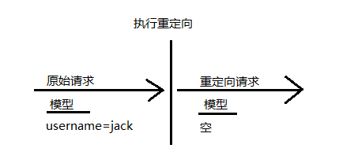
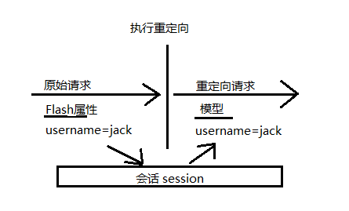

[TOC]



当控制器的结果是重定向的话，原始的请求就结束了，并且会发起一个新的GET请求，原始请求中所带有的模型数据也会消失。


spring为我们提供了两种方式来实现请求重定向传递模型数据。


# 1 通过URL模版进行重定向

```
@PostMapping("/originalUrl")
public String solution_1(User user,Model model){
    service业务处理
    model.addAttribute("username",user.getName());
    model.addAttribute("id","user.getId()");
    return "redirect:/newUrl/{username}";
}
```

如果username的属性为"liuxindong"，id属性为"123"，那么重定向后的url为 "/newUrl/liuxindong?id=123"。


# 2 使用flash属性



代码示例:

```
@PostMapping("/originalUrl")
public String fun01(User user,RedirectAttributes model){    //RedirectAttributes是Model的一个子接口,添加了flash属性的相关方法
    service 业务处理
    model.addFlashAttribute("user",user);    //将user实体flash到model中
    return "redirect:/newUrl";
}

@PostMapping("/newUrl")
public String fun02(Model model){
    service 业务处理
    User user = model.getAttribute("user");  // 此处可直接获取上面flash设置的user实体
    return "finallyView";
}
```