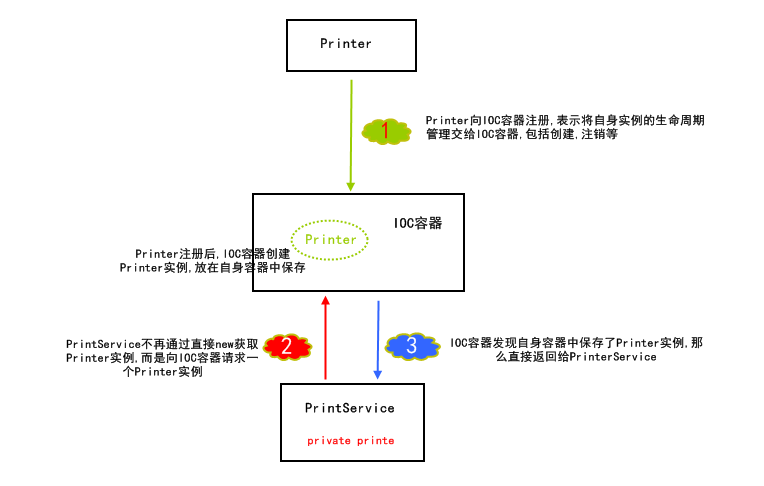
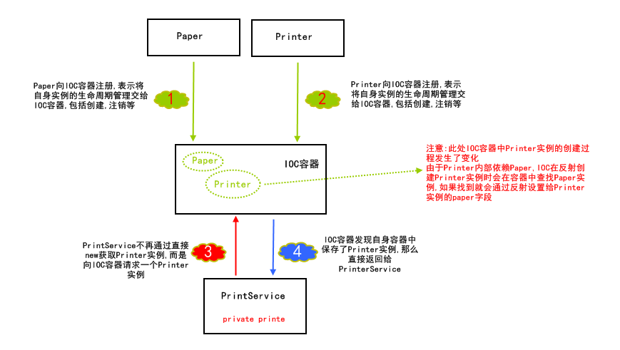
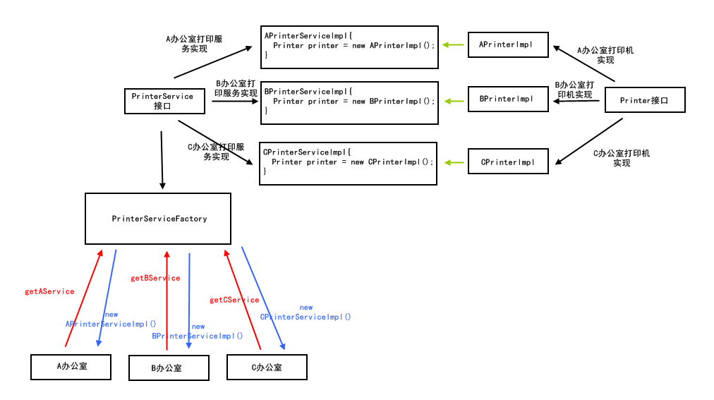
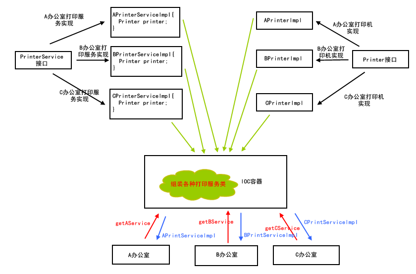

[TOC]


# 1 IOC

## 1.1 IOC出现前


假设，我们有一个服务类Printer，该类表示一个打印机，具有打印文件的功能：

```
public class Printer {
    
    public void print(String filename){
        // doPrint....
    }
    
}
```


此时，我们创建了一个打印服务类PrintService，这个服务类提供给客户端打印功能，但是其打印功能是通过Printer打印机来实现的：

```
public class PrintService {
    
    private Printer printer;
    
    public void print(String filename){
        printer.print(filename);
    }
    
}
```


在IOC之前，PrintService中是通过new来创建printer依赖的，如下图图示:


## 1.2 IOC出现后

首先，我们要先初步了解下什么是IOC，IOC又叫控制反转，IOC是一种思想，在技术上主要是通过一个容器实现，对于我们的应用来说，这个容器又被称为第三方容器。下面就通过图示来演示IOC是如何改变PrintService和Printer之间的依赖方式的。

在查看图示的过程中，思考“控制反转”这个定义中，”控制”是什么？谁控制了谁？“反转”又是什么？什么被反转了？



**“控制”是什么? 谁控制了谁?**

很明显，IOC控制了Printer，控制的是其生命周期，包括创建、注销等都由IOC来控制。


**“反转”是什么?什么被反转了?**

很明显，PrintService获取Printer实例的方式改变了，不再主动直接创建，而是向IOC容器请求Printer实例，然后被动等待IOC容器返回Printer实例。也就是PrintService获取Printer实例的方式被反转了。


看到这里，你可能会疑问：DI在哪里？大家不总是把IOC和DI放在一起讨论吗？


# 2 DI

在上面的简单示例中，并没有设计到DI（依赖注入），下面，我们将上面的示例做一个小小的扩展，来讲解什么是DI。

对于打印机Printer，在打印时是需要纸的，这样才能将文件上的内容写到纸上，也就是说，Printer依赖一个代表纸的类Paper：

```
public class Paper {
    
    public void write(String content){
        //将文件内容写到纸上
    }
    
}
```


此时Printer类为：

```
public class Printer {
    
    private Paper paper;

    public void print(String filename){
        // doPrint....
        paper.write("从文件读取的内容");
    }

}
```


这时，我们来通过图示了解DI的过程：



在图示中，我们可以知道，IOC容器不仅完成了Printer实例的创建，而且完成了其内部属性paper的组装，这个组装就被称为"依赖注入"，能实现这个组装功能的前提是Paper类也向IOC容器注册了，交出了自身实例的控制权。否则，IOC容器是无法创建Paper实例，进而组装到Printer中的。


# 3 IOC和DI带来的优势

## 3.1 解耦合


通过上面的图示，可以看到，使用了IOC后，服务类PrintService和打印机Printer不再需要自己去维护内部的依赖，而是向IOC容器请求或者全权交给IOC容器来完成。这在开发中带来的巨大优势就是解耦合，例如客户端和服务端，客户端不需要关心自身依赖的服务端是如何实现的以及如何创建的，只需要向IOC容器请求即可，而服务端也不再需要关心自己内部依赖组件是如何创建或者实现的，它只需要声明自己需要这些组件，至于组装工作则完全交给IOC容器完成。


## 3.2 更强的扩展性


上面PrintService和Printer示例只展示了一对一依赖的情况，考虑下面的场景：公司有3个办公室A、B、C，每个办公室都有一台打印机，为每个办公室提供一个打印服务，要求打印服务和打印机都有一定的拓展性，此时我们可能很容易的想到使用接口和工厂模式来实现，如下图：



在上面的图示中，各个打印服务实现类以及打印服务工厂中都是用硬编码的方式为不同的办公室提供打印服务。我们假设A办公室的打印机是一台惠普打印机，如果该打印机坏掉了，我们更换了一台新的联想打印机，那么此时A办公室的打印服务实现APrinterServiceImpl中的printer就不可用了，我们需要修改代码来更换成新的可用的联想打印机，这样就影响了程序的扩展性。

如果使用了IOC容器呢？




如图所示，IOC容器完成所有打印服务的组装，如果A办公室的打印机故障，也就是APrinterImpl实例不可用了，那么只需要重新注册A办公室打印机实现即可，将注册实现类修改为新的可用的联想打印机（如ALenovePrinterImpl）即可。这样就不需要修改任何一方的源代码，只需要重新注册A办公室打印服务即可，而IOC容器的注册是可以通过配置文件实现的，如spring可以通过xml配置文件注册类，这样就不用修改源代码。