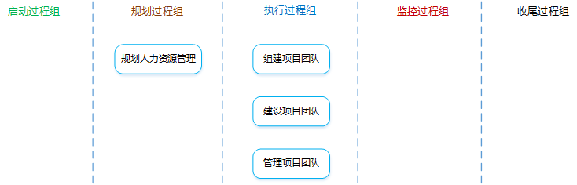
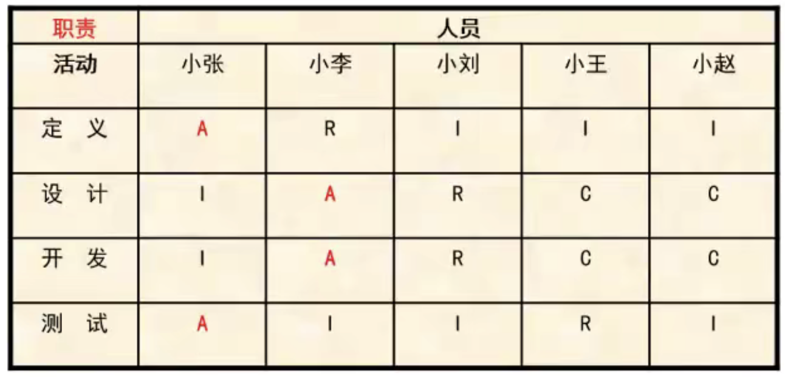
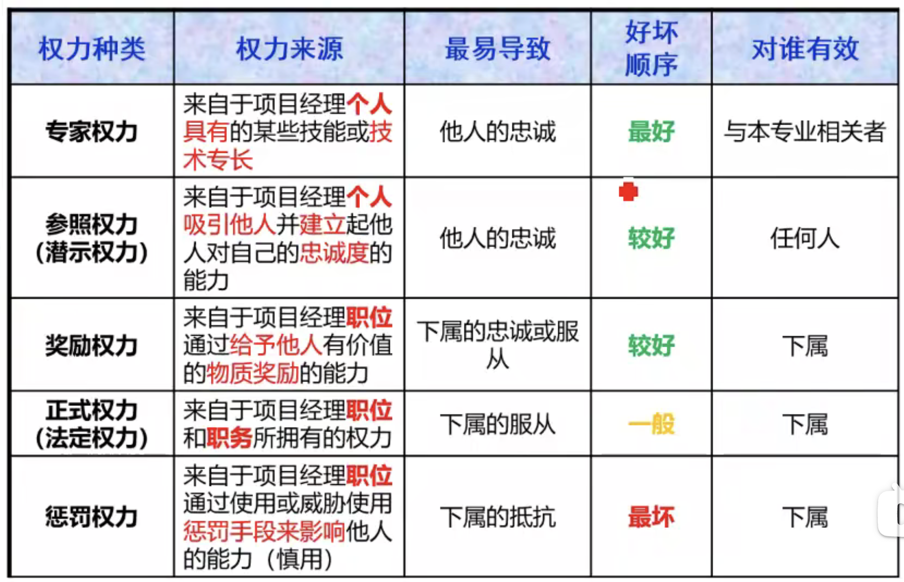
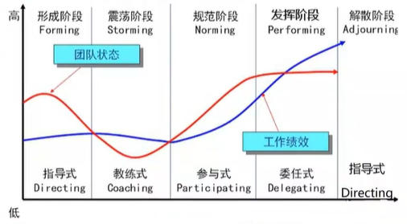

[TOC]

**项目人力资源管理**

**项目人力资源管理是什么**？：根据项目需要规划并组建项目团队，对团队进行有效的指导和管理，以保证他们可以完成项目任务，实现项目目标。

**冲突和竞争：**

- 冲突

  双方在目标上互不相容和互相排斥，从而产生心理或行为上的矛盾。

  冲突不一定有害，要解决和减少有害冲突，利用有益冲突。

- 竞争

  双方目标相同，不会发生势不两立的争夺。

**领导者和管理者：**

- 领导者

  确定方向、统一思想、激励和鼓舞。

- 管理者

  负责某件事情的管理或实现某个目标。

# 1 规划人力资源管理

**是什么？**：识别和记录项目角色、职责、所需技能、报告关系，并编制人员配备管理计划的过程。

**有什么作用？**：建立项目角色与职责、项目组织图、人员配备管理计划（包含人员招募和遣散时间表）。

## 输入

1. 项目管理计划

2. **活动资源需求**

   根据活动资源需求来确定项目所需的人力资源，明确对项目团队成员及其能力的初步需求，并不断渐进明细。

3. 事业环境因素

4. 组织过程资产

## 工具与技术

1. **组织图和职位描述**

   可采用多种格式（层级型、矩阵型、文本型）来记录团队成员的角色与职责。要确保每个工作包都有明确的责任人，确保全体团队成员都清楚地理解其角色和职责。

   - **层级型**

     组织分解结构（OBS），对项目组织层级分解，用于查看每个部门的项目职责、活动和负责的工作包。

   - **矩阵型**

     责任分配矩阵（RAM）是用来显示分配给每个工作包的项目资源的表格。

     在大型项目中，可以指定多个层次的RAM：高层次RAM可定义项目团队中的各小组分别负责WBS中的哪部分工作；低层级RAM可在各小组内为具体活动分配角色、职责和职权。

     RACI矩阵（R：执行，A：负责，C：咨询，I：知情）是一种RAM矩阵，如下图所示，它对明确划分角色和期望特别有用。在RACI中，每个活动只可能有一个“A”。

     

   - **文本型**

     通常以概述的形式，提供诸如职责、权职、能力和资格等方面的详细信息。

2. 人际交往

3. 组织理论

## 输出

1. **人力资源管理计划**

   **是什么？**：提供了关于如何定义、配备、管理及最终遣散项目人力资源的指南。

   **包含哪些内容？**：

   - **项目组织图**

     以图形方式展示项目团队成员及其报告关系。

   - **角色和职责**

     角色：在项目中，某人承担的职务。

     职权：使用项目资源、做出决策、签字批准、验收可交付成果等可影响他人开展项目工作的权利。

     职责：必须履行的职责和工作。

     能力：需要具备的技能和才干。

     **项目经理5种权利**：

     

   - **人员配备管理计划**

     **是什么？**：人力资源管理计划的组成部分，说明将在何时、以何种方式获得项目团队成员，以及他们需要在项目中工作多久。它描述了如何满足项目对人力资源的需求。

     **包含哪些内容？**：

     - 人员招募
     - 资源日历
     - 人员遣散计划
     - 培训需要
     - 认可和奖励
     - 合规性
     - 安全

# 2 组建项目团队

**是什么？**：确认人力资源的可用情况，并为开展项目活动而创建团队的过程。

**有什么作用？**：指导团队选择和职责分配，组件一个成功的团队。

**注意事项**：

- 应该进行有效谈判，影响那些能为项目提供所需人力资源的人员。
- 不能获得项目所需的人力资源或人员能力不足会降低项目成功的概率，甚至可能导致项目取消。
- 无法获得所需人力资源，项目经理或项目团队可能不得不使用替代资源（也许能力较低）。

## 输入

1. 人力资源管理计划
2. 事业环境因素
3. 组织过程资产

## 工具与技术

1. **预分派**

   **是什么？**：如果项目团队成员是事先选定的，那么他们就是预分派的。

   **什么情况下可能使用？**：

   - 竞标过程中承诺分派。

   - 项目取决于特定人员的专有技能。

   - 项目章程中指定。

2. **谈判**

   **有哪些谈判对象？**：

   - 职能经理

     获得具备适当能力的人员。

   - 组织中其他项目管理团队

     获得稀缺或特殊人力资源。

   - 外部组织

     获取执行组织不能提供的人力资源，可能是稀缺的，也可能是普通的。

3. **招募**

   **是什么？**：执行组织不能提供，需从外部获取，包括雇佣或工作分包（一般是获取具备适当能力的人员）。

4. **虚拟团队**

   **是什么？**：具有共同目标、在完成角色任务的过程中很少或者没有时间面对面工作的一群人。

   **优点**：可以将不同地理位置、有特殊技能、在家办公、行动不便者或残疾人、工作时间不同的员工纳入项目团队，另外可以节约差旅费等成本。

   **缺点**：可能产生误解，有孤立感，团队成员之间难以分享知识和经验，所以团队的沟通规划非常重要。

## 输出

1. **项目人员分派**

   **是什么？**：把合适的人员分派到团队，把人员姓名插入项目组织图和进度计划等。其实它就是具体的人员清单。

   与之相关的文件是项目团队名录和通讯录。

2. **资源日历**

   **是什么？**：记录每个项目团队成员在项目上的工作时间段与休假时间。

3. 项目管理计划更新

# 3 建设项目团队

**是什么？**：是提高工作能力，促进团队成员互动，改善团队整体氛围，以提高项目绩效的过程。

**有什么作用？**：改进团队协作，增强人际技能，激励团队成员，降低人员离职率，提升整体项目绩效。

**注意事项**：项目经理应请求管理层提供支持，并（或）对相关干系人施加影响，以获得建设高效项目团队所需的资源。

## 输入

1. **人力资源管理计划**
2. **项目人员分派**
3. **资源日历**

## 工具与技术

1. 人际关系技能

   **是什么？**：因富有情商，并熟练掌握沟通技巧、冲突解决方法、谈判技巧、影响技能、团队建设技能和团队引导技能，而具备的行为能力。

2. **培训**

   **是什么？**：包括旨在提高项目团队成员能力、减少成员之间差异的全部活动。

   如果项目团队成员缺乏必要的管理或技术技能，可以将相关的培训作为项目工作的一部分。

   培训成本通常要包含在项目预算中。

3. **团队建设活动**

   **是什么？**：旨在帮助各团队成员更加有效地促进协同工作、有助于建立信任和良好的工作关系。

   如果团队成员的工作地点相隔甚远，无法进行面对面接触，就特别需要有效的团队建设策略。

   团队建设是一个持续性过程。

4. **基本规则**

   **是什么？**：对项目团队成员的可接受行为做出明确规定，有利于减少误解、提高生产力、形成一致的价值观。

5. **集中办公**

   **是什么？**：将大部分或者全部项目团队成员安排在同一个物理地点办公，有助于增进沟通、加强集体感。

6. **认可与奖励**

   最初的奖励计划是在规划人力资源管理过程中编制的。

   当人们感受到自己在组织中的价值，并且可以通过获得奖励来体现这种价值，他们就会受到激励。

   只有能满足被奖励者的某个重要需求的奖励，才是有效的奖励。决定认可与奖励时，应考虑文化差异。

   可以正式或非正式的方式做出奖励决定，但不要授权别人颁发奖励，以免被人误以为不重视。

   通常，金钱是奖励制度中的有形奖励，然而也存在各种同样有效、甚至更加有效的无形奖励。

   应该在整个项目生命周期中尽可能地给予表彰，而不是等到项目完成时。

   认可与奖励应针对每个人能做到的行为。
   
7. 期望理论

   弗鲁姆的期望理论：一种行为倾向的强度取决于个人对于这种行为可能带来的结果的期望度，以及这种结果对个人的吸引力。

8. 人事测评工具

   能让项目经理洞察团队成员的优势和劣势，评估他们的偏好和愿望。如360度反馈（360度绩效考核法、全方位考核法）

## 输出

1. **团队绩效评价**

   **如何做？**：基于项目技术成功度、项目进度绩效和成本绩效来评价团队绩效。

   **包含哪些指标？**：

   - 个人技能的改进
   - 团队能力的改进
   - 团队成员离职率的降低
   - 团队凝聚力的加强

2. 事业环境因素更新

# 4 管理项目团队

**是什么？**：是跟踪团队成员工作表现，提供反馈，解决问题并管理团队变更，以优化项目绩效的过程。

**有什么作用？**：影响团队行为，管理冲突，解决问题，并评估团队成员的绩效。

## 输入

1. 人力资源管理计划

2. 项目人员分派

3. **团队绩效评价**

   不断地评价项目团队绩效，有助于采取措施解决问题，调整沟通方式，解决冲突和改进团队互动。

4. **问题日志**

   记录问题、负责人、解决时间等，并监督解决情况。

5. **工作绩效报告**

   绩效报告中的信息，有助于确定未来的人力资源需求，开展认可与奖励，以及更新人员配置管理计划。

6. 组织过程资产

## 工具与技术

1. **观察和交谈**

   通过观察和交谈，随时了解项目团队成员的工作和态度。

2. **项目绩效评估**

   **有什么作用？**：

   - 澄清角色与职责
   - 提供建设性反馈
   - 发现未知或未决问题
   - 制定个人培训计划
   - 确立未来目标

3. **冲突管理**

   **产生冲突的原因？**：进度计划、项目优先级、资源、技术意见及绩效的权衡、行政管理程序、成本估算、个性。

   **解决步骤？**：

   - 首先由项目团队成员负责解决。
   - 冲突升级，项目经理应该协助解决（私下处理）。
   - 如果破坏性冲突仍然存在，则可以使用正式程序，包括采取惩戒措施。

   **解决方法？**：

   - 撤退/回避

     退出冲突、将问题推迟或者推给他人解决。

   - 缓和/包容

     强调一致而非差异。

   - 妥协/调解

     各退一步，各方在一定程度上满意。

   - 强迫/命令

     推行某一方的观点，通常用来强行解决紧急问题。

   - 合作/解决问题

     合作的态度和开放式对话引导各方达成共识和承诺，是能够真正解决问题的最佳方式。

4. 人际关系技能

## 输出

1. 变更请求
2. 项目管理计划更新
3. 项目文件更新
4. 事业环境因素更新
5. 组织过程资产更新

# 补充知识点

## 塔可曼 - 阶梯理论

塔可曼阶梯理论将团队建设分为5个阶段：

- **形成阶段**

  相互认识、相互独立、不一定开诚布公。

- **震荡阶段**

  冲突、矛盾、不同的观点和意见。

- **规范阶段**

  开始协同工作、开始相互信任。

- **发挥阶段（成熟阶段）**

  组织有序、相互依靠、平稳高效。

- **解散阶段**

  释放人员、释放团队。

尽管这些阶段通常按顺序进行，但是团队也可能停滞在某个阶段或者退回到之前的阶段（在软考中，如果新增加团队成员，一律按照退回到形成阶段处理）；如果团队成员曾经共同工作过，也可能直接跳过某个阶段。

## 马斯洛 - 需求层次理论

人有五个层次的需求，从低到高分别是：

- **生理需求**
  相应的激励措施：工作餐、工作服、员工宿舍、班车、工资...

- **安全需求**

  相应的激励措施：长期劳动合同、社保...

- **社交需求**

  相应的激励措施：定期员工活动、聚餐、比赛、俱乐部...

- **尊重需求**

  相应的激励措施：形象、地位提升、奖章、荣誉性奖励...

- **自我实现需求**

  相应的激励措施：参与决策、管理、成为智囊团...

## 赫兹伯格 - 双因素理论

有两类因素会决定人的行为：

- **保健因素**

  是导致不满足感的因素，这些因素做得好不会提高激励，做得不好就会损害激励。

  相当于马斯洛需求层次中较低层次的需求（生理需求、安全需求、社交需求）。

  比如：工作环境或条件、工资、同事或上下级关系、个人生活、安全、职务等。

- **激励因素**

  是导致满足感的因素，能够真正起激励作用。

  相当于马斯洛需求层次中较高层次的需求（尊重需求、自我实现需求）。
  
  比如：成就感、责任感、得到认可和赞赏、挑战性和兴趣、发展前途、个人成长等。

## 麦格雷戈 - X理论和Y理论

- **X理论**

  认为人是消极懒惰的，缺乏进取心，总是逃避责任。

  X理论认为总能用低层次的需求进行激励。

- **Y理论**

  认为人是积极的，愿意进步，愿意承担责任。

  Y理论认为人更应该受到高层次需求的激励。
