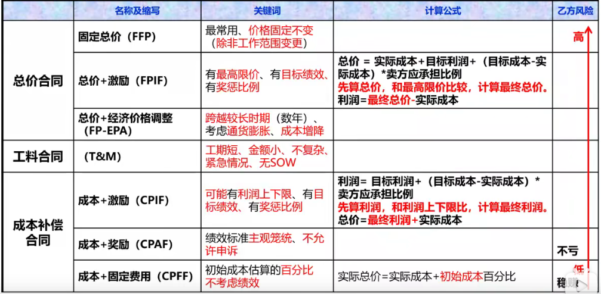

[TOC]

# 1 合同分类

- **按照项目范围划分**

  1. **总承包合同**

     **定义**：买方将项目的全过程作为一个整体发包给同一个卖方的合同。

     **理解**：对于某一项目来说，只与一个乙方订立合同，但是可能不止一份合同。

  2. **单项承包合同**

     **定义**：一个卖方只承包某一项或某几项内容，买方分别于不同卖方订立合同。

     **理解**：对于某一份合同来说，可以有多个乙方。

  3. **分包合同**

     **定义**：经合同约定和卖方认可，卖方将其承包项目的某一部分或某几个部分（非项目的主体结构）再发包给具有相应资质条件的分包方而订立的合同。若分包的项目出现问题，买方即可要求卖方、也可直接要求分包方承担责任。

     **理解**：① 买方认可。② 分包部分必须非主体。③ 不能转包整个项目。④ 分包方必须具备相应资质。⑤ 不能再次分包。

- **按项目付款方式划分**

  1. **总价合同**

     为既定产品、服务或成果的采购设定一个总价。适用于已明确定义需求，且不会出现重大范围变更的情况下使用。

     其又细分为以下三种：

     - **固定总价合同（FFP）**

       **定义**：采购价格在一开始就确定，并且不允许改变（**除非工作范围发生变更**）。

       **理解**：最常用，大多数买方都喜欢。但是买方应该准确定义拟采购的产品和服务，对采购规范的任何变更都会增加买方的成本。

       卖方有义务完成工作，并且承担因不良绩效导致的任何成本增加。

     - **总价加经理价格调整合同（FPEPA）**

       **定义**：允许根据条件变化（如通货膨胀、某些特殊商品的成本增降），以事先确定的方式对合同价格进行最终调整。

       **理解**：虽然合同价格可调整，但是要事先确定好调整的规则，适用于卖方履约期跨越几年、买方以不同货币支付价款等情况。

     - **总价加激励费用合同（FPIF）**

       **定义**：允许一定的绩效偏离，并对实现既定目标给与相关的财务奖励（通常取决于卖方的成本、进度或技术绩效）。但是，要设置价格上限，卖方必须完成工作并且承担高于上限的全部成本。

       **计算**：

       - 涉及要素

         目标成本（估算成本）、目标利润（目标费用）、实际成本、实际利润、分摊比例（买方/卖方，如 80/20 表示买方承担80%，卖方承担20%）

       - 公式
         $$
         \mathbf{总价 = 实际成本 + [目标利润 + (目标成本 - 实际成本) * 卖方分摊比例]} \\
         \mathbf{最终总价 = \begin{cases}
         \mathbf{最高限价\ \ \ (总价>=最高限价)} \\
         \mathbf{总价\ \ \ \ \ \ \ \ \ \ (总价<最高限价)} \\
         \end{cases}} \\
         \mathbf{实际利润 = 最终总价 - 实际成本}
         $$

  2. **成本补偿合同**

     向卖方支付为完成工作而发生的全部合法实际成本（可报销成本），外加一笔费用作为卖方的利润。适用于工作范围预计会在合同执行期间发生重大变更的情况。

     其又细分为以下两种：

     - **成本加固定费用合同（CPFF）**

       **定义**：为卖方报销履行合同工作缩放生的一切可列支成本，并向卖方支付一笔固定费用，该费用以项目初始成本估算的某一百分比计算。

       **理解**：A公司为B公司提供产品，他们签订了成本加固定费用合同，合同规定了130万的目标成本，利润10%，项目实际成本为140万，那么B公司应支付多少钱？**140 + （130 x 10%）= 153** 万

     - **成本加奖励费用（CPAF）**

       **定义**：为卖方报销一切合法成本，但只有卖方满足合同规定的、某些笼统主管的绩效标准下，才向卖方支付大部分费用。

       **理解**：完全由买方根据自己对卖方绩效的主管判断来决定奖励费用，并且通常不允许申诉。

     - **成本加激励费用（CPIF）**

       **定义**：为卖方报销履行合同工作缩放生的一切可列支成本，并在卖方达到合同规定的绩效目标时，向卖方支付预先确定的激励费用。

       与总价加激励费用相比，不存在总价上的最高限价，但是有时会出现利润的最高限价或最低限价。

       **计算**：

       - 涉及要素

         目标成本（估算成本）、目标利润（目标费用）、实际成本、实际利润、分摊比例（买方/卖方，如 80/20 表示买方承担80%，卖方承担20%）

       - 公式
         $$
         \mathbf{利润 = 目标利润 + (目标成本 - 实际成本) * 卖方分摊比例} \\
         \mathbf{最终利润 = \begin{cases}
         \mathbf{利润上限\ \ \ (利润>=利润上限)} \\
         \mathbf{利润\ \ \ \ \ \ \ \ \ \ (利润下限<利润<利润下限)} \\
         \mathbf{利润下限\ \ \ (利润<=利润下限) }
         \end{cases}} \\
         \mathbf{最终总价 = 最终利润 + 实际成本}
         $$

  3. **工料合同（T&M）**

     兼具成本补偿合同和总价合同的某些特点的混合型合同。适用于无法快速编制出准确的工作说明书、金额小、工期短、不复杂的项目。

     这类合同与成本补偿合同的相似之处在于，它们都是开口合同，合同价因成本增加而变化。

     在授予合同时，买房可能并未确定合同的总价值和采购的准确数量。

     很多组织要求在工料合同中规定最高价值和时间限制，以防止成本无限增加。

     由于合同中确定了一些参数，工料合同又与固定单价合同相似。

     预先设定了单位人力或材料费率（包含卖方利润）。

     买方承担工作量变动的风险，卖方承担单价风险。

**合同汇总**

# 2 合同选择标准

- 看范围
  - **初始范围明确，不会重大改变** $\Rightarrow$​ 总价合同
  - **初始范围明确，会变化** $\Rightarrow$ 成本补偿合同
  - **初始范围不明确** $\Rightarrow$ 工料合同
  - **购买标准产品、数量不大** $\Rightarrow$ 订购单
- 风险承担
  - **甲方承担** $\Rightarrow$ 成本补偿合同
  - **双方承担** $\Rightarrow$ 工料合同
  - **乙方承担** $\Rightarrow$ 总价合同

# 3 合同的内容

- 项目名称
- 标的内容和范围
- 计划、进度、地点、方式
- 各种期限
- 价款、报酬及支付方式
- 质量要求
- 风险承担方式
- 验收的标准和方法
- 技术成果的归属
- 保密协议
- 违约条款
- 解决争议的方法
- 名词术语解释

# 4 合同管理过程

1. **合同变更管理**

   当事人一方要求修改合同时，应首先向另一方用书面的方式提出。

   另一方当事人在收到有关变更项目合同的申请后，应及时做出书面答复。

2. **合同签订管理**

   签订合同前要做好以下工作：

   - 最好市场调查
   - 进行潜在合作伙伴或竞争对手的资信调查。
   - 了解相关环境，做出正确的风险分析判断。

3. **合同履行管理**

   合同争议、合同违约、合同索赔等处理。

   解决争议的办法：谈判（协商）、替代争议解决（调节、仲裁）、诉讼。

   如果约定了仲裁且约定了仲裁裁决的终局性，就不能向法院提起诉讼。

4. **合同档案管理**

   是整个合同管理的基础。

   可以使用合同档案管理系统对合同文件和记录进行管理。

# 5 合同索赔分类

- **工期索赔**

  不可抗力、买方造成延期。

- **费用索赔**

  买方造成延期

# 6 合同索赔流程

1. **提出索赔要求**

   索赔事项发生后的28天内，由监理工程师正式提出。

2. **报送索赔资料**

   索赔通知书发出后的28天内，向监理工程师提交索赔报告及有关资料。

3. **监理工程师回复**

   监理工程师在收到索赔报告后的28天内给予答复。如果逾期未回复，则视为已认可。

4. **持续索赔**

   索赔事件持续进行时，索赔方应阶段性发出索赔意向。在索赔事件终了后的28天内，向监理工程师提交最终索赔报告。

5. **总裁与诉讼**

   对于监理工程师对索赔的答复不能接收的话，可由政府建设主管机构进行调解。如果仍调解不成，则由经济合同仲裁委员会进行仲裁或直接提起诉讼。

