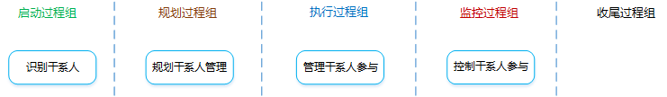
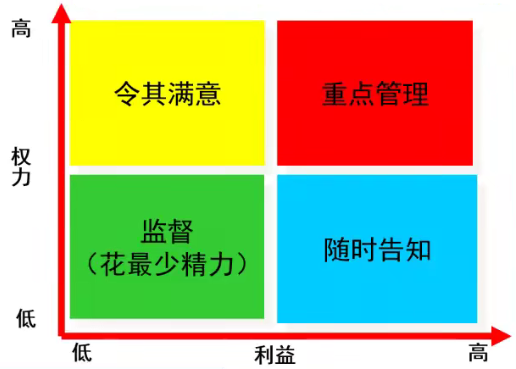
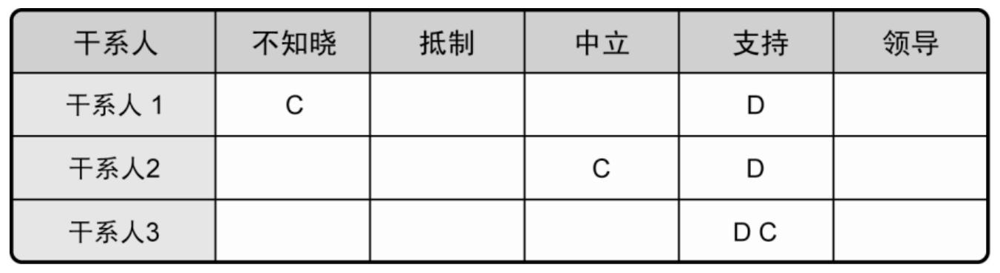

[TOC]

**项目干系人管理**

**项目干系人管理是什么**？：对项目干系人需求、希望和期望的识别，并通过沟通上的管理来满足其需要、解决其问题的过程。

# 1 识别干系人

**是什么？**：识别能影响项目或者受项目影响的全部人员、群体或组织，分析干系人对项目的期望和影响。

应按照干系人的利益、影响力和参与项目的程度对其进行分类。

应该全过程识别干系人，定期审查和更新。

**有什么作用？**：帮助项目经理建立对各个干系人或干系人群体的适度关注。

## 输入

1. **项目章程**

2. **采购文件**

   合同各方都是关键的项目干系人，也应该把其他相关方（如供应商）视为项目干系人。

3. 事业环境因素

4. 组织过程资产

## 工具与技术

1. **干系人分析**

   **是什么？**：识别出干系人的利益、期望和影响，并把他们与项目的目的联系起来。

   

   **分析步骤？**：

   - 识别全部潜在项目干系人及其相关信息。
   - 分析每个干系人可能的影响和支持，并把他们分类，以便制定管理策略。
   - 评估关键干系人对不同情况可能做出的反应或应对，策划提高支持，减轻影响。

   

   **干系人权力/利益方格**：

   

2. 专家判断

3. 会议

## 输出

1. **干系人登记册**

   **是什么？**：用于记录已识别的干系人的所有详细信息。

   

   **包含哪些内容？**：

   - **基本信息**

     姓名、职位、地点、显目中角色、联系方式等。

   - **评估信息**

     主要需求、主要期望、影响、与生命周期的哪个阶段最为紧密等。

   - **干系人分类**

     内部/外部、正面/中立/负面、上级/下级/外围/横向、四象限（重点/观察）等。

# 2 规划干系人管理

**是什么？**：是基于对干系人需要、利益及对项目成功的潜在影响的分析，制定合适的管理策略，以有效调动干系人参与整个项目生命周期的过程。

**有什么作用？**：为与项目干系人的互动提供清晰且可操作的计划，以支持项目利益。

## 输入

1. 项目管理计划
2. 干系人登记册
3. 事业环境因素
4. 组织过程资产

## 工具与技术

1. 专家判断

2. 会议

3. **分析技术**

   **干系人参与评估矩阵**：

   C—当前参与程度，D—所需参与程度

   

## 输出

1. **干系人管理计划**

   **是什么？**：为有效调动干系人参与而规定所需的管理策略。

   

   **包含哪些内容？**：

   - 干系人登记册中的资料。
   - 关键干系人所需参与程度和当前参与程度。
   - 干系人变更的范围和影响。
   - 干系人之间的相互关系和潜在交叉。
   - 项目现阶段的干系人沟通需求。
   - 需要分发给干系人的信息，包括语言、格式、内容和详细程度。
   - 分发相关信息的理由，以及可能对干系人参与所产生的影响。
   - 向干系人分发所需信息的时限和频率。
   - 随着项目的进展，更新和优化干系人管理计划的办法。

2. 项目文件更新

# 3 管理干系人参与

**是什么？**：在整个项目生命周期中，与干系人进行沟通和协作，以满足其需要与期望，解决实际出现的问题，促进干系人合理参与项目活动的过程。

**有什么作用？**：帮助项目经理提升来自干系人的支持，并把干系人的抵制降到最低，显著提高项目成功的机会。

**包含哪些活动？**：

1. 调动干系人适时参与项目。
2. 管理干系人的期望。
3. 尽早识别和处理尚未成为问题的干系人关注点，以便评估相关的项目风险。
4. 澄清和解决已识别出的问题。

## 输入

1. 干系人管理计划

2. 沟通管理计划

3. **变更日志**

   变更日志用于记录项目期间发生的变更，应该与适当的干系人就这些变更及其对项目时间、成本和风险等的影响进行沟通。

4. 组织过程资产

## 工具与技术

1. 沟通方法

2. **人际关系技能**

   应用人际关系技能来管理干系人的期望，例如：建立信任、解决冲突、积极倾听、克服变更阻力。

3. **管理技能**

   应用管理技能来协调各方以实现项目目标，例如：引导人们对目标达成共识、施加影响支持项目、谈判达成共识、调整组织行为、接受成果。

## 输出

1. **问题日志**

   问题日志用于记录和监督问题的解决，应随新问题的出现和老问题的解决而动态更新。

   **三要素**：

   - 问题
   - 责任人
   - 解决期限

2. 变更请求

3. 项目管理计划更新

4. 项目文件更新

5. 组织过程资产更新

# 4  控制干系人参与

**是什么？**：全面监督项目干系人之间的关系，调整策略和计划，以调动干系人参与的过程。

**有什么作用？**：随着项目进展和环境变化，维持并提升干系人参与活动的效率和效果。

## 输入

1. 项目管理计划
2. 问题日志
3. 工作绩效数据
4. 项目文件

## 工具与技术

1. 信息管理系统
2. 专家判断
3. 会议

## 输出

1. 工作绩效信息
2. 变更请求
3. 项目管理计划更新
4. 项目文件更新
5. 组织过程资产更新
