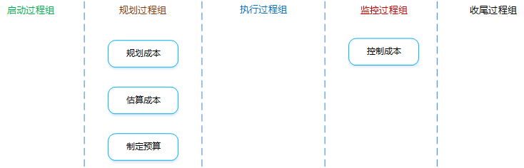
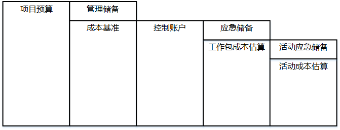
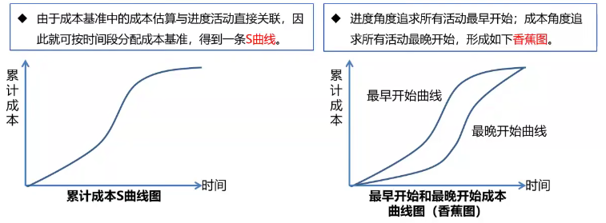
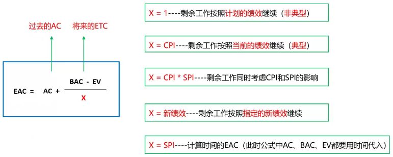
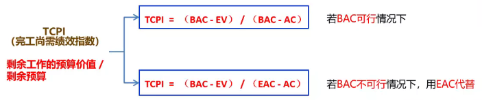

[TOC]

**项目成本管理**

**项目成本管理**：确保在批准的预算内完成项目。重点关注完成项目活动所需资源的成本，同时也要考虑项目决策时对项目产品、服务或成果的使用成本、维护成本和支持成本的影响。

# 1 规划成本管理

**是什么？**：为规划、管理、花费和控制项目成本而制定政策、程序和文档的过程。

**有什么作用？**：在整个项目中为如何管理项目成本提供指南和方向。

## 输入

1. **项目管理计划**

   需要使用其中的范围基准、进度基准等。

2. **项目章程**

   包含“项目总体预算”的描述。

3. **事业环境因素**

   发布的商业信息。经常可以从商业数据库中获取资源成本费率及相关信息。

4. 组织过程资产

## 工具与技术

1. 专家判断

2. 分析技术

3. **会议**

   项目团队可能举行规划会议来指定成本管理计划。参会人员可能是项目经理、项目发起人、选定的项目团队成员、选定的干系人、项目成本负责人，以及其他必要成员。

## 输出

1. **成本管理计划**

   **是什么？**：描述将如何规划、安排和控制项目成本。成本计划无成本。

   **包含哪些内容？**：

   - **计量单位**

     每种资源的计量单位。比如：时间计量用“人天”，数量计量用吨、千米等。

   - **准确度**

     为活动成本估算规定一个可接受的区间（如 $\pm10\%$），其中可能包括一定数量的应急储备。

   - **精确度**

     根据活动范围和项目规模，设定成本估算向上或向下取整的程度。

   - **组织程序链接**

     在项目成本核算中使用的WBS组件，称为控制账户（CA）。每个CA都有唯一的编码或账号，直接与执行组织的会计制度相联系。

   - **控制临界值**

     项目执行中，采取某种措施前，允许出现的最大成本偏差。通常用偏离基准计划中的参数的某个百分数来表示。

   - **绩效测量规则**

     需要规定用于绩效测量的挣值管理（EVM）规则或其他测量规则。

# 2 估算成本

**是什么？**：对完成项目活动所需资金进行近似估算的过程。

**有什么作用？**：确定完成项目工作所需的成本数额。

**知识点**：

1. **成本估算的单位**

   - 某种货币单元（美元、人民币等），通常使用。

   - 其他计量单位（人天等），这是为了消除通货膨胀的影响。

2. **估算的准确性**

   - 粗略量级估算（$-25\%$ 到 $+75\%$）

   - 确定性估算（$-5\%$ 到 $+10\%$）

3. 在项目生命周期中，项目估算并不是一成不变的，并且随着项目的进展其准确性逐步提高。

4. 进行项目估算时，应考虑将向项目收费的全部资源（如特殊的：通货膨胀补贴、融资成本或应急成本等）。

**成本估算的主要步骤？**：

1. 识别并分析成本的构成科目。

   确定资源（人、设备、材料等）的种类。

2. 估算每一科目的成本大小。

   可以使用不同的单位，估算时需要考虑通货膨胀以及货币的时间效应。

3. 分析成本估算结果，找出各种可以相互替代的成本，协调各种各种成本之间的关系。

   找寻低成本的替代方案，尽可能降低总成本。应急储备和管理储备不应被裁减。

## 输入

1. **成本管理计划**

   其中有“估算成本活动的方法和需要达到的准确度”的描述。

2. **人力资源管理计划**

   其中有“项目人员配备情况、人工费率和相关奖励方案”的描述，是估算成本必须考虑的因素。

3. **范围基准**

   范围说明书中的“假设条件、制约因素”、WBS词典中的“可交付成果详细信息”、范围基准中的“合同和法律有关的信息”都需要在进行成本估算时加以考虑。

4. **项目进度计划**

   在以下情况下，活动持续时间估算会对成本估算产生影响，需要加以考虑：

   - 项目预算中包含融资成本（如利息）。
   - 资源消耗取决于活动持续时间的长短（如管理费）。
   - 成本估算中包含时间敏感型成本（如价格随季节波动的材料）。

5. **风险登记册**

   考虑应对风险所需的成本。

6. 事业环境因素

7. 组织过程资产

## 工具与技术

1. 专家判断

2. **类比估算**

   参照过去，估算当前。也是一种专家判断、也是整体估算、也是自上而下的。

   关键词：成本低、耗时少、准确性低、详细信息不足时、需要快速得到结果时、启动阶段时。

3. **参数估算**

   利用历史数据之间的统计关系和其他变量来估算。回归分析是典型的参数估算。

   关键词：统计关系、参数模型、基础数据。

4. **自下而上估算**

   估算个体，逐层汇总。

   自下而上估算的准确性及其本身所需的成本，通常取决于单个活动或工作包的规模和复杂程度。

5. **三点估算**

   关键词：考虑不确定性与风险、提高估算准确性。

6. **储备分析**

   只估算“应急储备”。

   <table>
       <tr>
           <td rowspan=2 align="center">已知风险（能识别）</td>
           <td align="center">已知 （能事先规划应对）</td>
           <td align="center">事先应对</td>
           <td align="center">估算成本</td>
           <td rowspan=2 align="center">成本基准</td>
           <td rowspan=3 align="center">总预算</td>
           <td>事先直接使用</td>
       </tr>
       <tr>
           <td align="center">未知 （无法/不需要规划应对）</td>
           <td align="center">无应对，准备一笔钱</td>
           <td align="center">应急储备</td>
           <td>风险发生后，直接使用，专款专用，可新增释放</td>
       </tr>
       <tr>
           <td align="center">未知风险（不能识别）</td>
           <td align="center">未知 （无法/不需要规划应对）</td>
           <td align="center">无应对，准备一笔钱</td>
           <td align="center">管理储备</td>
           <td></td>
           <td>风险发生后，走变更流程申请使用，使用的储备纳入基准</td>
       </tr>
   </table>

7. **质量成本**

   估算成本时，可能要用到关于质量成本的各种假设。

8. 项目管理软件

9. 卖方投标分析

10. 群体决策技术

## 输出

1. **活动成本估算**

   对完成项目工作可能需要的成本的量化估算。

   **成本的类型**：

   | 名称           | 含义                                                         | 举例                                 |
   | -------------- | ------------------------------------------------------------ | ------------------------------------ |
   | 直接成本       | 直接可以归属于工作的成本                                     | 全职项目团队人员的差旅费、工资       |
   | 间接成本       | 来自一般管理费用科目，或多个项目分摊                         | 管理费用、水电费、房租等             |
   | 固定成本       | 不随生产量、工作量或时间的变化而变化的非重复成本             | 打印机、扫描仪等固定资产采购费用     |
   | 可变成本       | 随着生产量、工作量或时间而变的成本，又称为变动成本           | 原材料、人工费、墨盒、A4纸等耗材费用 |
   | 全生命周期成本 | 在产品经济有效使用期间所发生的与该产品有关的所有成本         | 设计、生产、运维、处置               |
   | 沉没成本       | 任何已发生的成本，与是否合理无关。在决定是否继续某个出了问题的项目时，不应该考虑沉没成本。 |                                      |
   | 机会成本       | 因为选择一个项目而放弃另一个或多个项目可能带来的最高价值     |                                      |

2. **估算依据**

   支持性文件、清晰完整地说明成本估算是如何得出的。

3. 项目文件更新

# 3 制定预算

**是什么？**：汇总所有单个活动或工作包的估算成本，建立一个已批准的成本基准的过程。

**有什么作用？**：

- **汇总估算的成本（包含应急储备）**
- **建立成本基准**
- **计算管理储备**
- **形成预算**

## 输入

1. 成本管理计划

2. 范围基准

3. **活动成本估算**

4. 估算依据

5. **项目进度计划**

   包含项目活动、工作包的计划开始和完成时间。据此，把计划成本和实际成本汇总到相应日历时段中。

6. 资源日历

7. **风险登记册**

   审查风险登记册，确定如何汇总风险应对成本。

8. **协议**

   考虑采购的产品、服务或成果的成本。

9. 组织过程资产

## 工具与技术

1. **成本汇总**

   **是什么？**：把活动或工作包的成本逐层向上，汇总到控制账户和整个项目。

2. **储备分析**

   **是什么？**：通过预算储备分析，计算出项目的管理储备。

3. 专家判断

4. 历史关系

5. **资金限制平衡**

   **是什么？**：在既定的资金限制下，确保项目各阶段、各部位和整个项目都有足够的资金，可能会导致进度计划的改变，可以通过在项目进度计划中添加强制日期来实现。

## 输出

1. **成本基准**

   **是什么？**：成本基准是经过批准、按时间段分配的项目预算。包括应急储备，但不包括管理储备。成本基准中既包括预计的支出，也包括预计的债务。

   **项目预算的组成**：

   

   **自下而上制定项目预算的过程**：

   1. 用“成本汇总”，把活动或工作包的成本逐层向上汇总到控制账户和整个项目。
   2. 用“储备分析”、“历史关系”和“专家判断”，对汇总的结果进行验证和调整。
   3. 采用“资金限制平衡”，根据资金限制平衡资金输出，确保项目有资金保证。形成“成本基准”。
   4. 成本基准 + 管理储备 = 项目预算

2. **项目资金需求**

   **是什么？**：成本基准 + 管理储备。项目资金通常以阶梯状的形态，增量而非连续的方式投入。

   

3. 项目文件更新

# 4 控制成本

**是什么？**：监督项目状态，以更新项目成本，管理成本基准变更的过程。在成本控制中，应重点分析项目资金支出与相应完成的实际工作之间的关系。

**有什么作用？**：发现实际与计划的差异，以便采取纠正措施，降低风险。

## 输入

1. 项目管理计划
2. **项目资金需求**
3. 工作绩效数据
4. 组织过程资产

## 工具与技术

1. **挣值管理**

   - **BAC（完工预算）**

     全部计划工作的预算价值，就是成本基准。

     **BAC = 完工时PV的总和**

     BAC = EV 表明项目已完工

   - **PV（计划价值）**

     截止到某个时间点，计划完成工作的预算价值。

     **PV = 计划工作量 x 预算单价**

   - **EV（挣值）**

     截止到某个时间点，实际完成工作的预算价值。

     **EV = 实际工作量 x 预算单价**

   - **AC（实际成本）**

     截止到某个时间点，实际花了多少钱。

     **AC = 实际工作量 x 实际单价**

   - **SV（进度偏差）**

     **SV = EV - PV**

     SV > 0 进度提前

     SV = 0 进度符合预期

     SV < 0 进度落后

   - **CV（成本偏差）**

     **CV = EV - AC**

     CV > 0 成本节约

     CV = 0 成本符合预期

     CV < 0 成本超支

   - **SPI（进度绩效指数）**

     **SPI = EV / PV**

     SPI > 1 进度提前

     SPI = 1 进度符合预期

     SPI < 1 进度落后

   - **CPI（成本绩效指数）**

     **CPI = EV / AC**

     CPI > 1 成本节约

     CPI = 1 成本符合预期

     CPI < 1 成本超支

2. **预测**

   - **ETC（完工尚需估算）**

     剩余工作预期的成本。

   - **EAC（完工估算）**

     完工预期的总成本。

     **EAC = AC + ETC**

     

3. **完工尚需绩效指数**

   

   TCPI > 1 很难完成

   TCPI = 1 正好完成

   TCPI < 1 很容易完成

4. **绩效审查**

   需要进行以下分析：

   - **偏差分析**

     比较计划活动成本和实际活动成本，来识别成本基准与实际项目绩效之间的差异。

   - **趋势分析**

     审查项目绩效随时间的变化情况，以判断绩效是正在改善还是正在恶化。

   - **挣值绩效**

     将实际的进度及成本绩效与绩效测量基准进行比较。

5. 项目管理软件

6. 储备分析

## 输出

1. 工作绩效数据
2. **成本预测**
3. **变更请求**
4. 项目管理计划更新
5. 项目文件更新
6. 组织过程资产更新

# 其他知识点

**现值（PV）**

对未来现金流量以恰当的折现率进行折现后的价值（未来的钱在现在的价值）。
$$
PV = \frac{FV}{(1+r)^n}
$$

- PV：现值
- FV：投资的终值，将来的值
- r：折现率
- n：年数

**净现值（NPV）**

投资方案所产生的净现金流量以资金成本为折现率折现之后与原始投资额现值的差额（时间段内报酬现值的总和减去原始投资额）。
$$
NPV = \sum_{t=1}^n\frac{FV_t}{(1+r)^t} - FV_0
$$

- NPV：净现值
- FV：投资的终值，现金流量
- r：折现率
- n：年数

NPV > 0 接受该项目

NPV < 0 放弃该项目

**内部收益率（IRR）**

净现值等于零时的折现率。代表了项目抗风险（通货膨胀等）能力的大小，越大越好。

**静态投资回收期（PP）**

从项目的投建之日起，用项目所得的净收益偿还原始投资所需要的年限。不考虑货币时间的价值。越短越好。

**投资回报率（ROI）**

年平均利润 / 投资总额 x 100%，越大越好。

**效益成本比（BCR）**

项目投资与效益之间关系的比率，收益 / 投资，越大越好。

BCR > 1 接受该项目

BCR < 1 放弃该项目