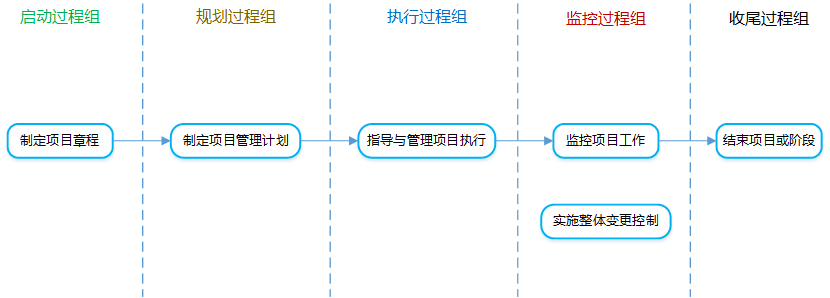

[TOC]

**项目整体管理**

项目整体管理是为识别、定义、组合、统一和协调**各项目管理过程组的各种过程和活动**而开展的过程与活动。其包括上述6个子过程。

# 1 制定项目章程

**是什么？：**编写一份正式批准项目并授权项目经理在活动中使用组织资源的文件的过程。

**有什么作用？：**明确定义项目开始和项目边界，确立项目的正式地位，得到高级管理层对项目的支持。

## 输入

1. **项目工作说明书**

   **是什么？**：对项目需交付的产品、服务或成果的叙述性说明。

   **包含哪些内容？**：业务需求、产品范围描述、战略计划。

   **从哪里来？**：

   - 内部项目：由项目启动人或发起人提供。
   - 外部项目：由客户提供（作为招标文件或合同的一部分）。

2. **商业论证**

   **是什么？**：从商业角度提供必要的信息，决定项目是否值得投资。是对项目工作说明书的论证。

   **谁来论证？**：商业分析师。

   **谁来审核论证结果？**：发起组织，并且需要定期审核（贯穿项目始终）。

3. **协议**

   **协议的形式**：合同、谅解备忘录、服务品质协议、意向书等。

4. 事业环境因素

   **是什么？**：能影响（积极或消极影响）项目但项目团队无法控制的任何内外部环境因素。

   **包含哪些内容？**：

   - 内部：组织文化、结构和治理，基础设施，项目管理信息系统PMIS，干系人的风险承受力，人事管理制度，设施和资源的地理分布等

   - 外部：市场条件，社会和文化影响与问题，法律限制，商业数据库，政府或行业标准等。

5. 组织过程资产

   **是什么？**：执行组织特有并使用的计划、政策、过程与程序、知识库，在项目全过程中，项目成员可以对其进行必要的更新和填补。

   **包含哪些内容？**：

   - 过程与程序：指南和标准、模板、财务控制程序、变更控制程序、风险控制程序、组织对沟通的要求等。
   - 组织知识库：配置管理知识库、财务数据库、测量指标数据库、经验教训知识库、以往项目的档案等。

## 工具与技术

1. **专家判断**

   是什么？：具有专业知识或受过专业培训的任何小组或个人。

2. **引导技术**

   是什么？：用来帮助团队和个人完成项目活动的关键技术。

   举例说明？：

   - 头脑风暴：短时间内获得大量的创意，任何人都可以发表自己的想法，只进行信息收集，不进行分析，在收集过程中，要秉持不质疑、不分析、不批判、不反对的原则。
   - 冲突管理
   - 会议管理

## 输出

1. **项目章程**

   **是什么？**：由项目启动者或发起人发布的，正式批准项目成立，并授权项目经理动用组织资源开展项目活动的文件。

   **包含哪些内容？**：

   - 委派的项目经理及其权责
   - 项目目的或批准项目的原因
   - 概括性的项目描述
   - 可测量的项目目标
   - 总体要求（范围）
   - 总体里程碑进度计划（进度）
   - 总体预算（成本）
   - 主要风险（风险）
   - 发起人或其他批准项目章程的人员信息（干系人）
   - 项目审批要求（成功标准、结束签署人）

**其他相关知识点：**

1. 项目由项目以外的实体来启动，如发起人、PMO、项目组合指导委员会等。
2. 经批准的项目章程意味着项目的正式启动。
3. 项目章程在项目执行组织与需求组织之间建立伙伴关系。
4. 不要把项目章程看作合同。
5. 应尽早确认并任命项目经理，最好在制定项目章程时就任命，最晚也要在规划开始之前。

# 2 制定项目管理计划

**是什么？**：定义、准备和协调所有子计划，并把它们整合为一份综合项目管理计划的过程。项目管理计划是项目干系人一起完成的，不是由某一个人或者某些人分工完成的。

**有什么作用？**：

- 生成一份核心文件，作为所有项目工作的依据。

- 确定项目的执行、监控和收尾方式。
- 项目管理计划可以是概括的，也可以是详细的，它是通过不断更新来渐进明细的，一旦被确定为基准，只能通过整理变更控制流程来修改。

## 输入

1. **项目章程**

2. **其他过程的输出**

   **是什么？**：其他规划过程所输出的任何基准和子管理计划，都是本过程的输入。

   **包含哪些内容？**：范围管理计划、需求管理计划、进度管理计划、成本管理计划、范围基准、进度基准、成本基准等。

3. 事业环境因素

4. 组织过程资产

## 工具和技术

1. 专家判断
2. **引导技术**

## 输出

1. **项目管理计划**

   **由哪些文件组成？**：13 + 3 = 16 份文件，除此之外的文件全部属于“项目文件”。

   - 13个子计划：配置管理计划、变更管理计划、范围管理计划、需求管理计划、进度管理计划、成本管理计划、质量管理计划、过程管理计划、人力资源管理计划、沟通管理计划、风险管理计划、采购管理计划、干系人管理计划

   - 3个基准：范围基准、进度基准、成本基准

   **包含哪些内容？**：

   - 项目管理团队选择的各个项目管理过程。（要实施哪些子过程）
   - 每个选定的项目管理过程的实施水平。（要实施到什么程度）
   - 对实施选定过程时所适用的工具与技术的说明（需要用到什么工具，有什么输入输出）
   - 选定过程之间的依赖关系和相互作用，以及重要的依据和成果。
   - 为了实现项目目标所执行的工作的方式、方法。
   - 监控变更的方式、方法。
   - 实施配置管理的方式、方法。
   - 项目干系人之间的沟通需要和方式、方法。
   - 使用的效果测量基准。
   - 选定的项目生命周期和划分的项目阶段。
   - 关键审查的内容、范围和时间安排。

# 3 指导与管理项目工作

**是什么？**：领导和执行项目管理计划中确定的工作，并实施已批准变更的过程。

**有什么作用？**：

- 干计划（按项目管理计划去干活）
- 干变更（实施已批准的变更）
- 干接口（接口的整合）
- 干数据（产生工作绩效数据）

## 输入

1. **项目管理计划**

2. **批准的变更请求**

   **是什么？**：可能是纠正措施、预防措施、缺陷补救。

3. 事业环境因素

4. 组织过程资产

## 工具和技术

1. 专家判断

2. **项目管理信息系统**

3. **会议**

   **有哪些会议？**：

   - 信息交流会（交换信息）
   - 方案设计和评审会（方案评估或者方案设计）
   - 决策制定会（制定决策）

   **如何召开高效会议？**：

   - 事先制定一个例会制度、明确会议规则。
   - 放弃可开可不开的会议。
   - 明确会议的目的和期望结果、明确每个参会者的角色。
   - 发布会议通知。
   - 在会议之前将会议资料发给参会人员。
   - 面对面的会议效果最好，也可以借助视频设备。
   - 会后要做好总结、达成共识。
   - 会议要有纪要。
   - 做好会议的后勤保证。
   - 不要把各种会议类型混合在一起。

## 输出

1. **可交付成果**

   **是什么？**：在某一过程、阶段或项目完成时，必须产出的独特并可核实的产品、成果或服务能力，不一定非要是给客户的，一些计划类的辅助性文件也可算作可交付成果。

2. **工作绩效数据**

   **是什么？**：在项目执行过程中，收集到的原始观察结果和测量值，它反映了项目当前情况（范围、进度、成本）的第一手、基础的数据。

   **举例说明？**：变更请求的数量、工作完成百分比、质量和技术绩效测量值、实际成本和实际持续时间。

3. **变更请求**

   **是什么？**：是关于修改任何文档、可交付成果或基准的正式提议。可以是直接或间接的，可以由外部或内部提出，可能是自选或由法律/合同所强制的，可口头提，但必须书面记录。

   **包括哪些内容？**：

   - 纠正措施（纠偏差）
   - 预防措施（防风险）
   - 缺陷补救（补质量）
   - 更新（通常是基准更新）

4. 项目管理计划更新

5. 项目文件更新

# 4 监控项目工作

**是什么？**：跟踪、审查和报告项目进展，收集、测量并散发绩效信息，分析测量结果和预测趋势，以便推动过程改进。它贯穿于整个项目，是唯一输出工作绩效报告的过程。

**有什么作用？**：让干系人了解项目的当前状态、已采取的步骤，对预算、进度和范围的预测，以便推进过程改进。

## 输入

1. **项目管理计划**

   监控工作需要测量绩效信息，并进行分析即预测趋势，所以需要将实际绩效和计划做对比。

1. 进度预测

2. 成本预测

3. 确认的变更

4. **工作绩效信息**

   **是什么？**：是对工作绩效数据进行整合分析后得到的数据，是工组绩效数据和基准计划对比后的偏差结果。

5. 事业环境因素

6. 组织过程资产

## 工具和技术

1. 专家判断

2. **分析技术**

   **有哪些方法？**：挣值管理、回归分析、预测方法、趋势分析、根本原因分析等。

3. 项目管理信息系统

4. 会议

## 输出

1. **变更请求**

2. **工作绩效报告**

   **是什么？**：汇编工作绩效信息后形成的文件。

3. 项目管理计划更新

4. 项目文件更新

# 5 实施整体变更控制

**是什么？**：审查所有变更请求、批准变更、管理变更、并对变更处理结果进行沟通的过程。该过程不会提出变更请求。

**有什么作用？**：从整合的角度考虑记录在案的项目变更，从而降低项目风险。

**引起变更的原因？**：

- 产品范围定义的过失或疏忽。
- 项目范围定义的过失或疏忽。
- 增值变更。
- 应对风险的计划。
- 绩效与基准不一致带来的被动调整。
- 外部事件。

**变更的分类？**：

- 按性质分：重大变更、重要变更、一般变更。
- 按迫切性分：紧急变更、非紧急变更。

**变更控制委员会（CCB）是什么？**：

- 一个正式组成的团体，负责审议、批准、推迟或否决项目变更，以及记录和传达变更处理决定。
- CCB由项目所涉及的多方人员共同组成，通常包括用户和实施方的决策人员。
- CCB是决策机构，不会提出变更方案。
- CCB并不是必须的，也不是所有的变更请求都必须由CCB来审批。
- CCB是建立在项目层面的。

**如何选择变更审批人？：**

- 首选：项目管理计划或者组织流程中制定的责任人。
- 次选：CCB。
- 再选：PMO、发起人、项目经理等。

**变更请求处理流程？：**

1. 提出和记录变更申请。
2. 初审变更。
3. 评估论证变更方案。
4. 提交CCB审查。
5. 更新、通知并组织实施变更。
6. 监控变更实施。
7. 评估变更效果。
8. 归档。

## 输入

1. 项目管理计划

2. **工作绩效报告**

   **有用的报告由哪些？**：资源可用情况、进度和成本数据、挣值管理报告、燃尽图。

3. **变更请求**

4. 事业环境因素

5. 组织过程资产

## 工具和技术

1. 专家判断
2. **会议**
3. **变更控制工具**

## 输出

1. **批准的变更请求**

2. **变更日志**

   被否决的变更请求也要记录在变更日志中。

3. **项目管理计划更新**

   对基准的变更，只能针对今后的情况，不能变更以往的绩效。

4. 项目文件更新

**其他知识点：**

1. 如何做版本回退？
   - 通知相关用户。
   - 通知各关联系统。
   - 回退存储过程等数据对象。
   - 配置数据回退。
   - 应用程序、接口程序、工作流等版本回退。
   - 回退完成后通知各关联系统。
   - 进行回退后测试。
   - 通知用户。

# 6 结束项目或阶段

**是什么？**：完结所有项目管理过程组的所有活动，以正式结束项目或阶段的过程。

**有什么作用？**：总结经验教训，正式结束项目工作，释放相关资源。

**结束项目或阶段需要做什么？**：行政收尾和合同收尾，下面所列都为行政收尾。

- **正常收尾**
  1. 获得项目或阶段的整体验收。
  2. 干系人满意度调查。
  3. 移交成果。
  4. 总结和记录经验教训。
  5. 组织过程资产更新。
  6. 文件归档。
  7. 庆功会。
  8. 释放资源。
- **提前收尾**
  1. 记录终止的原因。
  2. 干系人满意度调查。
  3. 移交已完成和未完成的成果。
  4. 总结和记录经验教训。
  5. 组织过程资产更新。
  6. 文件归档。
  7. 庆功会。
  8. 释放资源

**注意：**

1. 必须经过正式收尾过程，才可以正式结束项目或阶段。
2. 项目提前结束（中止、取消、无法完成）也必须正式收尾。
3. 收尾工作不仅针对整个项目，也要在每个阶段结束时进行。

## 输入

1. **项目管理计划**

2. **验收的可交付成果**

   在分阶段实施或被取消的项目中，可能会包括未全部完成的可交付成果。

3. 组织过程资产

## 工具和技术

1. **专家判断**
2. 分析技术
3. **会议**

## 输出

1. **最终产品、服务或成果移交**

2. **组织过程资产更新**

   **包括哪些内容？**：

   - 项目档案
   - 项目或阶段收尾文件
   - 历史信息、经验教训

