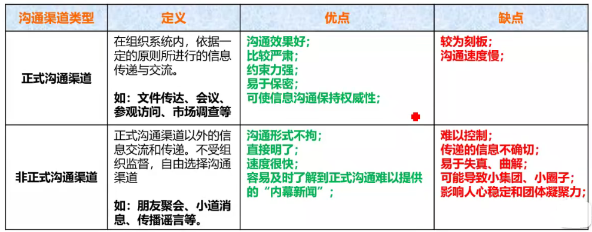
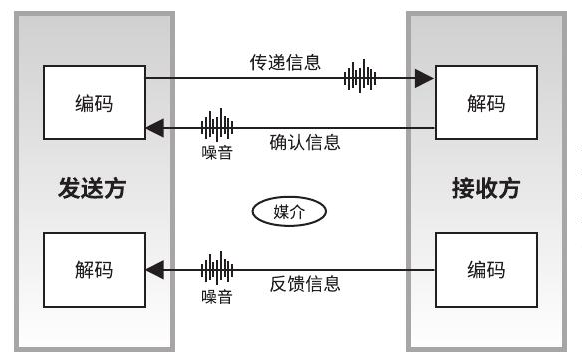

[TOC]

**项目沟通管理**

**项目沟通管理是什么**？：为确保项目信息及时且恰当地规划、收集、生成、存储、检索、管理、控制、监督和最终处置所需的各个过程。

**沟通有哪些分类？**：

- **内部**：项目内（效率和准确、非正式的方式）

  **外部**：客户、媒体、公众（充分和准确、正式的方式）

- **正式**：报告、情况介绍会（正式）

  **非正式**：电子邮件、备忘录（大多数场合）

- **垂直**：上下级之间（速度快、准确程度高）

  **水平**：同级之间（复杂程度高、不受控）

- **官方**：新闻通讯、年报

  **非官方**：私下沟通

- **口头语言**

  **非口头语言**

- **书面**：清晰、易复制传播、长期保存、法律防护依据；但耗时长、灵活性差

  **口头**：较灵活、速度快、便于双向沟通；但难以保存、正确性差、权威性低

# 1 规划沟通管理

**是什么？**：根据干系人的信息需要和要求及组织的可用资产情况，制定合适的项目沟通方式和计划的过程。

**有什么作用？**：识别和记录与干系人的最有效率和最有效果的沟通方式。

**什么是有效率的沟通？**：只提供所需要的信息。

**什么是有效果的沟通？**：以正确的形式、在正确的时间把信息提供给正确的受众，并且使信息产生正确的影响。

## 输入

1. 项目管理计划

2. **干系人登记册**

   为规划与项目干系人的沟通提供信息。

3. 事业环境因素

4. 组织过程资产

## 工具与技术

1. **沟通需求分析**

   **是什么？**：确定项目干系人的信息需求，包括所需信息的类型和格式，以及信息对干系人的价值。

   **沟通渠道**：

   - 计算公式：$n(n-1)/2$ ，n代表干系人的数量。

   - 分类：正式和非正式

     

2. **沟通技术**

   **是什么？**：在项目干系人之间传递信息的技术。如：谈话、会议、书面文件、资料等。

   **影响技术选择的因素？**：信息需求的紧迫性、可用性、易用性、项目环境、敏感性和保密性。

3. **沟通模型**

   

   **发送方**：需确保信息的清晰性和完整性，需确认信息已被正确理解。

   **接收方**：需正确地理解信息，需告知收悉或做出适当的回应。

   

   **5个关键要素**：

   - **编码**：把思想或想法转化为他人能理解的语言。
   - **信息和反馈信息**：编码过程所得到的结果。
   - **媒介**：用来传递信息的方法。
   - **噪声**：干扰信息传输和理解的一切因素。
   - **解码**：把信息还原成有意义的思想或想法。

   

   **5个基本状态**：

   - **已发送**
   - **已收到**
   - **已理解**
   - **已认可**
   - **已转化为积极的行动**

4. **沟通方法**

   **有哪些分类？**：

   - 推式沟通

     把信息发送给需要接收这些信息的特定接收方。可以确保信息的放松，但是不能确保信息送达或者被正确理解。

     例如：电子邮件、传真、报告、新闻稿等。

   - 拉式沟通

     用于信息量很大或者受众很多的情况，要求接收者自主自行地访问信息内容。

     例如：企业内网、经验教训数据库、知识库等。

   - 交互式沟通

     在两方或者多方之间进行信息交换，是确保全体参与者达成共识的最有效方法。

     例如：会议、电话、即时通信、视频会议等。

   **影响方法选择的因素？**：

   - 沟通需求
   - 成本和时间限制
   - 工具、资源可用性
   - 对工具、资源的熟悉程度

5. 会议

## 输出

1. **沟通管理计划**

   **包含哪些内容？**：

   - 干系人的沟通需求。
   - 需要沟通的信息，包括语言、格式、内容、详细程度等。
   - 发布信息及告知收悉或作出回应的时限和频率。
   - 负责授权保密信息发布的人员。
   - 将要接收信息的个人或小组。
   - 为沟通活动分配的资源，包括时间和预算。
   - 问题升级程序，用于规定下层员工无法解决问题时的上报时限和上报路径。
   - 通用术语表，可以包括用户沟通的指南和模板。

2. 项目文件更新

# 2 管理沟通

**是什么？**：根据沟通管理计划，生成、收集、分发、存储、检索及最终处置项目信息的过程。

**有什么作用？**：促进项目干系人之间实现有效率且有效果的沟通。

## 输入

1. 沟通管理计划

2. **工作绩效报告**

   工作绩效报告汇集了项目绩效和状态信息，可用于促进讨论和建立沟通。

3. 事业环境因素

4. 组织过程资产

## 工具与技术

1. 沟通技术

2. 沟通模型

3. 沟通方法

4. 信息管理系统

5. **报告绩效**

   **是什么？**：收集和发布绩效信息，包括状态报告、进展测量结果及预测结果。（可简单、可详细）

   **简单的状态报告**：包括完成百分比、每个领域的状态指示图。

   **详细的状态报告**：可能包括

   - 对过去绩效的分析，项目预测分析，包括时间和成本。
   - 本报告期完成的工作，下个报告期需要完成的工作。
   - 本报告期被批准的变更的汇总，需要审查和讨论的其他相关信息。

## 输出

1. **项目沟通**

   **包含哪些内容？**：绩效报告、可交付成果状态、进度进展情况、已发生的成本。

   **影响因素？**：信息的紧急性和影响、信息传递方法、信息机密程度。

2. 项目管理计划更新

3. 项目文件更新

4. 组织过程资产更新

# 3 控制沟通

**是什么？**：在整个项目生命周期中对沟通进行监督和控制的过程，以确保满足项目干系人对信息的需求。

**有什么作用？**：随时确保所有沟通参与者之间的信息流动的最优化。

## 输入

1. 项目管理计划
2. **项目沟通**
3. **问题日志**
4. 工作绩效数据
5. 组织过程资产

## 工具与技术

1. 信息管理系统
2. 专家判断
3. 会议

## 输出

1. 工作绩效信息

2. 变更请求

3. 项目管理计划更新

4. **项目文件更新**

   更新的文件可能包括（但不限于）：预测、绩效报告、问题日志。

5. 组织过程资产更新

