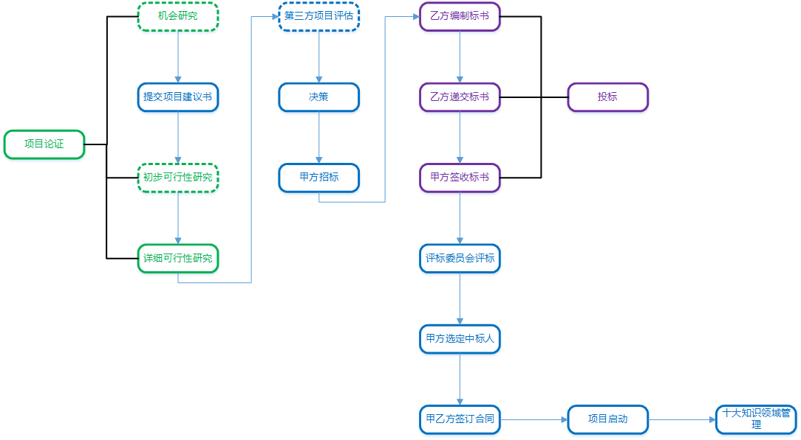
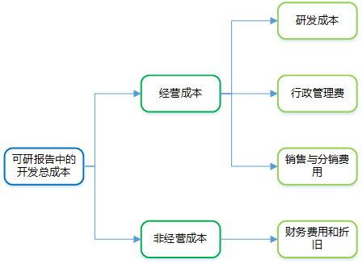

[TOC]

**项目立项流程**

# 1 项目论证

项目论证是指对实施项目**技术上**的先进性、适用性，**经济上**的合理性、营利性，**实施上**的可能性、风险性进行全面科学的综合分析，为项目决策提供客观依据的一种技术经济研究活动。

对于项目论证来说，**市场是前提、技术是手段、财务经济是核心**。

**项目论证的三个阶段：**

1. **机会研究**

   寻求投资机会，鉴别投资方向。是对项目的有关背景、资源条件、市场情况等进行的初步调查研究和分析预测，是进行可行性研究之前的准备性调查研究，是项目建议书前期的咨询文件。但是，机会研究不是必须的，可以省略或者与初步可行性研究合二为一。

2. **初步可行性研究**

   初步评估项目是否有生命力，能否盈利。

3. **详细可行性研究**

   详细技术经济论证，在多方案比较的基础上选出最优方案。

**项目论证的7个主要步骤：**

1. **明确范围和目标**
2. **收集资料**
3. **拟定实施方案**
4. **分析比较方案**
5. **选择最优方案论证**
6. **编制报告**
7. **编制计划**

## 1.1 可行性研究

信息系统的可行性研究是指从技术、经济、社会和人员等方面的条件和情况进行调查研究，对可能的技术方案就行论证，以最终确定整个项目是否可行。这里的可行性是指：可能性、效益性和必要性。

**可行性研究的主要内容为：**

1. **技术可行性分析**

   技术能力、开发风险、人力资源有效性、物资可用性等。

2. **经济可行性分析**

   支出分析（一次性和非一次性）、收益分析（直接和间接）、收益投资比和投资回收期分析、敏感性分析等。

3. **运行环境可行性分析**

   重点评估系统顺利运行所需的环境和建立环境所需的工作。

4. **其他方面的可行性分析**

   法律可行性、社会可行性、财务可行、组织可行性、投资必要性等。

### 1.1.1 初步可行性研究

初步可行性研究是对市场或者客户情况进行调查后，进行大体收集材料，对投资项目的前景进行初步评估的过程，并决定是否继续进行详细可行性研究，该过程可以省略或者与机会研究合二为一。

经过初步可行性研究，可以形成初步可行性研究报告，该报告可作为正式的文献供决策参考。

### 1.1.2 详细可行性研究

详细可行性研究是在项目决策前对项目有关的技术、经济、法律、社会环境等各方面的条件和情况进行详尽的、系统的、全面的调查、研究、分析，对各种可能的技术方案进行详细的论述、比较，并对项目建设完成后所可能产生的经济、社会效益进行预测和分析，最终提交的可行性研究报告将成为项目评估和决策的依据，详细可行性研究不可省略。

**详细可行性研究的方法：**

- **投资估算法**

- **增量净效益法（有无比较法）**

  将有项目时的成本（效益）与无项目时的成本（效益）进行比较，求得两者差额，即为增量成本（效益）。

- **经济评价法**

- **市场预测法**

**详细可行性研究的内容（或者说项目论证的内容）：**

1. **概述**
2. **需求确定**
3. **现有资源、设施情况分析**
4. **设计（初步）技术方案**
5. **项目实施进度计划建议**
6. **投资估算和资金筹措计划**
7. **项目组织、人力资源、技术培训计划**
8. **经济和社会效益分析**
9. **合作/协作方式**

# 2 项目建议书

项目建议书（也称立项申请），是项目建设单位向上级主管部门提交项目申请时所必须的文件，是提出的某一具体项目的建议文件，是对拟建项目的框架性的总体设想。

**其核心内容包括：**

1. **项目的必要性**
2. **项目的市场预测**
3. **产品方案或服务的市场预测**
4. **项目建设必需的条件**

# 3 项目评估

项目评估是在项目可行性研究的基础上，由第三方（国家、银行或有关机构）对拟建项目的各方面进行评价、分析和论证，进而判断其是否可行。项目评估的最终成果为项目评估报告。

# 4 招标

招标包括公开招标、邀请招标、议标等，招标项目按规定如需审批手续的，应先履行审批手续，取得批准后再进行招标。

# 知识点补充

1. 关于可行性研究报告中的开发成本：

   

2. 项目可行性研究报告的编制内容与项目建议书批复内容有重大变更的，应重新报批项目建议书。

3. 项目初步设计方案和投资概算报告的编制内容与项目可行性研究报告批复内容有重大变更或者变更投资超出已批复总投资额度的10%的，应重新报批可行性研究报告；如果未超过10%，需要在提交项目初步设计方案和投资概算报告时以独立章节对调整部分进行定量补充说明。

4. 关于投标：

   - 投标书中应列明如中标后签订的合同所包含的全部重要内容。
   - 有效期内不得撤回标书、变更报价或做实质性的修改。
   - 要求投标人提供一定比例或金额的投标保证金，如未中标予以退还。
   - 投标人应在招标文件要求提交投标文件的截止时间前，将投标文件送达投标地点。
   - 如以邮寄方式递交标书的，送达时间不以邮戳为准。
   - 招标人收到投标文件后，应当牵手保存，不得开启。

5. 关于评标：

   - 评标由评标委员会负责，成员名单在评标结果公示前必须保密。
   - 评标委员会由具有高级职称或同等专业水平的技术、经济等相关领域专家、招标人和招标机构代表等5人以上单数组成，其中技术、经济等方面的专家人数不得少于成员总数的2/3。
   - 按标准评审后，必须分别填写评标意见表，作为评估报告的一部分。
   - 投标人应提供在开标日前三个月内由其开立基本账户的银行开具的银行资信证明的原件或复印件。

6. 关于选定项目承建方：

   - 招标人根据评标委员会提出的书面评标报告和推荐的中标候选人确定中标人。
   - 中标人确定后，招标人应向中标人发出中标通知书，并同时将中标结果通知所有未中标的投标人。
   - 中标通知书对招标人和中标人具有法律效力。
   - 投标人和中标人应当自中标通知书发出之日起30日内，按照招标文件和中标人的投标文件订立书面合同。
   - 招标人应当自确定中标人之日起15天内，向有关行政监督部门提交招标投标情况的书面报告。

   

