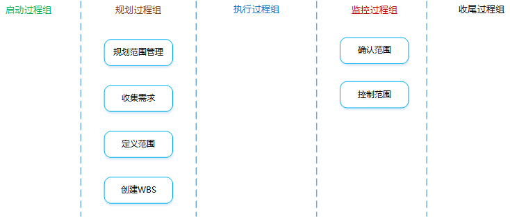
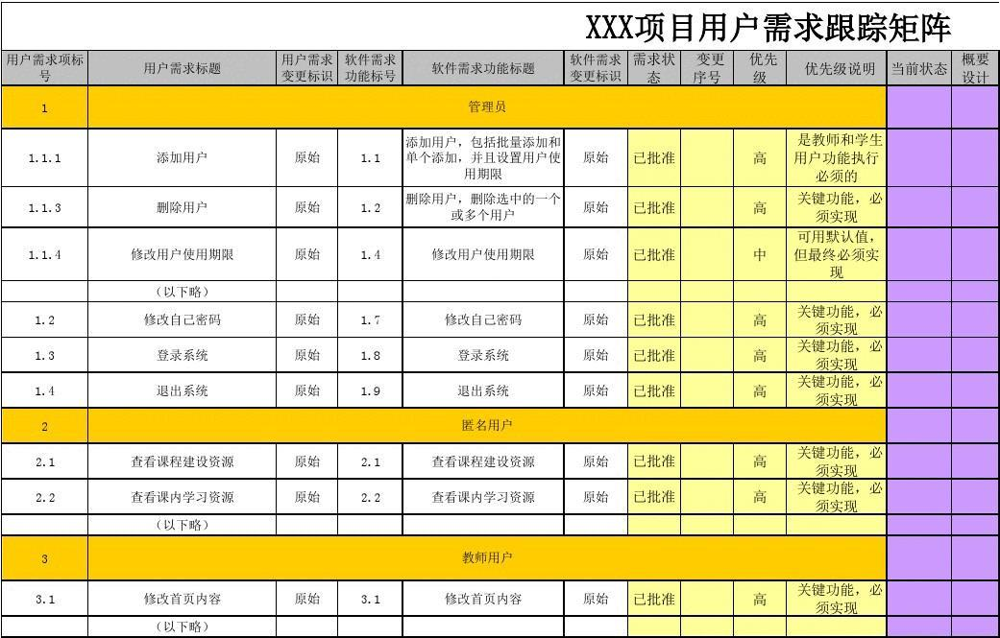
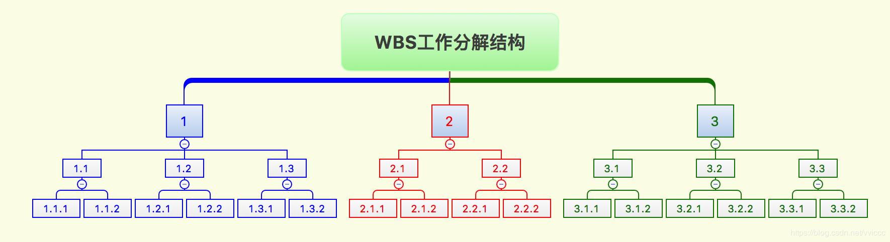

[TOC]

**项目范围管理**

项目范围管理：**做且只做**所需的全部工作。

在讲解子过程之前，先了解下一些定义。

**范围蔓延**：指未对时间、成本和资源做相应调整，未经控制的产品或项目范围的扩大。

**镀金**：来自团队内部原因造成的范围蔓延，例如项目人员为了“讨好”客户而做的不解决实际问题、没有应用价值的项目活动。

**范围潜变**：来自团队外部原因造成的范围蔓延，例如客户不断提出小的、不易察觉的范围改变，如果不加控制，累积起来导致项目严重偏离既定的范围基准，导致项目失控和失败。

**如果已经发生了范围蔓延，一定要走变更流程。**

# 1 规划范围管理

**是什么？**：创建范围管理计划，书面描述将如何定义、确认和控制项目范围的过程。

**有什么作用？**：在整个项目中对如何管理范围提供指南和方向。

## 输入

1. **项目管理计划**

   需要参照项目管理计划中已批准的子计划。

2. **项目章程**

   依据项目章程中的项目背景信息来规划各个范围管理过程。

3. 事业环境因素

4. 组织过程资产

## 工具与技术

1. 专家判断
2. 会议

## 输出

1. **范围管理计划**

   **是什么？**：描述将如何定义、指定、监督、控制和确认项目范围。（注意：范围管理计划中都是描述如何去管理范围，并没有描述有哪些范围）

   **有什么作用？**：在整个项目中对如何管理范围提供指南和方向，有助于降低项目范围蔓延的风险。

2. **需求管理计划**

   **是什么？**：描述在整个项目生命周期中，如何分析、记录和管理需求。（注意：需求管理计划并没有描述有哪些需求）

   **包含哪些内容？**：

   - 如何规划、跟踪、报告各种需求活动，用什么标准对需求进行优先级排序。
   - 需求管理需要使用的资源。
   - 培训计划。
   - 项目干系人参与需求管理的策略。
   - 判断项目范围与需求不一致的准则和纠正过程。
   - 需求跟踪结构。
   - 配置管理活动。

   

# 2 收集需求

**是什么？**：为实现项目目标而确定、记录并管理干系人的需要和需求的过程。

**有什么作用？**：为定义和管理项目范围（包括产品范围）奠定基础。

## 输入

1. 范围管理计划

2. **需求管理计划**

   其中有描述“整个收集需求过程的工作流程”的规定。

3. 干系人管理计划

4. **项目章程**

   其中有“产品、服务或成果的高层次描述”。

5. **干系人登记册**

   其中有“干系人对项目的主要需求和期望”及“哪些干系人能提供需求方面的信息”等内容。

## 工具与技术

1. **访谈**

   与干系人直接交谈，向其提出预设和即兴的问题，记录他们的回答。

2. **焦点小组**

   由一位受过训练的主持人引导预先选定的干系人和主题专家进行互动式的讨论。这些参加者往往是同职能、同一领域或有相似背景条件的人。

3. **引导式研讨会**

   把主要干系人召集在一起，通过集中讨论来定义产品需求。这些参与者是跨职能、不同部门的干系人。

4. **群体创新技术**

   - 头脑风暴：单纯地收集创意，不进行质疑、分析、批判和反对。
   - 名义小组：通过投票对创意进行优先排序，便于进一步头脑风暴。
   - 思维导图（脑图）
   - 亲和图：对创意进行相似性分组。
   - 多标准决策分析（如优先矩阵）：建立多种标准，对备选方案进行评估和排序。

5. **群体决策技术**

   - 一致同意
   - 大多数原则
   - 相对多数原则
   - 独裁
   - 德尔菲技术：一组专家就某一主题达成一致意见的过程。通过问卷，专家匿名提交自己的意见，往往要经过多轮问卷才能达成一致意见。

6. **问卷调查**

   设计一系列书面问题，向众多受访者快速收集信息。

## 输出

1. **需求文件**

   **是什么？**：描述各种单一需求将如何满足与项目相关的业务需求。

2. **需求跟踪矩阵**

   **是什么？**：把产品（项目）需求从其来源连接到能满足需求的可交付成果的一种表格。

   **有什么作用？**：

   - 提供了在整个项目生命周期中跟踪需求的一种方法。
   - 把每个需求与业务目标或项目目标联系起来。

   **注意**：收集需求时产生的需求文件和需求跟踪矩阵并不代表项目的真实范围。
   
   

# 3 定义范围

**是什么？**：制定项目和产品详细描述的过程。

**有什么作用？**：

- 明确所收集的需求哪些将包含在项目范围内，哪些将排除在项目范围外。
- 明确项目、服务或成果的边界。

## 输入

1. 范围管理计划

2. **项目章程**

   包含对项目和产品特征的高层级描述，还包括项目审批要求。

3. **需求文件**

   使用需求文件来选择哪些需求将包含在项目中。

4. 组织过程资产

## 工具与方法

1. 专家判断

2. **产品分析**

   **是什么？**：把高层级的产品描述转变为有形的可交付成果。

   **有哪些技术？**：系统工程、价值工程、价值分析等。

3. **备选方案生成**

   **是什么？**：制定尽可能多的潜在可选方案的技术，用于识别执行项目的不同方法。

   **有哪些技术？**：备选方案分析、横向思维。

4. 引导式研讨会

## 输出

1. **项目范围说明书**

   **是什么？**：对项目范围、主要可交付成果、假设条件和制约因素的描述。记录了整个范围，包括项目和产品范围，也代表项目干系人之间就项目范围所达成的共识。为了便于管理干系人的期望，项目范围说明书可明确指出哪些工作不属于本项目范围。

   **包含哪些内容？**：

   - **产品范围描述**

     逐步细化在项目章程和需求文件中所属的产品、服务或成果的特征。

   - **验收标准**

     可交付成果通过验收前必须满足的一系列条件。

   - **可交付成果**

     必须产出的任何独特并可核实的产品、成果或服务能力。也包括辅助成果，如项目管理报告和文件。

   - **除外责任**

     明确说明哪些内容不属于项目范围，有助于管理干系人的期望。

   - **制约因素**

     对项目或过程的执行有影响的限制性因素（如预算、里程碑、合同条款等）。

   - **假设条件**

     不需验证即可视为正确、真实的因素。还应描述若这些因素不成立，可能造成的潜在影响。

2. 项目文件更新

# 4 创建WBS

**是什么？**：把项目可交付成果和项目工作分解成较小的、更易于管理的组件的过程。

**有什么作用？**：对所要交付的内容提供一个结构化的视图。

**注意**：WBS中的“工作“并不是指工作本身，而是指工作所导致的产品或可交付成果。

## 输入

1. **范围管理计划**

   定义了应该如何根据详细项目范围说明书创建WBS，以及应该如何维护和批准WBS。

2. **项目范围说明书**

   描述了需要实施的工作及不包含在项目中的工作，同时也列举和描述了会影响项目执行的各种内外部制约或限制条件。

3. **需求文件**

   对理解需要产出什么项目结果，需要做什么来交付项目及其最终产品，都非常重要。

4. 事业环境因素

5. 组织过程资产

## 工具与方法

1. **分解**

   **是什么？**：把项目范围和项目可交付成果逐步划分为更小、更便于管理的组成部分的技术。创建WBS，就是要将整个项目工作分解为工作包。

   **什么是工作包？**：位于WBS每条分支最底层的可交付成果或项目工作组成部分，可对其成本和持续时间进行估算和管理。工作包大小在8~80小时之间。

   **分解的步骤？**：

   - 识别和分析可交付成果及相关工作。
   - 确定WBS的结构和编排方法。
   - 自上而下逐层细化分解。
   - 为WBS组件定制和分配标识编码。
   - 核实可交付成果的分解程度是否恰当。

   **分解的方式？**：

   - 把项目生命周期的各个阶段放在第二层。
   - 把可交付成果放在第二层。
   - 整合可能由项目团队以外的组织来实施的各种子组件（如外包工作）。

   **分解的原则？**：

   - 100%原则（包含原则）
     仅包含所有可交付成果，所有下一级的元素之和必须100%地代表上一级元素。

   - 独立责任原则

     每个元素有且只有一个人负责。

   - 80小时原则

     工作包大小在8~80小时之间。

   - 4~6层指导

     不宜分解过细，每层建议4\~7个元素，总层数建议在4~6层。

   - 滚动分解原则

     渐进明细。

   - 功能或技术原则

     分解时需要考虑将不同人员的工作分开。

2. 专家判断

## 输出

1. **范围基准**

   **是什么？**：经过批准的项目范围说明书、WBS、WBS词典，只有通过正式的变更控制程序才能进行变更，它被用作比较的基础。

   - 项目范围说明书：是对项目范围、可交付成果、假设条件和制约因素的描述。记录了整个范围，包括项目和产品范围。
   - WBS：全部工作范围的层级分解。
   - WBS词典：针对每个WBS组件，详细描述可交付成果、活动和进度信息的文件。

2. 项目文件更新

# 5 确认范围

**是什么？**：”客户“或”发起人“正式验收已完成的项目可交付成果的过程。

**有什么作用？**：使验收过程具有客观性，通过验收每个可交付成果，提高最终产品、服务或成果验收的可能性。

## 输入

1. **项目管理计划**

   定义了如何正式验收已完成的可交付成果。

2. **需求文件**

   将需求与实际结果比较，以决定是否有必要进行变更、采取纠正措施或预防措施。

3. **需求跟踪矩阵**

   含有与需求相关的信息，包括如何确认需求。

4. **核实的可交付成果**

   已完成的，并由控制质量过程核实为正确的可交付成果。

5. 工作绩效数据

## 工具与技术

1. **检查**

   **是什么？**：开展测量、审查与确认等活动，来判断工作和可交付成果是否符合需求和产品验收标准。

   **包含哪些方式？**：审查、走查、评审、巡检、测试等。

   **注意**：检查与审计不同，检查的是结果，审计的是过程。

2. 群体决策技术

## 输出

1. **验收的可交付成果**

   符合验收标准的可交付成果应由客户或发起人正式签字批准。

   应该从客户或发起人那里获得正式文件，证明干系人对项目可交付成果的正式验收。

2. **变更请求**

   针对未通过验收的情况，处理步骤为：记录原因 $\Rightarrow $ 提交变更请求 $\Rightarrow$ 进行缺陷补救。

3. 工作绩效信息

4. 项目文件更新

# 6 控制范围

**是什么？**：监督项目和产品的范围状态，管理范围基准变更的过程。

**有什么作用？**：在整个项目期间保持对范围基准的维护，确认所有变更请求、纠正措施、预防措施都通过实施整体变更控制过程进行处理。

## 输入

1. **项目管理计划**
2. 需求文件
3. 需求跟踪矩阵
4. **工作绩效数据**
5. 组织过程资产

## 工具与技术

1. **偏差分析**

   **是什么？**：一种确定实际绩效与基准的差异程度及原因的技术。

## 输出

1. **工作绩效信息**
2. **变更请求**
3. 项目管理计划更新
4. 项目文件更新
5. 组织过程资产更新

