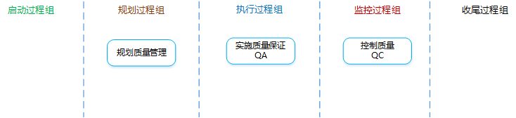
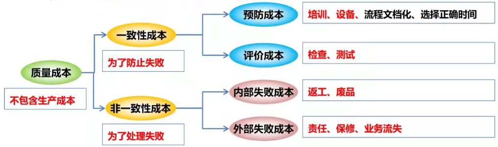
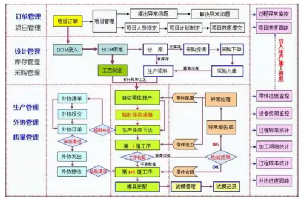
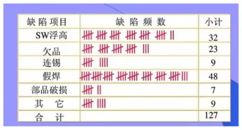
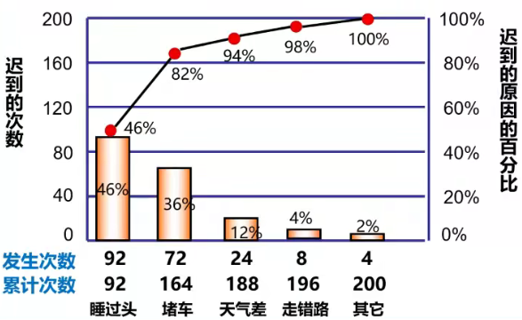
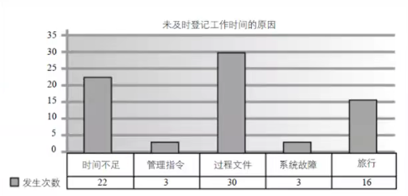
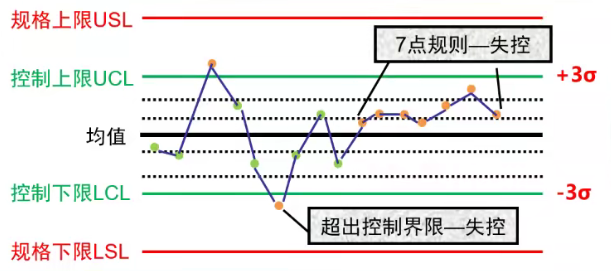
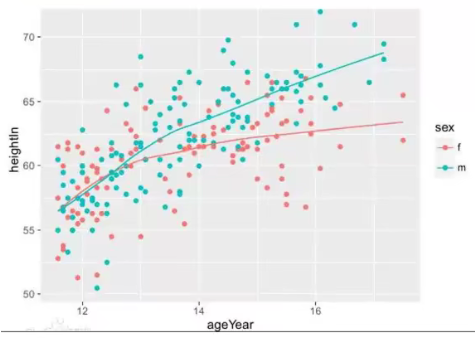
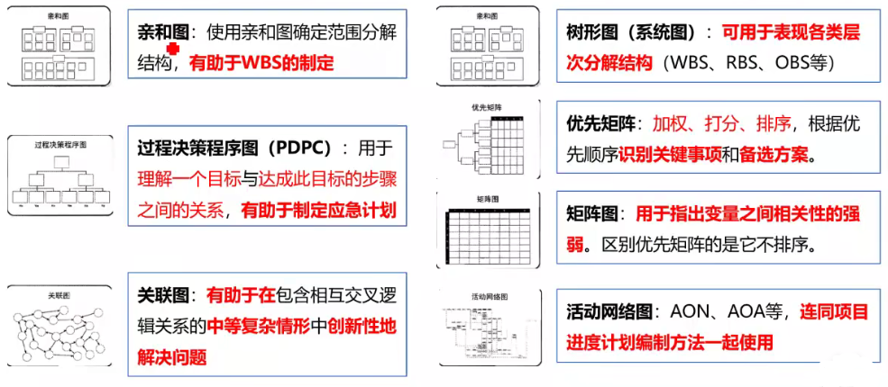

[TOC]

**项目质量管理**

**项目质量管理是什么**？：确定质量方针、质量目标和职责，并通过质量体系中的质量规划、质量保证和质量控制以及质量改进来使其实现所有管理职能的全部活动。

项目质量管理需要兼顾项目管理和项目可交付成果两个方面。

对于质量管理，更重要的是价值观（理念）问题，而不是技术问题。

**质量方针是什么？**：由组织的最高管理者正式发布的该组织总的质量宗旨和方向，体现了组织的质量意识和质量追求。

**质量目标是什么？**：在质量方面所追求的目的，是落实质量方针的具体要求。必须明确、具体、量化。

**什么是质量**？

- ISO中定义：反映实体满足主体明确和隐含需求的能力的特性总和。
- GB/T中定义：一组固有特性满足要求的程度。

**质量管理标准体系**

- **ISO 9000质量管理的8项基本原则**
  领导作用、全员参与、过程方法、持续改进、以顾客为中心、与供互利的关系、管理的系统方法、基于事实的决策方法。

- **全面质量管理TQM**

  一种全员、全过程、全企业的品质管理。

  4个组成要素：结构、技术、人员、变革推动者。

- **6$\sigma$方法**

  每百万不合格率少于3.4。

# 1 规划质量管理

**是什么？**：识别项目及其可交付成果的质量要求和（或）标准，并书面描述项目将如何证明符合质量要求的过程。

**有什么作用？**：为整个项目中如何管理和确认质量提供指南和方向。

## 输入

1. 项目管理计划

2. **干系人登记册**

   有助于识别对质量重视或者有影响的干系人。

3. **风险登记册**

   包含可能影响质量要求的各种威胁和机会信息。

4. **需求文件**

   包含项目需求、产品需求、质量需求。有助于项目团队规划如何开展质量控制。

5. **事业环境因素**

   可能影响质量期望的政策法规、文化观念等。

6. **组织过程资产**

   执行组织的质量政策是高级管理层所推崇的，规定了组织在质量管理方面的工作方向。

## 工具与技术

1. **成本效益分析**

   **是什么？**：对每个质量活动的可能成本和预期效益进行对比。

   预期效益包括：减少返工、提高生产率、降低成本、提高干系人满意度、提升盈利能力。

2. **质量成本**

   **是什么？**：在产品生命周期中为预防不符合要求、为评价产品或服务是否符合要求，以及因未达到要求（返工），而发生的所有成本。

   

3. **七种基本质量工具**

   - **因果图（鱼骨图、石川图、why-why分析图）**

     **作用**：找出根本原因。

     **关键字**：追溯问题来源，回推根本原因。

     

   - **流程图（过程图）**

     **作用**：寻找出错环节。

     **关键字**：改进过程、识别潜在缺陷、估算质量成本、预测出错环节。

     

   - **核查表**

     **作用**：收集属性数据。

     **关键字**：收集数据、潜在质量问题、缺陷数量或后果、统计分析结果。

     

   - **帕累托图**

     **作用**：识别主要原因。

     **关键字**：主要原因、二八定律、80/20法则、优先排序、有重点地采取纠正措施。

     

   - **直方图**

     **作用**：显示趋势分布。

     **关键字**：集中趋势、分散程度、分布形状、特定变量发生的频率。

     

   - **控制图**

     **作用**：判断过程是否稳定。

     **关键字**：过程失控、7点规则、控制上下限、规格上下限、变更频率。

     失控的判断：① 某个数据点超出控制界限。 ② 连续7个点落在均值的一侧。

     

   - **散点图（相关图）**

     **作用**：表示两个变量间的关系。

     **关键字**：两个变量、回归线、强相关性、自变量、因变量。

     

4. **标杆对照**

   **是什么？**：将实际或计划的项目实践与组织内部或外部、同一应用领域或不同应用领域的可比项目实践进行比较，以便识别最佳实践，形成改进意见，并为绩效考核提供依据。（可用于确定质量标准）

   任何项目，只要与本项目在某个局部可比，就可作为本项目的标杆。

5. **实验设计（DOE）**

   **是什么？**：一种统计方法，用来识别哪些因素会对正在生产的产品或正在研发的流程的特定变量产生影响。（可用于确定测试的数量和类别，以及这些测试对质量成本的影响）

   DOE有助于产品或过程的优化。降低产品性能对各种环境变化或制造过程变化的敏感度。系统地改变所有重要因素，而不是每次只改变一个因素（敏感性分析）。

6. 统计抽样

7. 其他质量规划工具

8. 会议

## 输出

1. **质量管理计划**

   **是什么？**：描述将如何实施组织的质量政策，以及项目管理团队准备如何达到项目的质量要求。

   质量政策由组织的管理层制定，而质量管理计划由项目管理团队指定。

2. **过程改进计划**

   **是什么？**：详细说明对项目管理过程和产品开发过程进行分析的各个步骤，以识别增值活动。

   需要考虑的方面：过程边界、过程配置、过程测量指标、绩效改进目标。

3. **质量测量标准**

   **是什么？**：描述项目或产品属性，以及控制质量过程将如何对属性进行测量（必须具体可操作）。

   测量指标的可允许变动范围称为公差。

4. **质量核对单**

   **是什么？**：一种结构化工具，通常具体列出各项内容，用来核实所要求的一系列步骤是否已得到执行。

   只核对合格还是不合格，不考察合格和不合格的程度。

5. 项目文件更新

# 2 实施质量保证（QA）

**是什么？**：审计质量要求和质量控制测量结果，确保采用合理的质量标准和操作性定义的过程。

**有什么作用？**：促进质量过程改进。

实施质量保证是一个执行过程，使用规划质量管理和控制质量过程所产生的数据。质量保证工作属于质量成本框架中的一致性工作。

**需要做哪些工作？**：

1. 按质量管理计划和质量测量指标做出合格的质量。
2. 按过程改进计划，改进生产过程，消除非增值活动。
3. 对照实际质量绩效，考察质量指标和可操作定义的合理性，提出必要的表更请求。
4. 提高主要项目干系人对项目将要达到质量要求的信心。

## 输入

1. **质量管理计划**

   需要其中的将如何实施组织的质量政策，以及项目管理团队准备如何达到项目的质量要求的内容。

2. **过程改进计划**

   质量保证活动应支持并符合过程改进计划。

3. **质量测量指标**

   质量测量指标提供了应被测量的属性和允许的偏差。

4. **质量控制测量结果**

   用于分析和评估项目过程的质量是否符合执行组织的标准或特定要求，也有助于分析这些测量结果的产生过程，以确定实际测量结果的正确程度。

5. 项目文件

## 工具与技术

1. **七种基本质量工具**

   即“规划质量管理”过程中的七工具。

2. **新七工具**

   

3. **质量审计**

   **是什么？**：对具体质量管理活动的结构性的评审。

   质量审计旨在过程改进，可以事先安排，也可以随即进行；可由内部或外部审计师进行。

   **目标是什么？**：

   - ① 识别最佳实践、违规做法、差距及不足。
   - ② 分享类似项目的良好实践。
   - ③ 协助过程改进，提高生产效率。
   - ④ 积累经验教训。
   - ⑤ 确认已批准的变更请求的实施情况。

4. **过程分析**

   **是什么？**：按照过程改进计划的步骤识别所需改进，发现非增值活动。

## 输出

1. **变更请求**
2. 项目管理计划更新
3. 项目文件更新
4. 组织过程资产更新

# 3 控制质量（QC）

**是什么？**：监督并记录质量活动执行结果，以便评估绩效，并推荐必要的变更的过程。

**有什么作用？**：识别过程低效或产品质量低劣的原因，建议并采取相应措施消除这些原因，确保项目的可交付成果及工作满足主要干系人的既定需求，足以进行最终验收。

**需要做哪些工作？**：

1. 用质量核对单检查质量。
2. 检查项目的管理工作的质量，并记录检查结果。
3. 检查已完成的可交付成果是否符合质量要求，并记录检查结果。
4. 基于质量控制测量结果和相关计划，整理出工作绩效信息，并提出变更请求。
5. 检查已批准的变更请求是否已得到合理实施。

## 输入

1. 项目管理计划
2. **质量测量指标**
3. **质量核对单**
4. 工作绩效数据
5. **批准的变更请求**
6. **可交付成果**
7. 项目文件
8. 组织过程资产

## 工具与技术

1. **七种基本质量工具**

   同上。

2. **统计抽样**

   **是什么？**：从目标总体中选取部分样品用于检查。

3. **检查**

   **是什么？**：检验工作产品，以确定是否符合书面标准。

   检查可在任意层次上进行。

4. 审查已批准的变更请求

## 输出

1. **质量控制测量结果**
2. **确认的变更**
3. **核实的可交付成果**
4. 工作绩效信息
5. 变更请求
6. 项目管理计划更新
7. 项目文件更新
8. 组织过程资产更新