[TOC]

**项目进度管理**

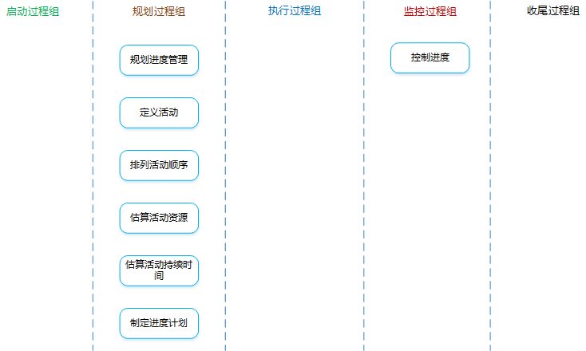


项目进度管理：对各阶段的进展程度和项目最终完成的期限所进行的管理。


# 1 规划进度管理

**是什么？**：为实施项目进度管理制定政策、程序，并形成文档化的项目进度管理计划的过程。

**有什么作用？**：在整个项目中对如何管理项目进度提供指南和方向。


## 输入

1. **<font color="red">项目管理计划</font>**

   - **范围基准**

     可用于定义活动、持续时间估算和进度管理。

   - **开发方法**

     有助于定义进度计划方法、估算技术、进度计划编制工具以及用来控制进度的技术。

2. **<font color="red">项目章程</font>**

   规定的<font color="red">总体里程碑进度计划</font>和项目审批要求，都会影响项目的进度管理。

3. 事业环境因素

4. 组织过程资产


## 工具与技术

1. 专家判断

2. **<font color="red">分析技术</font>**

   - **备选方案分析**

     可包括<font color="red">确定采用哪些进度计划方法</font>，以及如何将不同方法整合到项目中；还可以包括<font color="red">确定进度计划的详细程度、滚动式规划的持续时间，以及审查和更新频率</font>。

3. **<font color="red">会议</font>**

   可以举行<font color="red">规划会议</font>来制定进度管理计划。参会人员可能包括项目经理、项目发起人、选定的项目团队成员、选定的干系人、进度规划或执行负责人，以及其他必要人员。


## 输出

1. **<font color="red">进度管理计划</font>**

   **是什么？**：为如何编制、监督和控制项目进度提供指南和方向。进度管理计划可以是正式的或者非正式的，可以是详细或者高度概括的，其中应包括合适的控制临界值，进度管理计划中没有具体的进度。

   **包含哪些内容？**：

   - **方法论和工具**

     制定项目进度模型的进度规划方法论和工具。

   - **准确度**

     活动及工期的估算应准确到的程度。比如：估算某活动的工期是$10\pm2$​​天。

   - **计量单位**

     每种资源的计量单位。比如：时间计量用“人天”，数量计量用吨、千米等等。

   - **控制临界值**

     项目执行中，<font color="red">采取某种措施前，允许出现的最大进度偏差</font>。通常用偏离基准计划中的参数的某个百分数来表示。

   - **绩效测量规则**

     需要规定用于测量绩效的挣值管理规则或其他测量规则。

     补充：固定公式法（一种绩效测量技术，适用于工作量无法准确测量的情况），具体分为3种法则：50/50法则（开始计50%，结束计另外50%）、20/80法则（开始计20%，结束计另外80%）、0/100法则（开始计0%，结束计100%）。

   - **报告格式**

     进度报告的格式和编制频率。


# 2 定义活动

**是什么？**：识别和记录为完成项目可交付成果而需采取的<font color="red">具体行动</font>的过程。

**有什么作用？**：<font color="red">将工作包分解为活动</font>，作为对项目工作进行估算、进度规划、执行、监督和控制的基础。


**注意理解工作包和活动的区别**：

<font color="red">工作包</font>是WBS中最低层的<font color="red">可交付成果</font>；而<font color="red">活动</font>是对工作包的进一步分解，代表着为完成工作包所需要的<font color="red">工作投入</font>。


## 输入

1. **<font color="red">进度管理计划</font>**

   规定了滚动式规划的持续时间，以及管理项目工作所需的详细程度。

2. **<font color="red">范围基准</font>**

   定义活动时，需明确考虑范围基准中的WBS、可交付成果、制约因素、假设条件。

3. 事业环境因素

4. 组织过程资产


## 工具与技术

1. **<font color="red">分解</font>**

   **是什么？**：把项目范围和项目可交付成果逐步划分为更小、更便于管理的组成部分。

   WBS中的每个工作包都需要分解成活动，以便通过这些活动来完成相应的可交付成果。

   <font color="red">让团队成员参与分解过程</font>，有助于得到更好、更准确的结果。

2. **<font color="red">滚动式规划</font>**

   **是什么？**：<font color="red">详细规划近期</font>要完成的工作，同时在较高层级上<font color="red">粗略规划远期</font>工作。

   滚动式规划是一种<font color="red">渐进明细</font>的规划方式。

   早期的战略规划节点，信息尚不够明确，工作包只能分解到已知的详细水平。

3. 专家判断


## 输出

1. **<font color="red">活动清单</font>**

   **是什么？**：一份包含项目所需的<font color="red">全部进度活动</font>的综合清单，还包括每个活动的<font color="red">标识</font>及<font color="red">工作范围描述</font>。

2. **<font color="red">活动属性</font>**

   **是什么？**：把<font color="red">产品（项目）需求</font>从其<font color="red">来源</font>连接到能满足需求的<font color="red">可交付成果</font>的一种表格。

3. **<font color="red">里程碑清单</font>**

   **是什么？**：列出了所有项目里程碑，并指明每个里程碑的类型（强制性或者选择性）。

   **什么是里程碑？**：项目中的重要时点或事件。<font color="red">与活动有相同的属性和结构，但是它不是活动，持续时间为零，只代表一个时间点</font>。


# 3 排列活动顺序

**是什么？**：识别和记录项目活动之间的关系的过程。

**有什么作用？**：定义工作之间的<font color="red">逻辑顺序</font>，以便<font color="red">在既定的所有项目制约因素下获得最高的效率</font>。


## 输入

1. **<font color="red">进度管理计划</font>**

   其中有“进度规划方法和工具”的规定，对活动排序有指导作用。

2. **<font color="red">活动清单</font>**

   有全部的活动。

3. 活动属性

4. **<font color="red">里程碑清单</font>**

   里程碑的实现日期，对活动排序有影响。

5. **<font color="red">项目范围说明书</font>**

   有影响活动排序的产品特征的描述，以及项目的制约因素、假设条件等内容。

   虽然活动清单中已体现了这些因素的影响结果，但还需对产品范围描述进行整体审查以确保准确性。

6. 事业环境因素

7. 组织过程资产


## 工具与技术

1. **<font color="red">紧前关系绘图法（PDM、前导图法、单代号法、节点法）</font>**

   **是什么？**：创建进度模型的一种技术，用<font color="red">节点表示活动</font>，用一种或者多种逻辑关系连接活动，以显示活动的实施顺序。

   **紧前活动**：排在非开始活动前面的活动。

   **紧后活动**：排在某个活动后面的活动。

   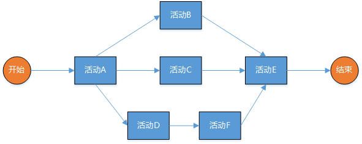

   **PDM的四种逻辑关系**：

   - **FS**（完成到开始）

     只有紧前活动完成，紧后活动才能开始。

     

   - **FF**（完成到完成）

     只有紧前活动完成，紧后活动才能完成。

     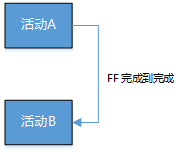

   - **SS**（开始到开始）

     只有紧前活动开始，紧后活动才能开始。

     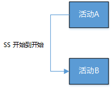

   - **SF**（开始到完成）

     只有紧前活动完成，紧后活动才能完成。

     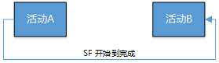

2. **<font color="red">箭线绘图法（ADM、双代号法、AOA）</font>**

   **是什么？**：用<font color="red">箭头表示活动</font>，把活动名称及相关信息表示在箭线上，<font color="red">节点表示连接活动的“事件”</font>。

   **紧前事件**：活动的开始（箭尾）事件称为该活动的紧前事件。

   **紧后事件**：活动的结束（箭头）事件称为该活动的紧后事件。

   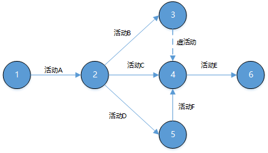

   **注意**：

   - <font color="red">虚线表示虚活动，虚活动指实际上并不存在的虚拟活动，不消耗时间和资源，只用来表示逻辑关系</font>。
   - 双代号图中<font color="red">只有FS（完成到开始）的逻辑关系</font>。
   - 活动和事件的<font color="red">代号唯一</font>。
   - <font color="red">任意两项活动紧前和紧后事件代号至少有一个不同</font>。
   - 节点代号沿箭头方向越来越大。
   - 流入/流出同一节点的活动，均有共同的紧后/紧前活动。

3. **<font color="red">确定依赖关系</font>**

   - **强制性依赖关系（硬逻辑、硬依赖）**

     <font color="red">法律或合同要求的</font>或<font color="red">工作的内在性质决定的</font>依赖关系（项目团队<font color="red">不能违反</font>）。

   - **选择性依赖关系（首选逻辑、优先逻辑、软逻辑）**

     <font color="red">基于最佳实践建立的</font>、或<font color="red">基于项目的某些特殊性质</font>而采用的依赖关系（项目团队<font color="red">可自由选择</font>）。

     如果打算<font color="red">快速跟进</font>，应当审查相应的选择性依赖关系。

   - **外部依赖关系**

     <font color="red">项目活动</font>与<font color="red">非项目活动</font>之间的依赖关系（项目团队<font color="red">不可控</font>）。

   - **内部依赖关系**

     <font color="red">项目活动之间</font>的紧前关系（项目团队<font color="red">可控</font>）。

   这些依赖关系间可两两组合形成：**强制性外部关系**、**强制性内部关系**、**选择性外部关系**、**选择性内部关系**。

4. **<font color="red">提前量与滞后量</font>**

   **提前量**：相对于紧前活动，紧后活动<font color="red">可以</font>提前的时间量。

   **滞后量**：相对于紧前活动，紧后活动<font color="red">必须</font>推迟的时间量。


## 输出

1. **<font color="red">项目进度网络图</font>**

   **是什么？**：表示项目进度活动之间的<font color="red">逻辑关系</font>（也叫依赖关系）的图形。

   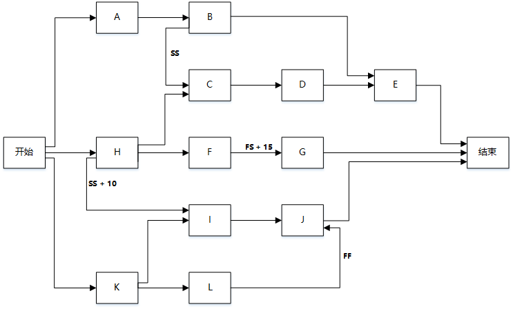

2. 项目文件更新


# 4 估算活动资源

**是什么？**：估算执行各项活动所需的<font color="red">材料、人员、设备或用品</font>的种类和数量的过程。

**有什么作用？**：明确完成活动所需的资源种类、数量和特性，以便做出更准确的成本和持续时间估算。


## 输入

1. 进度管理计划

2. 活动清单

3. 活动属性

4. **<font color="red">资源日历</font>**

   **是什么？**：表明每种具体资源的可用工作日或工作班次的日历。通俗理解，就是哪些活动可用、什么时候可用、可用多久等，同时还要考虑资源的其他属性，如技能水平、经验能力等。

5. 风险登记册

6. **<font color="red">活动成本估算</font>**

   **是什么？**：对完成项目工作可能需要的成本的量化估算。

7. 事业环境因素

8. 组织过程资产


## 工具与技术

1. 专家判断

2. **<font color="red">备选方案分析</font>**

   很多进度活动都有若干种备选的实施方案，如使用能力或技能水平不同的资源等。有助于提供在定义的制约因素范围内执行项目活动的最佳方案。

3. **<font color="red">发布的估算数据</font>**

   一些组织会定期发布最新的生产率信息与资源单位成本。

4. **<font color="red">自下而上估算</font>**

   在活动级别上估算，然后汇总成工作包、控制账户和总体项目层级上的估算。

5. 项目管理软件


## 输出

1. **<font color="red">活动资源需求</font>**

   **是什么？**：明确工作包中每个活动所需的资源类型和数量。

2. **<font color="red">资源分解结构（RBS）</font>**

   **是什么？**：资源依<font color="red">类别</font>和<font color="red">类型</font>的<font color="red">层级展现</font>。

   **资源类别**：人力、材料、设备和用品。

   **资源类型**：技能水平、等级水平等。

   **有什么作用？**：

   - 结合资源使用情况，<font color="red">组织与报告项目的进度数据</font>。
   - <font color="red">同一种资源的统一采购</font>。

3. 项目文件更新


# 5 估算活动持续时间

**是什么？**：根据资源估算的结果，估算完成单项活动所需工作时段数（工期）的过程。

**有什么作用？**：确定完成每个活动所需花费的时间量，为制定进度计划过程提供主要输入。

**注意**：应该由项目团队中<font color="red">最熟悉具体活动的个人或小组（专家）</font>，来提供估算活动持续时间所需的各种输入。估算是<font color="red">渐进明细</font>的，准确性和质量会逐步提高，这取决于输入数据的数量和质量。


## 输入

1. 进度管理计划

2. 活动清单

3. 活动属性

4. **<font color="red">活动资源需求</font>**

   估算的活动资源需求会对活动持续时间产生影响。

   **注意**：当向某个活动新增资源或分配低技能资源，就需要增加沟通、配信和协调工作，从而可能导致活动效率或生产率下降，以致需要更长的持续时间。

5. **<font color="red">资源日历</font>**

   其中的“资源可用性、资源类型和资源性质”都会影响活动的持续时间。

6. **<font color="red">项目范围说明书</font>**

   需要考虑项目范围说明书中所列的<font color="red">假设条件</font>和<font color="red">制约因素</font>。

7. 风险登记册

8. 资源分解结构

9. 事业环境因素

10. 组织过程资产


## 工具与技术

1. 专家判断

2. **<font color="red">类比估算</font>**

   **是什么？**：一种使用<font color="red">相似活动</font>或项目的<font color="red">历史数据</font>，来估算当前活动或项目的持续时间或成本的技术。

   **关键词**：<font color="red">**相似活动、历史数据、也是一种专家判断、也是整体估算、也是自下而上的、成本较低、耗时较少、准确性也较低、项目详细信息不足时、在启动阶段**</font>。

   **注意**：如果以往活动是<font color="red">本质上类似</font>，而不是表面是类似，并且从事估算的<font color="red">项目团队成员具备必要的专业知识</font>，那么<font color="red">类比估算就最为可靠</font>。

3. **<font color="red">参数估算</font>**

   **是什么？**：一种<font color="red">基于历史数据和项目参数</font>，利用历史数据之间的<font color="red">统计关系和其他变量</font>来估算成本或持续时间的技术（<font color="red">准确性取决于参数模型的成熟度和基础数据的可靠性</font>）。

   **关键词**：<font color="red">**历史数据、项目参数、统计关系、参数模型、基础数据、公式**</font>。

4. **<font color="red">三点估算</font>**

   **是什么？**：考虑估算中的不确定性和风险，来提高估算的准确性。

   **三个估算值**：最可能时间、最乐观时间、最悲观时间。

   **两种假定分布**：

   - **三角分布**

     **<font color="red">期望值 = （最悲观 + 最乐观 + 最可能）/ 3</font>**

   - **贝塔分布**

     **<font color="red">期望值 = （最悲观 + 最乐观 + 最可能 x 4）/ 3</font>**

   **标准差**：<font color="red">**标准差 = （最悲观 - 最乐观）/ 6**</font>

   **方差**：<font color="red">**方差 = $(标准差)^2$​** </font>

   **常用的均值概率**：

   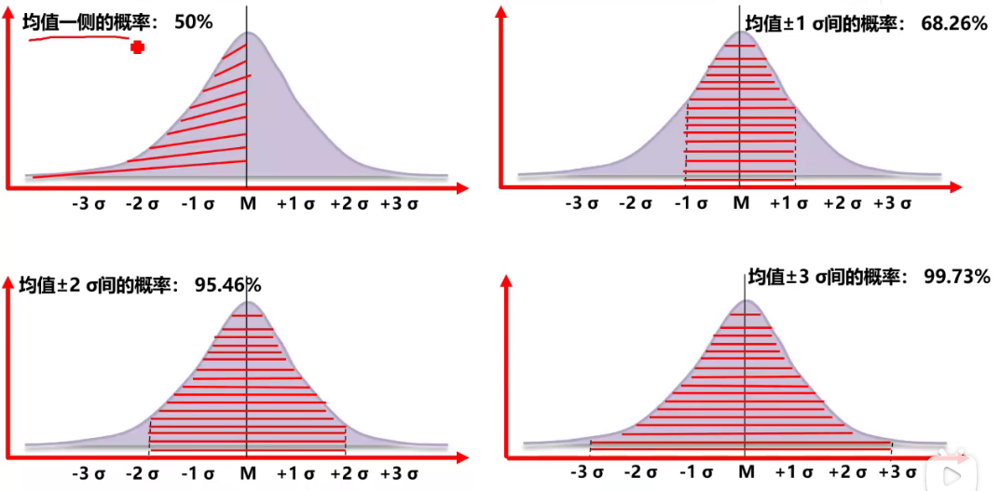

5. 群体决策技术

   调动团队成员的参与，以提高估算的准确度，并提高对估算结果的责任感。

6. 储备分析


## 输出

1. **<font color="red">活动持续时间估算</font>**

   **是什么？**：对完成某项活动所需的工作时段数的定量评估。

   **包括哪些内容？**：完成本活动所需要的时间、变动区间、概率。

   **注意**：不包括提前量和滞后量。

2. 项目文件更新


# 6 制定进度计划

**是什么？**：分析活动顺序、持续时间、资源需求和进度制约因素，创建项目进度模型的过程。

**有什么作用？**：把进度活动、持续时间、资源、资源可用性和逻辑关系代入进度规划工具，形成包含各个项目活动的计划日期的进度模型。


## 输入

1. 进度管理计划

2. 活动清单

3. 活动属性

4. **<font color="red">项目进度网络图</font>**

   其中包含用于推算项目进度计划的紧前和紧后活动的<font color="red">逻辑关系</font>。

5. **<font color="red">活动资源需求</font>**

   明确了每个活动所需的资源类型和数量，<font color="red">用于创建进度模型</font>。

6. **<font color="red">资源日历</font>**

   规定了在项目期间的<font color="red">资源可用性</font>。

7. **<font color="red">活动持续时间估算</font>**

   是完成各活动所需的工作时段数，<font color="red">用于进度计划的推算</font>。

8. **<font color="red">项目范围说明书</font>**

   包含了会影响项目进度计划特定的<font color="red">假设条件</font>和<font color="red">制约因素</font>。


## 工具与技术

1. 进度网络分析

2. **<font color="red">关键路径法</font>**

   **关键路径**：是项目中时间最长的活动顺序，决定着可能的项目最短工期。

   **七格图**：

   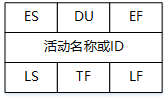

   - **ES**（Early Start）

     最早开始时间。

     ```
     ES = （所有紧前活动的EF中的最大值）
     ```

   - **DU**（Duration）

     活动持续时间。

   - **EF**（Early Finish）

     最早完成时间。

     ```
     EF = ES + DU
     ```

   - **LS**（Late Start）

     最晚开始时间。

   - **TF**（Total Float）

     总浮动时间（总时差、进度灵活性），<font color="red">不延误项目完工工期</font>。

     ```
     TF = LF - EF = LS - ES
     ```

   - **LF**（Late Finish）

     最晚结束时间。

     ```
     LF = (所有紧后活动的LS中最小值)
     ```

   - **FF**（Free Float）

     自由浮动时间（自由时差），<font color="red">不延误任何紧后活动最早开始时间</font>。

     ```
     FF = (所有紧后活动的ES中最小值) - EF
     ```

   **注意**：

   - 关键路径的总浮动时间可能是<font color="red">正值、零或负值</font>。
   - 关键路径可能存在多条，关键路径越多，风险越大。
   - 关键路径上的活动称为关键路径活动。
   - 关键路径不考虑资源约束，但是考虑路径约束。
   - <font color="red">关键路径排出来的计划未必可行，关键路径法不考虑资源约束，需要配合资源平衡处理</font>。

3. **<font color="red">关键链法</font>**

   **是什么？**：允许项目团队在任何项目进度路径上<font color="red">设置缓冲</font>，以应对资源限制和项目不确定性。这种方法<font color="red">建立在关键路径法之上，资源约束型关键路径就是关键链</font>，关键链法重点管理剩余的缓冲持续时间和剩余的活动链持续时间之间的匹配关系，是用来<font color="red">应对帕金森（学生综合症）</font>的一种办法。

   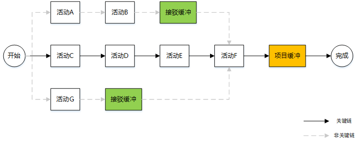

   **接驳缓冲**：放置<font color="red">在非关键链与关键链的接合点</font>的持续时间缓冲，用来<font color="red">保护关键链不受非关键链延误的影响</font>。

   **项目缓冲**：放置<font color="red">在关键链末端</font>的持续时间缓冲，用来<font color="red">保证项目不因关键链的延误而延误</font>。

4. **<font color="red">资源优化技术</font>**

   **是什么？**：根据资源供需情况来调整进度模型的技术。包括“资源平和”和“资源平滑”。

   **资源平衡：**

   - **是什么？**

     根据资源制约<font color="red">对开始日期和结束日期进行调整</font>的一种技术。

   - **应用场景**

     - 资源<font color="red">只在特定时间可用</font>。
     - 资源<font color="red">数量有限</font>。
     - 资源<font color="red">被过度分配</font>。
     - 为保持资源使用量<font color="red">处于均衡水平</font>。

   - **注意**

     - **<font color="red">资源平衡往往导致关键路径改变，通常是延长</font>**。
     - 理想情况下，资源平衡<font color="red">应作用于非关键路径上的活动</font>。

   **资源平滑：**

   - **是什么？**

     对活动进行调整，使项目资源需求<font color="red">不超过</font>预定的资源限制的技术，活动<font color="red">只在其自由和总浮动时间内延迟</font>，所以该技术<font color="red">可能无法实现所有资源的优化</font>。

   - **注意**

     - **<font color="red">资源平滑不会改变项目的关键路径，完工日期也不会延迟</font>。**

     - **<font color="red">优先做平滑，再做平衡</font>。**

5. **<font color="red">建模技术</font>**

   - **假设场景分析**

     对“如果情景X出现，情况会怎样？”这样的问题进行分析。既基于已有的进度计划，考虑各种各样的情景，根据情景分析的结果，<font color="red">评估项目进度计划在不利条件下的可行性</font>。

   - **模拟**

     基于多种不同的活动假设<font color="red">计算出多种可能的项目工期</font>，以<font color="red">应对不确定性</font>，最常用的技术是<font color="red">蒙特卡洛分析</font>。

6. **<font color="red">进度压缩</font>**

   **是什么？**：在<font color="red">不缩减项目范围</font>的前提下，<font color="red">缩短工期</font>。（进度压缩后要进行关键路径分析，防止出现新的关键路径）

   **有哪些方法？**：

   - **赶工**

     通过增加资源，以最小的成本增加来压缩进度工期。

     可能导致成本、风险的增加。

     <font color="red">只适合那些需要增加资源就能缩短持续时间的、且位于关键路径上的活动</font>。

   - **快速跟进**

     按顺序进行的活动或阶段改为<font color="red">至少是部分并行</font>开展。

     可能造成返工或风险增加。

     <font color="red">只适用于相互为选择性依赖关系的活动</font>。


## 输出

1. **<font color="red">进度基准</font>**

   **是什么？**：<font color="red">从进度网络图分析中得到</font>的，包含了<font color="red">基准的开始/结束日期、重要的里程碑点等</font>信息的，并<font color="red">由相关干系人接受和批准</font>的一种特殊版本的项目进度计划。

2. **<font color="red">项目进度计划</font>**

   **是什么？**：进度模型的输出，展示活动之间的相互关联，以及计划日期、持续时间、里程碑和所需资源。有三种层次的进度计划。

   **三种层次的进度计划**（详细程度由低到高）：

   - <font color="red">里程碑进度计划</font>

     **别称**：里程碑图

     **用途**：了解主要可交付成果和关键外部接口的计划开始或完成日期；方便向管理层或客户汇报。

   - <font color="red">概括性进度计划</font>

     **别称**：横道图、甘特图

     **用途**：用于追踪活动进度；常用于向管理层汇报。

   - <font color="red">详细进度计划</font>

     **别称**：项目进度网络图、时标逻辑图

     **用途**：优化展现活动之间的关系。

     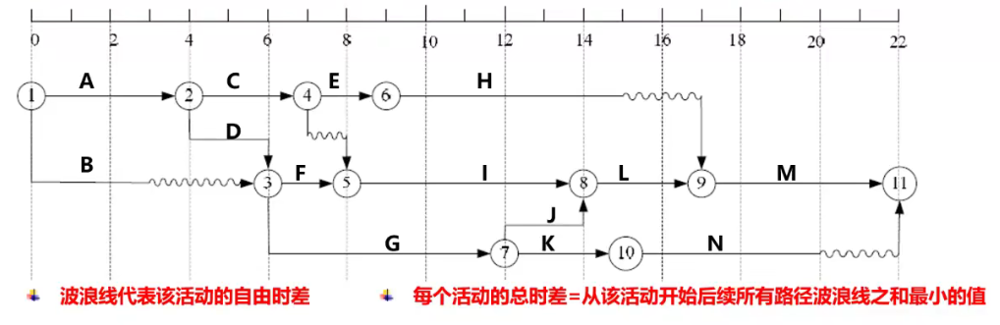

3. 进度数据

4. 项目日历

5. 项目管理计划更新

6. 项目文件更新


# 7 控制进度

**是什么？**：监督项目活动状态，更新项目进展，管理进度基准变更，以实现计划的过程。

**有什么作用？**：提供发现计划偏离的方法，从而可以及时采取纠正和预防措施，以降低风险。


**控制进度的关注点**：

- 判断进度状态
- 对引起变更的因素施加影响
- 判断进度变更
- 管理变更


**<font color="red">缩短工期的方法</font>**：

- 赶工。
- 快速跟进。
- 使用高素质的资源或经验更丰富的人员。
- 在甲方同意的前提下减小活动范围或降低活动要求。
- 改进方法或技术，提高生产效率。
- 加强质量管理，及时发现问题，减少返工。


## 输入

1. 项目管理计划
2. **<font color="red">项目进度计划</font>**
3. **<font color="red">工作绩效数据</font>**
4. 项目日历
5. 进度数据
6. 组织过程资产


## 工具与技术

1. **<font color="red">绩效审查</font>**
2. 项目管理团建
3. 资源优化技术
4. 建模技术
5. 提前量与滞后量
6. 进度压缩
7. 进度计划编制工具


## 输出

1. **<font color="red">工作绩效信息</font>**
2. 进度预测
3. **<font color="red">变更请求</font>**
4. 项目管理计划更新
5. 项目文件更新
6. 组织过程资产更新
