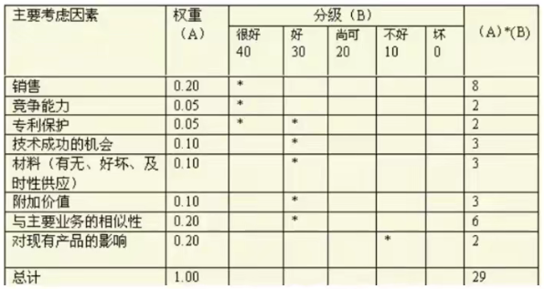

[TOC]

**项目采购管理**

**项目采购管理8个细化步骤**：

1. 需求确定与采购计划的制订。
2. 供应商的搜寻与分析。
3. 定价。
4. 拟定并发出订单。
5. 订单的跟踪和跟催。
6. 验货和收货。
7. 开票和支付货款。
8. 记录管理

**战略合作伙伴关系**：

- **是什么？**

  企业与供应商之间达成的最高层次的合作关系，它是指在相互信任的基础上，供需双方为了实现共同的目标而采取的共担风险、共享利益的长期合作关系。

- **对双方有什么好处？**

  - 缩短供应周期
  - 降低管理费用
  - 提高采购设备的质量
  - 加强沟通、改善过程、提高需求精准度
  - 共享技术，缩短开发周期
  - 共享管理经验，提高管理水平

- **如何构建这种关系？**

  1. 分析市场竞争环境。
  2. 合作伙伴的主因素分析。
  3. 建立合作伙伴关系的标准。
  4. 评价和选择合作伙伴。
  5. 建立和实施合作伙伴关系。

- **如何避免关系失败？**

  高层承诺、严选供应商、持续改进、目标一致、支持体系和文件、关注双赢、广泛沟通和分享信息、建立信任、资源让步、内部教育、人员变动时保持合作关系的能力。

**供应商选择的三大主要考虑因素**：

- 产品价格
- 质量
- 服务

**供应商评估的三个方法**：

- 供应商走访
- 招标法
- 协商法（适用情况：时间紧、单价少、竞争少、技术复杂）

**采购计划的作用**：

- 有效地规避风险、减少损失。
- 为采购提供依据。
- 有利于资源合理配置以取得最佳经济效益。

# 1 规划采购管理

**是什么？**：记录项目采购决策、明确采购方法、识别潜在卖家的过程。

如果项目需要从执行组织外部取得所需的产品、服务或成果，则每次采购都要经历从规划采购管理到结束采购的各个过程。

**有什么作用？**：确定是否需要外部支持。如果需要，还要决定采购什么、如何采购、采购多少、何时采购。

## 输入

1. 项目管理计划

2. **需求文档**

   包括“与采购规划有关的、关于项目需求的重要信息”，以及“带有合同和法律含义的需求”。

3. 风险登记册

4. **活动资源需求**

   包含“人员、设备或地点的具体需求的信息”，可用于成本估算，进而判断是自制还是外购。

5. **活动成本估算**

   可用于得出这次采购的底价，来评价潜在卖方提交的投标书或建议书的合理性。

6. 项目进度计划

7. **组织过程资产**

   正式的采购政策、程序和指南；预先批准的卖方清单；合同类型。

## 工具与技术

1. **自制或外购分析**
2. 专家判断
3. **市场调研**
4. 会议

## 输出

1. **采购管理计划**

   **是什么？**：说明项目团队将如何从执行组织外部获取货物和服务，以及如何管理从编制采购文件到合同收尾的各个采购过程。

   **包含哪些内容？**：

   - 拟采用的合同类型。
   - 风险管理事项。
   - 是否需要编制独立估算，以及是否应把独立估算作为评价标准。
   - 如果执行组织没有采购、发包或采办部门，项目管理团队可独自采取行动。
   - 标准化的采购文件（如果需要）。
   - 如何管理多个供应商。
   - 如何协调采购工作与项目的其他工作。
   - 可能影响采购工作的制约因素和假设条件。

2. **采购工作说明书（SOW）**

   SOW应该详细描述拟采购的产品、服务或成果，以便潜在卖方确定是否有能力提供。

   SOW中可包括规格、数量、质量、性能参数、履约期限、工作地点和其他需求。

   在采购过程中，应根据需要对SOW进行修订和改进，知道成为所签协议的一部分。

3. **采购文件**

   **是什么？**：用于征求潜在卖方的建议书。

   如果主要依据价格来选择卖方，通常使用标书、投标或报价等术语。

   如果主要依据其他考虑来选择卖方，通常使用诸如建议书的术语。

   **包含哪些内容？**：应答格式要求、相关的采购工作说明书、所需的合同条款。

4. **供方选择标准**

   通常是采购文件的一部分，用于对卖方建议书进行评级或打分，从而挑选出符合要求的卖方。

   标准可以是主管的，也可以是客观的。

5. **自制或外购决策**

6. 变更请求

7. 项目文件更新

# 2 实施采购

**是什么？**：获取卖方应答、选择卖方并授予合同的过程。

**有什么作用？**：通过达成协议，使内部和外部干系人的期望协调一致。

## 输入

1. 项目管理计划
2. **采购文件**
3. **供方选择标准**
4. **卖方建议书**
5. 项目文件
6. 自制或外购决策
7. 采购工作说明书
8. 组织过程资产

## 工具与技术

1. **投标人会议**

   在投标书或建议书提交之前，在买方和所有潜在卖方之间召开的会议。如：发包会、承包商会议、供应商会议、投标前会议、竞标会议等。

   目的是保证所有潜在卖方对采购要求都有清楚且一致的理解，保证没有任何投标人会得到特别优待。

   买方必须尽力确保每个潜在卖方都能听到任何其他卖方所提出的问题，以及买方所作出的每个回答。

   可以运用相关技术来促进公平。

   要把对问题的回答，以修正案的形式纳入到采购文件中。

2. **建议书评价技术**

   对于复杂的采购，如果要基于卖方对既定加权标准的相应情况来选择卖方，则应该根据买方的采购政策，规定一个正式的建议书评审流程。

   

3. **独立估算**

4. 专家判断

5. **广告**

6. 分析技术

7. **采购谈判**

   在合同签署之前，对各同的结构、要求及其他条款加以澄清，以取得一致意见。

## 输出

1. **选定的卖方**

2. **协议**

   因应用领域不同，协议也可以称作谅解、合同、分包合同或订购单。

3. 资源日历

4. 变更请求

5. 项目管理计划更新

6. 项目文件更新

# 3 控制采购

**是什么？**：管理采购关系、监督合同执行情况，并根据需要实施变更和采取纠正措施的过程。

**有什么作用？**：确保买卖双方履行法律协议，满足采购需求。

## 输入

1. 项目管理计划
2. **采购文件**
3. **协议**
4. 批准的变更请求
5. 工作绩效报告
6. 工作绩效数据

## 工具与技术

1. **合同变更控制系统**
2. **采购绩效审查**
3. **检查**
4. **报告绩效**
5. **支付系统**
6. **索赔管理**
7. **记录管理系统**

## 输出

1. 工作绩效信息
2. 变更请求
3. 项目管理计划更新
4. 项目文件更新
5. 组织过程资产更新

# 4 结束采购

**是什么？**：完结单次项目采购的过程。

**有什么作用？**：把合同和相关文件归档以备将来使用。

## 输入

1. 项目管理计划
2. **采购文件**

## 工具与技术

1. **采购审计**
2. **采购谈判**
3. **记录管理系统**

## 输出

1. 结束的采购
2. 组织过程资产更新

