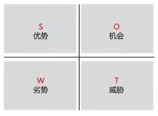
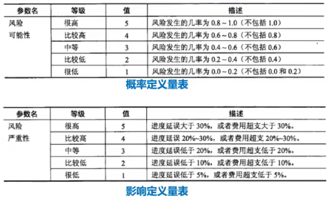
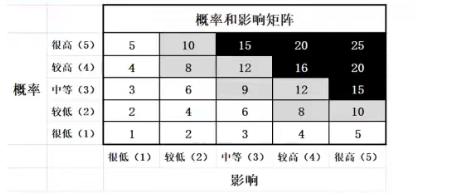
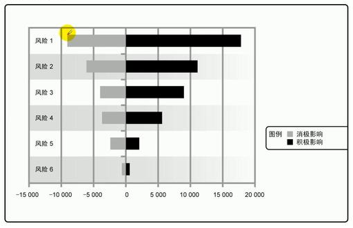
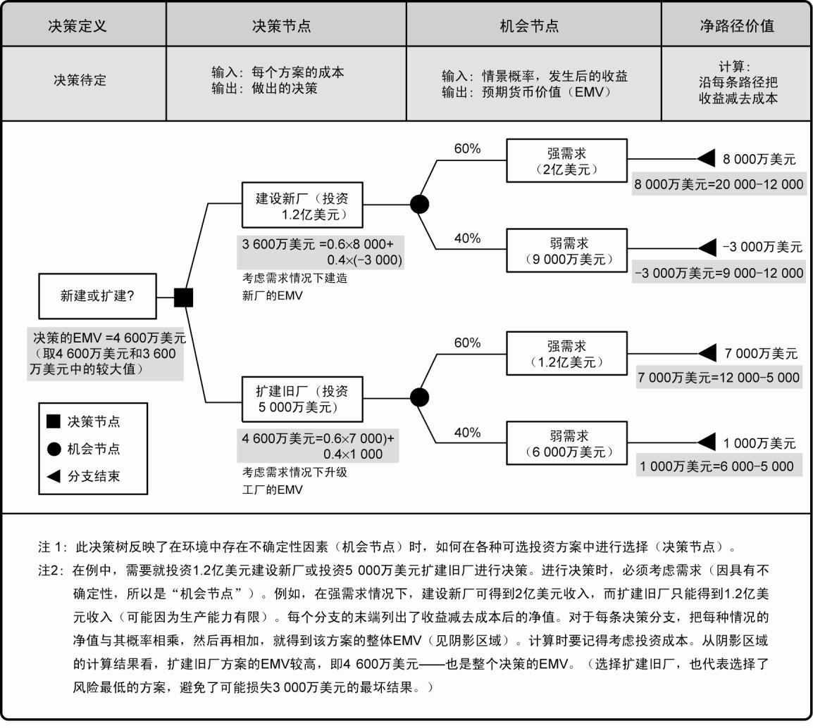
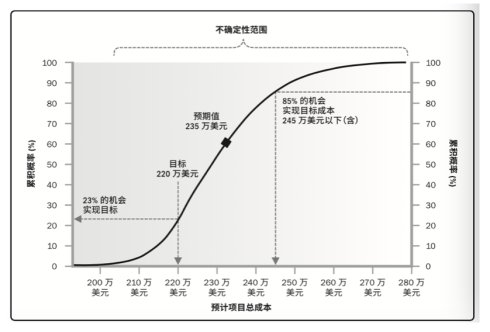
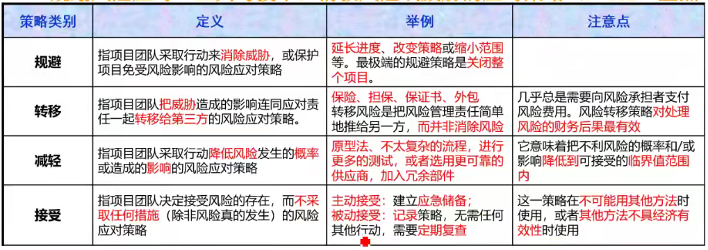
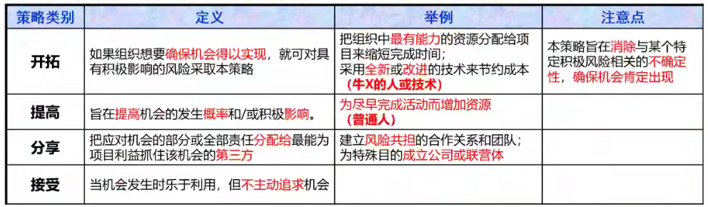
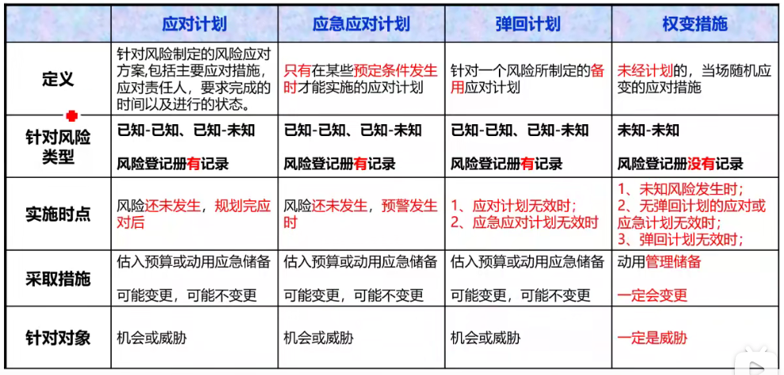

[TOC]

**项目风险管理**

**项目风险管理是什么**？：

**项目风险是什么？**：是一种不确定的事件或条件，一旦发生，就会对一个或者多个项目目标造成积极（机会）或消极（威胁）的影响。

**风险的分类？**：

- 按**可预测性**
  - 已知风险：可识别，可预见后果。（基本成本）
  - 可预测风险：可识别，不可预见后果。（应急储备）
  - 不可预测风险：无法识别，不可预见后果。（管理储备）
- 按**风险来源**
  - 自然风险
  - 人为风险
- 按**影响范围**
  - 总体风险
  - 局部风险
- 按**风险后果**
  - 纯粹风险：不能带来机会，无获得利益的可能。
  - 投机风险：既可能带来机会，又隐含威胁。

**风险态度**：冒进者、中立者、回避者

**影响风险态度的因素**：

- 风险偏好：愿意承受不确定性的程度。

- 风险承受力：能承受的风险程度、数量或容量。

- 风险临界值：所关注的不确定性的程度。

# 1 规划风险管理

**是什么？**：定义如何实施项目风险管理活动的过程。

**有什么作用？**：确保风险管理的程度、类型和可见度与风险及项目对组织的重要性相匹配。有利于促进与干系人的沟通，获得他们的同一和支持，从而确保风险管理的有效实施。

## 输入

1. 项目管理计划

2. **项目章程**

   可以提供高层级风险、项目描述和需求等输入。

3. **干系人登记册**

   包含了项目干系人的详细信息及角色描述，是识别风险的重要依据。

4. 事业环境因素

5. 组织过程资产

## 工具技术

1. **分析技术**

2. **会议**

   项目团队举行规划会议来指定风险管理计划。

   会议包含以下内容：

   - 界定风险管理活动的基本计划（进度、成本等）。
   - 对风险职责进行分配。
   - 对模板文件（风险水平、概率、影响）进行调整。

3. 专家判断

## 输出

1. **风险管理计划**

   **是什么？**：描述将如何安排与实施风险管理活动。

   **包含哪些内容？**：

   - 方法论、预算、时间安排

   - **角色与职责**

     确定每个风险管理活动的领导者、支持者和参与者，并明确他们的职责。

   - **风险类别**

     规定对潜在风险成因的分类方法。

     风险分解结构（RBS）有助于项目团队在风险识别过程中发现有可能引起风险的多种原因，是按风险类别排列的一种层级结构。

     

   - 风险概率和影响的定义

     

   - **概率和影响矩阵**

     把每个风险发生的概率和一旦发生对项目目标的影响映射起来的表格。通常由组织来设定概率和影响的各种组合，并据此定义高、中、低风险级别。

     

   - **修订的干系人承受力**

     可在规划风险过管理过程中对干系人的承受力进行修订，以适应具体项目的情况。

   - 报告格式、跟踪

# 2 识别风险

**是什么？**：判断哪些风险可能影响项目并且记录其特征的过程。

**注意**：

- 应鼓励全体项目人员参与潜在风险的识别工作。
- 识别风险是一个反复进行的过程。
- 识别风险过程通常会直接引入下一个过程，即定性风险分析过程。
- 有时，如果识别风险过程是由经验丰富的风险经理完成的，则可直接进入定量分析过程。
- 有些情况下，仅通过风险识别过程即可确定风险应对措施。

## 输入

1. **项目文件**

   如风险管理计划、成本管理计划、进度管理计划、质量管理计划、人力资源管理计划、范围基准、活动成本估算、活动持续时间估算、干系人登记册、采购文件等

2. 事业环境因素

3. 组织过程资产

## 工具与技术

1. **文档审查**

   对项目文档进行结构化审查。

   其中，项目计划的质量，以及这些计划与项目需求和假设之间的匹配程度，都可能是项目的风险指示器。

2. **信息收集技术**

   头脑风暴、德尔菲技术、访谈、根本原因分析。

3. **核对单分析**

   可以根据以往类似项目和其他来源的历史信息与知识编制风险识别核对单。

   核对单简单易用但是无法穷尽，所以应注意不要用核对单取代必要的风险识别能力。

   在项目收尾过程中，应对核对单进行审查，并根据新的经验教训改进核对单，供未来项目使用。

4. **假设分析**

   检验假设条件在项目中的有效性，识别因不准确、不确定、不一致或不完整导致的项目风险。

5. **图解技术**

   因果图、系统或过程流程图、影响图。

6. **SWOT分析**

   

   首先，从项目、组织或一般业务范围的角度识别组织的优势和劣势，然后，通过SWTO分析识别出由组织优势带来的各种项目机会以及由组织劣势带来的各种威胁。

   这一分析也可以用于考察组织优势能够抵消劣势的程度，以及机会可以克服劣势的程度。

7. 专家判断

## 输出

1. **风险登记册**

   **是什么？**：记录风险分析和风险应对规划的结果。随着其他风险管理过程的实施，风险登记册还将包括这些过程的输出，其中的信息种类和数量也就逐渐增加。

   风险登记册的编制始于识别风险过程。

   

   **包括哪些内容？**：

   - **已识别风险清单**

     对已识别风险进行尽可能详细的描述。

   - **潜在应对措施清单**

     在识别风险过程中，有时可以识别出风险的潜在应对措施。这些措施（如果已经识别出）应该作为规划风险应对过程的输入。

# 3 实施定性风险分析

**是什么？**：评估并综合分析风险的概率和影响，对风险进行优先排序，从而为后续分析或行动提供基础的过程。

**有什么作用？**：使项目经理能够降低项目的不确定性级别，并重点关注高优先级的风险。

**包含哪些工作？**：

- 分析每个风险的概率和影响。
- 从“概率量表”和“影响量表”中找到对应的定义等级和分值。
- 将概率分值和影响分值相乘，将得到的总分从“概率和影响矩阵”中找到对应的组别。
- 在每个优先级组别内根据概率-影响分值对每个风险进行优先级排序。
- 确定风险的应对责任人，这个人负责后续的工作，包括制定和落实应对措施。

## 输入

1. **风险管理计划**
2. **风险登记册**
3. 范围基准
4. 事业环境因素
5. 组织过程资产

## 工具与技术

1. **风险概率和影响评估**

   影响可能是积极的，可能是消极的。

   可以选择熟悉相关风险的人员，以会议或访谈的形式进行。

   具有低级别概率和影响的风险，将列入风险登记册中的观察清单，供将来监测。

2. **概率和影响矩阵**

   **假设风险A发生概率为0.8，如果发生，会造成5%的费用超支和25%的进度延误，那么，如果对A应用概率和影响矩阵呢？**（概率定义量表、影响定义量表、概率和影响矩阵已给出，如下图）

   

   

   - 首先，在“概率定义量表”中找到概率分值为4
   - 然后，在“影响定义量表”中找到影响分值为4
   - 将上面两者相乘得到结果16，在“概率和影响矩阵”中找到16对应的位置，该位置对应颜色和黑色，说明该风险为高风险

   **注意**：

   - 如果威胁处于矩阵高风险（黑色）地区，就可能需要采取优先措施和激进的应对策略。
   - 如果威胁处于矩阵低风险（白色）地区，那么作为观察对象列入风险登记册，或为之增加应急储备，而不必采取主动管理措施。
   - 如果机会处于矩阵高风险（黑色）地区，那么应该首先抓住。
   - 如果机会处于矩阵低风险（白色）地区，那么应该加以监督。

3. **风险紧迫性评估**

   实施风险应对措施所需的时间、风险征兆、警告和风险等级等都可作为确定风险优先级或紧迫性的指标。

4. **风险数据质量评估**

   评估风险数据对风险管理的有用程度的一种技术。

   主要考察人们对风险的理解程度，以及风险数据的准确性、质量、可靠性和完整性。

## 输出

1. **风险登记册更新**

# 4 实施定量风险分析

**是什么？**：就已识别风险对整体项目目标的影响进行定量分析的过程。

定量分析一般针对：① 重大影响的风险。② 可以量化的风险。

**有什么作用？**：产生量化风险信息，来支持决策制定，降低项目的不确定性。

## 输入

1. **风险管理计划**
2. **风险登记册**
3. 其他项目文件
4. 事业环境因素
5. 组织过程资产

## 工具与技术

1. **数据收集和展示技术**

   访谈、概率分析

2. **定量风险分析和建模技术**

   敏感性分析（单一因素分析）：把所有其他不确定因素固定在基准值，考察每个因素的变化会对目标产生多大程度的影响。

   龙卷风图（如下图）是敏感性分析的典型表现形式，用于比较不确定的变量与相对稳定的变量之间的相对重要性和相对影响。

   

3. **预期货币价值分析（EMV）**

   **是什么？**：当某些情况在未来可能发生或不发生时，计算平均结果的一种统计方法。

   机会的EMV通常表现为正值，威胁的EMV则表示为负值。

   EMV是建立在风险中立的假设之上，既不避险，也不冒险。

   

4. **建模和模拟**

   模拟通常采用蒙特卡洛技术。

   

5. 专家判断

## 输出

1. **风险登记册更新**

# 5 规划风险应对

**是什么？**：针对项目目标，制定提高机会、降低威胁的方案和措施的过程。

**有什么作用？**：根据风险的优先级来制定应对措施，并把风险应对所需的资源和活动加进项目的预算、进度计划和项目管理计划中。

**风险应对措施需要满足的条件**：

- 与风险的重要性相匹配。
- 能经济有效地应对挑战。
- 现实可行。
- 能获得全体相关方的同意。
- 由一名负责人具体负责。

## 输入

1. **风险管理计划**
2. **风险登记册**

## 工具与技术

1. **消极风险或威胁的应对策略**

   

   规避和减轻策略通常适用于高影响的严重风险。

   转移和接受更适用于低影响的不太严重威胁。

2. **积极风险或机会的应对策略**

   

3. **应急应对策略**

   只有在某些预定条件发生时才能实施的应对计划。

   如果确信风险的发生会有充分的预警信号，就应该制定应急应对策略。

   采用这一技术制定的风险应对方案称为应急计划或弹回计划。

4. 专家判断

## 输出

1. 项目管理计划更新
2. 项目文件更新

# 6 控制风险

**是什么？**：在整个项目中实施风险应对计划、监督实施的情况、跟踪已识别风险、监督残余风险、识别新风险、关闭过时的风险，以及评估风险管理过程有效性的过程。

**有什么作用？**：在整个项目生命周期中提高对风险的效率，不断优化风险应对。

风险应对负责人应该定期向项目经理汇报计划的有效性、未曾预料到的后果，以及合力应对风险而需要采取的纠正措施。

## 输入

1. **项目管理计划**
2. **风险登记册**
3. 工作绩效数据
4. 工作绩效报告

## 工具与技术

1. **风险再评估**

   在控制风险中，经常需要识别新风险，对现有风险进行再评估，以及删除已过时的风险。

2. **风险审计**

   检查并记录风险应对措施在处理已识别风险及其根源方面的有效性，以及风险管理过程的有效性。

3. **技术绩效测量**

   把项目执行期间所取得的技术成果与关于取得技术成果的计划进行比较。

4. **储备分析**

   在项目的任何时点比较剩余应急储备与剩余风险量，从而确定剩余储备是否合理。

5. **会议**

   定期状态审查会。

6. 偏差和趋势分析

## 输出

1. 工作绩效信息
2. 变更请求
3. 项目管理计划更新
4. 项目文件更新
5. 组织过程资产更新

# 补充

- **弹回计划**

  在所选策略无效或发生已接受的风险时加以实施。（其实就是备胎计划）

- **次生风险**

  由于应对一个风险而产生的另一个风险。

- **残余风险**

  执行风险应对计划后仍然残留的风险，通常是可接受的。

- **权变措施**

  在未事先制定应对措施或者事先制定的应对措施无效时，针对已发生的未知威胁而采取的应对措施。

- **应对措施的总结**

  