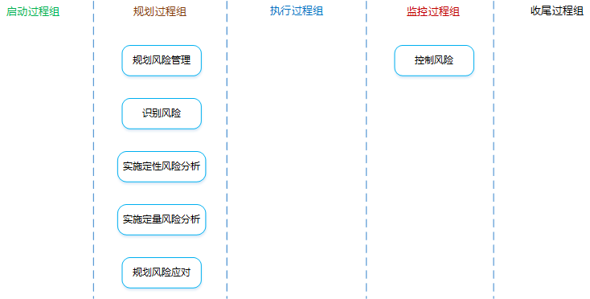
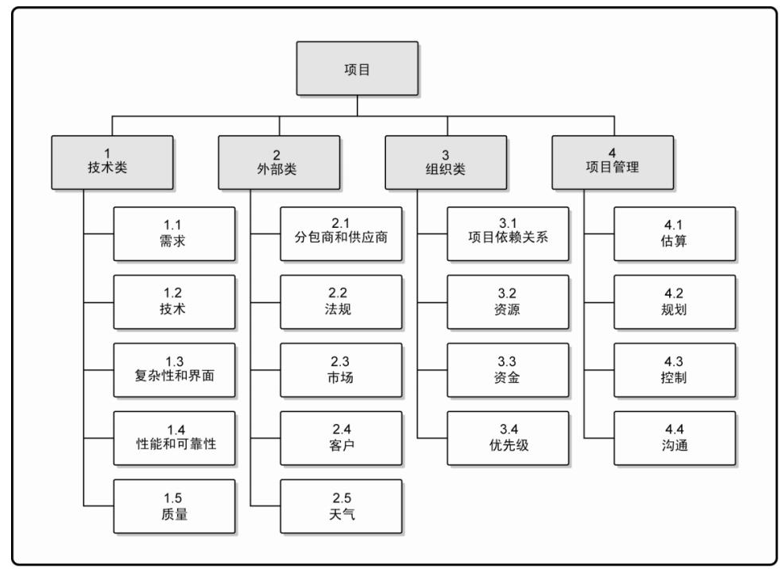
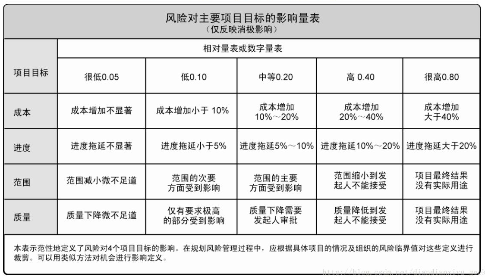
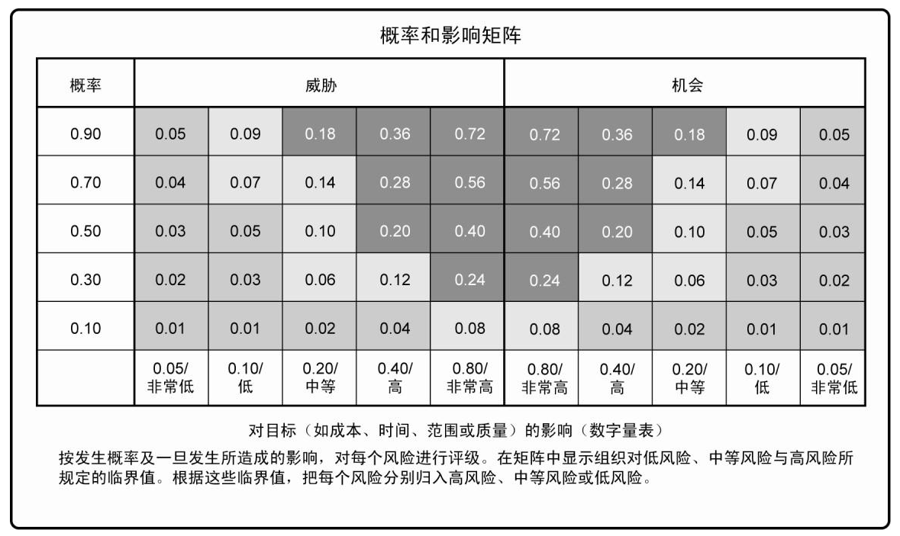

[TOC]

**项目风险管理**

**项目风险管理是什么**？：

**项目风险是什么？**：是一种不确定的事件或条件，一旦发生，就会对一个或者多个项目目标造成积极（机会）或消极（威胁）的影响。

**风险的分类？**：

- 按**可预测性**
  - 已知风险：可识别，可预见后果。（基本成本）
  - 可预测风险：可识别，不可预见后果。（应急储备）
  - 不可预测风险：无法识别，不可预见后果。（管理储备）
- 按**风险来源**
  - 自然风险
  - 人为风险
- 按**影响范围**
  - 总体风险
  - 局部风险
- 按**风险后果**
  - 纯粹风险：不能带来机会，无获得利益的可能。
  - 投机风险：既可能带来机会，又隐含威胁。

**风险态度**：冒进者、中立者、回避者

**影响风险态度的因素**：

- 风险偏好：愿意承受不确定性的程度。

- 风险承受力：能承受的风险程度、数量或容量。

- 风险临界值：所关注的不确定性的程度。

# 1 规划风险管理

**是什么？**：定义如何实施项目风险管理活动的过程。

**有什么作用？**：确保风险管理的程度、类型和可见度与风险及项目对组织的重要性相匹配。有利于促进与干系人的沟通，获得他们的同一和支持，从而确保风险管理的有效实施。

## 输入

1. 项目管理计划

2. **项目章程**

   可以提供高层级风险、项目描述和需求等输入。

3. **干系人登记册**

   包含了项目干系人的详细信息及角色描述，是识别风险的重要依据。

4. 事业环境因素

5. 组织过程资产

## 工具技术

1. **分析技术**

2. **会议**

   项目团队举行规划会议来指定风险管理计划。

   会议包含以下内容：

   - 界定风险管理活动的基本计划（进度、成本等）。
   - 对风险职责进行分配。
   - 对模板文件（风险水平、概率、影响）进行调整。

3. 专家判断

## 输出

1. **风险管理计划**

   **是什么？**：描述将如何安排与实施风险管理活动。

   **包含哪些内容？**：

   - 方法论、预算、时间安排

   - **角色与职责**

     确定每个风险管理活动的领导者、支持者和参与者，并明确他们的职责。

   - **风险类别**

     规定对潜在风险成因的分类方法。

     风险分解结构（RBS）有助于项目团队在风险识别过程中发现有可能引起风险的多种原因，是按风险类别排列的一种层级结构。

     

   - 风险概率和影响的定义

     

   - **概率和影响矩阵**

     把每个风险发生的概率和一旦发生对项目目标的影响映射起来的表格。通常由组织来设定概率和影响的各种组合，并据此定义高、中、低风险级别。

     

   - **修订的干系人承受力**

     可在规划风险过管理过程中对干系人的承受力进行修订，以适应具体项目的情况。

   - 报告格式、跟踪

