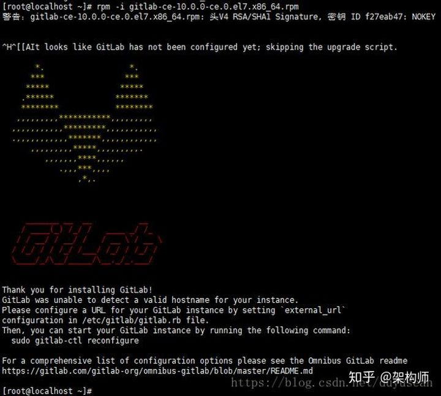
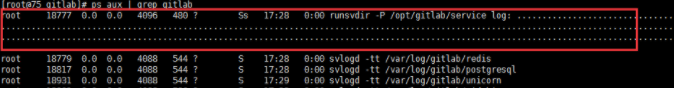

[TOC]


# 1 下载

国内镜像源网站下载：https://mirrors.tuna.tsinghua.edu.cn/gitlab-ce


# 2 安装

## 2.1 执行安装文件

进入到 gitlab 安装文件所在的文件夹（此处以我当初安装的版本为例 gitlab-ce-10.0.0-ce.0.el7.x86_64.rpm），执行命令

```
rpm -i gitlab-ce-10.0.0-ce.0.el7.x86_64.rpm
```


等待安装过程，出现下图信息，说明安装成功




## 2.2 修改配置文件

执行命令

```
vi /etc/gitlab/gitlab.rb 进入gitlab.rb
```

进入配置文件的编辑模式，根据需要配置IP地址、端口号、备份文件保存位置、备份文件保存时长等。

此处放一个我配置过的配置文件:  [gitlab.rb](./resources/gitlab.rb)


## 2.3 刷新配置

执行命令

```
gitlab-ctl reconfigure
```


## 2.4 启动

执行命令

```
gitlab-ctl restart
```


## 2.5 修改root密码

进入gitlab的bin目录

```
cd /opt/gitlab/bin
```


进入交互窗口

```
gitlab-rails console production
```


查找root用户

```
u=User.where(id:1).first
```


修改root密码

```
u.password='12345678'
```


保存

```
u.save!
```


退出交互窗口

```
exit 
```


至此，便可登录了，如果登陆失败，可以重启gitlab服务后重试。


# 3 备份

gitlab的备份文件是有保存时长的，通过 gitlab.rb 中配置项 `gitlab_rails['backup_keep_time']` 配置。

## 3.1 手动备份

执行命令

```
gitlab-rake gitlab:backup:create
```

备份完成后，备份文件将存放在 gitlab.rb 中配置项 `gitlab_rails['backup_path']` 配置的目录中。


## 3.2 自动备份

通过crontab实现自动备份，打开crontab配置文件

```
vi /etc/crontab
```


在最后一行添加（示例中表示每天凌晨1点进行备份）

```
0 1 * * * root gitlab-rake gitlab:backup:create -D 1
```


重启crontab

```
service crontab restart
```


# 4 还原

## 4.1 停止相关服务

```
gitlab-ctl stop unicorn
gitlab-ctl stop sidekiq
```


## 4.2 修改备份文件权限

```
chmod 777 1555011412_2019_04_12_11.1.4_gitlab_backup.tar
```


## 4.3 执行还原

```
gitlab-rake gitlab:backup:restore BACKUP=1555011412_2019_04_12_11.1.4
```


## 4.4 启动相关服务

```
gitlab-ctl start
```


# 5 卸载

## 5.1 停止

```
gitlab-ctl stop
```


## 5.2 卸载

```
rpm -e gitlab-ce
```


## 5.3 删除相关文件

查看gitlab相关进程

```
ps aux | grep gitlab
```


杀掉第一个进程



```
kill -9 18777
```


删除相关文件

```
find / -name gitlab | xargs rm -rf
```

