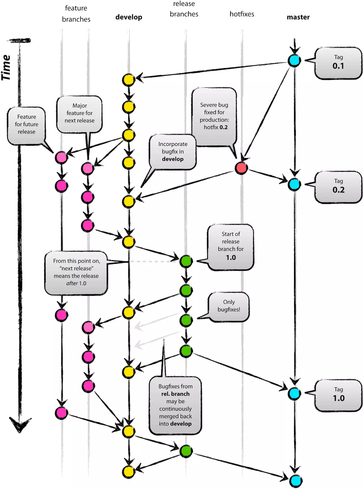

[TOC]

# 1 分支分类

## 1.1 master分支

主分支，固定分支。通过tag标签归档所有发布的版本，所有部署到生产环境的版本在master分支必须有其对应版本的tag标签。

master只能从release及hotfix分支合并代码，不允许在此分支直接修改代码！

## 1.2 dev分支

主开发分支，固定分支。该分支包含所有要发布的release分支内容。

dev主要用于创建其他分支以及从其他分支合并代码，不允许在此分支直接修改代码！

## 1.3 feat分支

特性开发分支，非固定分支。当需要开发新需求代码时，基于dev分支创建feat分支，分支名称格式为“feat-xxx”。

feat分支开发完毕后，代码合并至dev分支，删除该feat分支。

## 1.4 fix分支

bug修复分支，非固定分支。当需要修复bug时，基于dev分支创建fix分支，分支名称格式为“fix-xxx”。

fix分支开发完毕后，代码合并至dev分支，删除该fix分支。

## 1.5 hotfix分支

紧急bug修复分支，非固定分支。只有当发布版本部署至生产环境后，出现严重bug需要现场修复，才需要基于master分支创建hotfix分支，分支名称格式为“hotfix-xxx”。

hotfix分支开发完成后，代码合并至master分支，并打好最新tag标签，删除该hotfix分支。

## 1.6 release分支

发布版本分支，非固定分支。当feat或者fix分支合并至dev后，基于dev分支创建release分支，分支名称格式为“release-版本号”。

内部测试阶段，从release分支打包进行测试，测试中代码修改依旧在该release分支进行，release测试通过后，

代码合并至dev及master分支，并在master分支打好tag标签，删除该release分支。

# 2 版本号控制规则

## 2.1 版本号格式

主版本号.次版本号.修订版本号，如 1.0.2

## 2.2 升版规则

bug修复时，修订版本号+1，假设初始版本为1.1.2，bug修复后版本为1.1.3；

新增功能时，次版本号+1，修订版本号归零，假设初始版本为1.1.2，新增功能后版本为1.2.0；

项目核心功能变更时，主版本号+1，次版本号和修订版本号归零，假设初始版本为1.1.2，核心功能变更后版本为2.0.0；

# 3 示例

## 3.1 bug修复

假设当前发布版本为1.1.2，现要修复用户管理功能中出现的bug

操作步骤：

1. 基于dev分支创建fix-usermanage分支
2. 在fix-usermanage分支进行代码开发
3. 合并fix-usermanage分支代码至dev分支，删除fix-usermanage分支
4. 基于dev分支创建release-1.1.3分支
5. 在release-1.1.3分支进行测试，测试出现的问题在此分支进行修改
6. 测试完成后，合并release-1.1.3分支代码至dev和master分支，并在master分支打上名为“1.1.3”的tag标签
7. 从master分支的“1.1.3”tag标签上打包项目，部署至生产环境

## 3.2 新功能开发

假设当前发布版本为1.1.2，现要新增app管理相关功能

操作步骤：

1. 基于dev分支创建feat-appmanage分支
2. 在feat-appmanage分支进行代码开发
3. 合并feat-appmanage分支代码至dev分支，删除feat-appmanage分支
4. 基于dev分支创建release-1.2.0分支
5. 在release-1.2.0分支进行测试，测试出现的问题在此分支进行修改
6. 测试完成后，合并release-1.2.0分支代码至dev和master分支，并在master分支打上名为“1.2.0”的tag标签
7. 从master分支的“1.2.0”tag标签上打包项目，部署至生产环境

## 3.3 核心功能变更

假设当前发布版本为1.1.2，现要重构核心权限功能

操作步骤：

1. 基于dev分支创建feat-permission分支
2. 在feat-permission分支进行代码开发
3. 合并feat-permission分支代码至dev分支，删除feat-permission分支
4. 基于dev分支创建release-2.0.0分支
5. 在release-2.0.0分支进行测试，测试出现的问题在此分支进行修改
6. 测试完成后，合并release-2.0.0分支代码至dev和master分支，并在master分支打上名为“2.0.0”的tag标签
7. 从master分支的“2.0.0”tag标签上打包项目，部署至生产环境

## 3.3 紧急bug修复

假设当前发布版本为1.1.2，现要紧急修复角色管理的bug

操作步骤：

1. 基于master分支创建hotfix-rolemanage分支
2. 在hotfix-rolemanage分支进行代码开发并测试
3. 合并hotfix-rolemanage分支代码至master分支和dev分支，在master分支打上名为“1.1.3”的tag标签，删除hotfix-rolemanage分支
4. 从master分支的“1.1.3”tag标签上打包项目，部署至生产环境