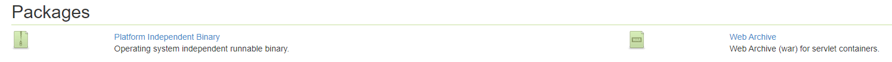
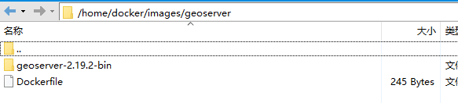
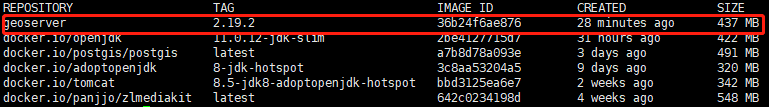
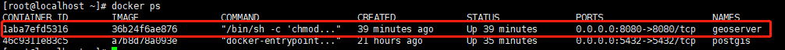
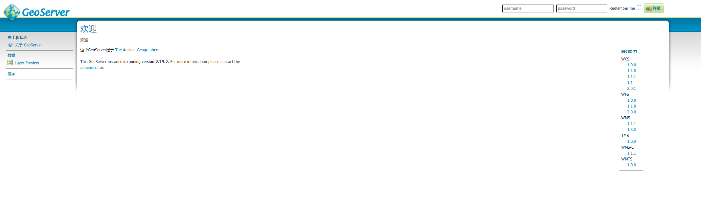

[TOC]


# 1 安装与启动

## 1.1 docker

geoserver提供了[docker官方镜像](https://hub.docker.com/r/geonode/geoserver)，可以直接拉取使用，如果通过文档可正常拉取并使用官方镜像，那么接下来的一段内容便不需要看了，否则需要自己构建镜像。


但是我在按照拉取官方镜像，然后按照文档操作时，出现了一系列操作，暂不确定是否是镜像的问题。所以我下载了geoserver程序，通过自定义Dockerfile重新了构建了一版geoserver镜像，以下为构建及启动过程：

1. 下载geoserver程序

   官方提供2种格式的程序：[Platform Independent Binary（可独立执行的程序包）](http://sourceforge.net/projects/geoserver/files/GeoServer/2.19.2/geoserver-2.19.2-bin.zip)与 [Web Archive（war包，可放入se'rvlet容器中执行）](http://sourceforge.net/projects/geoserver/files/GeoServer/2.19.2/geoserver-2.19.2-war.zip)

   

   因为是构建docker镜像用，此镜像只用于跑geoserver服务，所以直接下载可独立执行的程序包。

   

2. 编写Dockerfile

   ```
   FROM adoptopenjdk:8-jdk-hotspot
   # 拷贝geoserver到容器中
   COPY geoserver-2.19.2-bin/ /opt/geoserver/
   # 设置geoserver环境变量
   ENV GEOSERVER_HOME=/opt/geoserver
   EXPOSE 8080
   CMD chmod -R 777 /opt/geoserver && /opt/geoserver/bin/startup.sh
   ```

   如果docker所在服务器不能够连接互联网，那么需要提前用能够连接互联网的docker拉取并导出镜像 `adoptopenjdk:8-jdk-hotspot`，然后将此镜像导入到当前docker中。

   

3. 构建docker镜像

   ① 将1中下载好的程序包解压并上传至docker所在的服务器中，同时将2中编写的Dockerfile上传至服务器中，将二者放在同一目录下，例如在我构建时，将它们放在了 `/home/docker/images/geoserver` 目录下：

   

   

   ② 执行 `docker build` 命令进行构建

   ```
   docker build -f /home/docker/images/geoserver/Dockerfile -t geoserver:2.19.2
   ```

   

   ③ 构建成功后，可通过 `docker images` 查看镜像信息

   

   

4. 启动docker镜像

   ① 通过 `docker run` 启动容器

   > -p 8080:8080  																								geoserver默认监听8080端口，映射到宿主机8080端口
   >
   > -v /home/webgis/geoserver/data:/opt/geoserver/data_dir				                                         挂载geoserver数据目录
   >
   > --privileged																									 解决挂载目录的权限问题
   
   ```
   docker run -p 8080:8080 -v /home/webgis/geoserver/data:/opt/geoserver/data_dir --privileged -d --name geoserver
   ```

   

   ② 通过 `docker ps` 查看正在运行的容器

   
   
   
   
   ③ 打开浏览器，访问地址 http://yourhost:8080/geoserver ，出现如下页面说明启动成功。
   
   


## 1.2 windows/linux

1. 下载geoserver程序

   官方提供2种格式的程序：[Platform Independent Binary（可独立执行的程序包）](http://sourceforge.net/projects/geoserver/files/GeoServer/2.19.2/geoserver-2.19.2-bin.zip)与 [Web Archive（war包，可放入se'rvlet容器中执行）](http://sourceforge.net/projects/geoserver/files/GeoServer/2.19.2/geoserver-2.19.2-war.zip)

   

   

2. 启动geoserver

   ① 如果下载的是第一种可独立运行的程序包，那么直接解压，然后启动 `/bin` 目录下的 `startup.bat` 或者 `startup.sh` 即可；

   如果下载的是第二种war包，那么将其放入诸如tomcat、jetty等servlet容器中，然后直接启动容器即可。

   

   ② 打开浏览器，访问地址 http://yourhost:8080/geoserver ，出现如下页面说明启动成功。

   


# 2 发布地图

官网提供了2篇分别通过图层文件和PostGIS数据库来发布地图的入门文档，写的非常简洁易懂，这里就不搬运了了，直接放链接：[Publishing a shapefile](https://docs.geoserver.org/latest/en/user/gettingstarted/shapefile-quickstart/index.html)、[Publishing a PostGIS table](https://docs.geoserver.org/latest/en/user/gettingstarted/postgis-quickstart/index.html)

