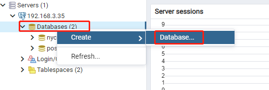
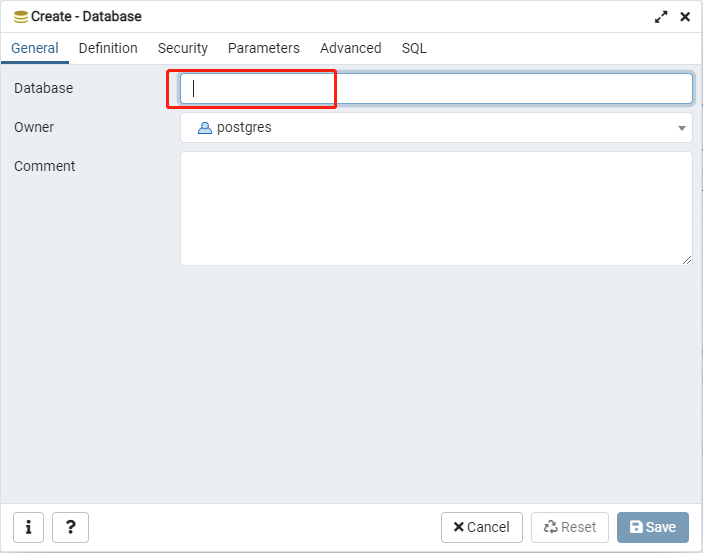

[TOC]


# 1 安装

## 1.1 docker

拉取PostGIS的docker镜像：

```
docker pull postgis/postgis
```


启动容器：

> POSTGRES_PASSWORD：数据库密码，根据需要自己定义

```
docker run --name postgis -e POSTGRES_PASSWORD=mysecretpassword -d -p 5432:5432 postgis/postgis
```


*在容器中连接数据库（与安装无关，如果后续需要进入容器对数据库进行操作时可通过下面的命令进入）：

```
docker exec -ti postgis psql -U postgres
```


## 1.2 windows

暂略

## 1.3 linux

暂略


# 2 创建数据库

## 2.1 创建数据库

### 2.1.1 通过SQL语句创建

```
create database dbname;
```


### 2.1.2 通过PgAdmin创建

① 连接数据库，在 **Databases** 右键：



② 填写数据库名称（根据需要设置其他属性）




## 2.2 添加扩展

在已创建好的数据库中执行：

```
CREATE EXTENSION postgis;
CREATE EXTENSION fuzzystrmatch;
CREATE EXTENSION postgis_tiger_geocoder;
CREATE EXTENSION address_standardizer;
```


至此，已经创建好可用于存储gis数据的数据库，后面便可导入数据使用即可。

