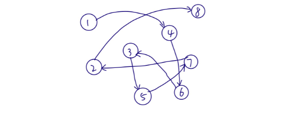

[TOC]

# 1 数据

是描述客观事物的符号，是计算机中可以操作的对象，是能被计算机识别，并输
入给计算机处理的符号集合.

# 2 数据元素

是组成数据的、有一定意义的基本单位，在计算机中通常作为整体处理，也被称
为记录

# 3 数据项

一个数据无素可以由若干个数据项组成，数据项是数据不可分割的最小单位

# 4 数据对象

是性质相同的数据元素的集合，是数据的子集

# 5 数据结构

是相互之间存在一种或多种特定关系的数据元素的集合.

## 5.1 逻辑结构

指数据对象中数据元素之间的相互关系

### 5.1 集合结构

数据元素同属一个集合，但之间没有关系

### 5.1.2 线性结构

数据元素之间是一对一的关系

### 5.1.3 树形结构

数据元素之向存在一种一对多的层次关系

### 5.1.4 图形结构

数据元素是多对多的关系

## 5.2 物理结构

指数据的逻辑结构在计算机中的存储形式

### 5.2.1 顺序存储结构

把数据元素存放在地址连续的存储单元里，其数据间的逻辑关系和物理关系是一致的

### 5.2.2 链式存储结构

把数据放在任意的存储单元里，这些存储单元可以是连续的、也可以是不连续的。此时存储关系并不能反映逻辑关系，因此需要用一个指针存放数据元素的地址

# 6 数据类型

指一组性质相同的值的集合及定义在此集合上的一些操作的总称

# 7 抽象数据类型

指一个数学模型及定义在该模型上的一组操作

